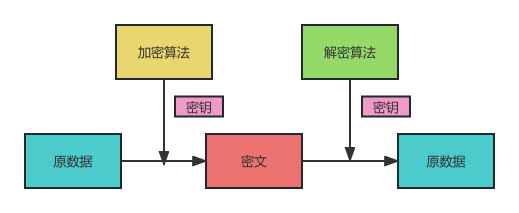

## 1、加密

### 1.1、对称加密

原理：使用密钥和加密算法对数据进行转换，得到的无意义数据即为密文，使用密钥和解密算法对密文进行逆向转换，得到原数据。

经典算法：DES、AES

### 1.2、非对称加密

原理：使用公钥对数据进行加密得到密文，使用私钥对数据解密得到原数据。

经典算法：RSA（加密、签名）、DSA （签名）

延伸用途：数字签名。 

### 1.3、数字签名

签名与验证

简单：

完整：

## 2、Base64

将二进制数据转换成 64 个字符组成的字符串的编码算法.

用途：

- 让原数据具有字符串所具有的特性，如可以放到URL中传输、可以保存到文本文件、可以通过普通的聊天软件进行文本传输。
- 把原本人眼可以读懂的字符串变成读不懂的字符串，降低偷窥风险。

## 3、Hash

定义：把任意数据转成指定大小范围（通常很小）的数据

左右：摘要、数字指纹

经典算法：MD5、SHA1、SHA256

实际用途：

- 数据完整性验证
- 保护隐私，数据库中保存SHA1之后的密码

