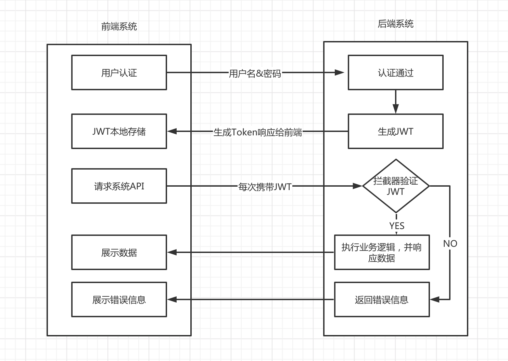

# JWT


## 1、什么是JWT

>  官网

​		官网地址：https://jwt.io/introduction/

> 解释

​		jsonwebtoken（JWT）是一个开放标准（rfc7519），它定义了一种紧凑的、自包含的方式，用于在各方之间以JSON对象安全地传输信息。此信息可以验证和信任，因为它是数字签名的。jwt可以使用秘密（使用HMAC算法）或使用RSA或ECDSA的公钥/私钥对进行签名。

​		通俗的说：JWT简称JSON Web Token，也就是通过JSON形式作为Web应用中的令牌，用于在各方之间安全地讲信息作为JSON对象传输。在数据传输过中还可以完成数据加密、签名等相关处理。

## 2、JWT能做什么

> 授权

​		这是使用JWT的最常见方案。一单用户登录，每个后续请求包括JWT,从而允许用户访问该令牌允许的路由，服务和资源。单点登录是当今广泛使用JWT的一项功能，因为它的开销很小并且可以在不同的域中轻松使用。		

> 信息交换

​		JSON Web Token 是在各方之间安全地传输信息的好方法。因为可以对JWT进行签名（例如：使用公钥/私钥对），所以你可以确保发件人是他们所说的人。此外，由于签名是使用标头和有效负载计算的，因此你还可以验证内容是否遭到篡改。

## 3、JWT认证流程



认证流程：

- 首先，前端通过Web表单将自己的用户名和密码发送给后端的接口。
- 后端核对用户名和密码成功后，将用户的id等其他信息作为JWT Payload（负载），将其与头部分别进行Base64编码拼接后签名，形成一个JWT。形成的JWT就是一个形同aaa.bbb.ccc的字符串
- 后端将JWT字符串作为登录成功的返回结果给前端。前端进行保存，退出登录时候前端删除保存的JWT即可。
- 前端在每次请求时将JWT放入HTTP Header中的 Authorization 里面（解决XSS和XSRF问题）
- 后端检查是否存在，如存在验证JWT的有效性。例如，检查签名是否正确；检查Token的接收方是否是自己（可选）
- 验证通过后，后端使用JWT中包含的用户信息进行其他逻辑操作，返回相应结果。

优势：

- 简洁：可以通过URL，POST参数或者在HTTP Header 发送，因为数据量小，传输速度也很快
- 自包含：负载中包含了所有用户所需要的信息，避免了多次查询数据库
- 跨语言：因为Token是以JSON加密的形式保存在客户端的，所以JWT是跨语言的，原则上任何的Web形式都支持
- 不需要在服务器保存会话信息，特别适用于分布式微服务


## 4、JWT的结构

令牌由三部分组成，中间用 . 连接。Header.Payload.Signature

- 标头（Header）
- 有效载荷（Payload）
- 签名（Signature）

> Header

​		Header通常由两部分组成：令牌的类型（即JWT）和所使用的签名算法，例如HMAC SHA256或RSA。它会使用 Base64 编码组成 JWT 结构的第一部分。

```json
{
    "alg":"HS256",
    "typ":"JWT"
}
```

> Payload

​		Payload是有效载荷，一般情况下只需要放用户的一般信息用户ID什么的，不能放密码之类的敏感信息。同样的，它会使用 Base64 编码组成 JWT 结构的第二部分。

```json
{
    "sub":"123",
    "name":"John Doe",
    "admin": true
}
```

> Signature

​		前面两部分都是使用 Base64 进行编码的，即前端可以解开知道里面的信息。Signature 需要使用编码后的 Header 和 Payload 以及我们提供的一个秘钥，然后使用 Header 中指定的签名算法（HS256）进行签名。签名的作用是保证 JWT 没有被篡改过如：HMACSHA256(base64UrlEncode(header) + "." + base64UrlEncode(payload),secret);

​		签名目的：最后一步签名过程，实际上是对头部以及负载内容进行签名，防止内容被篡改。如果有人对头部以及负载的内容解密之后进行修改，再进行编码，最后加上之前的签名组合新的 JWT 的话，那么服务器端会判断出新的头部和负载形成的签名和 JWT 附带上的签名不一样的。如果要对新的头部和负载进行签名，在不知道服务器加密时用的的秘钥的话，得出来的签名也是不一样的。

JWT 编码之前：

```markdown
Header的JSON . Payload的JSON. HMACSHA256(base64UrlEncode(header) + "." + base64UrlEncode(payload),secret)
```

JWT编码之后：

```markdown
sadfasdfasdfasdfasdfasdf.awerqwerqwefasdfasdfasdfasdfadsfawef.adsfqwer234asdfasdfasdf
```


## 5、信息安全问题

​		因为base64是一种编码，是可逆的。所以在 JWT 中。不应该在载荷里面加入任何敏感的数据。在上面的例子中。传输的是用户的 user id 。这个值实际上不是敏感内容。一般情况下知道也是安全的。但是像密码这样的内容就不能放到 JWT 中了。JWT 还经常用于设计用户认证和授权系统，甚至实现Web应用的单点登录。


## 6、使用 JWT

> 引入依赖

```xml
<dependency>
    <groupId>com.auth0</groupId>
    <artifactId>java-jwt</artifactId>
    <version>3.11.0</version>
</dependency>
```


