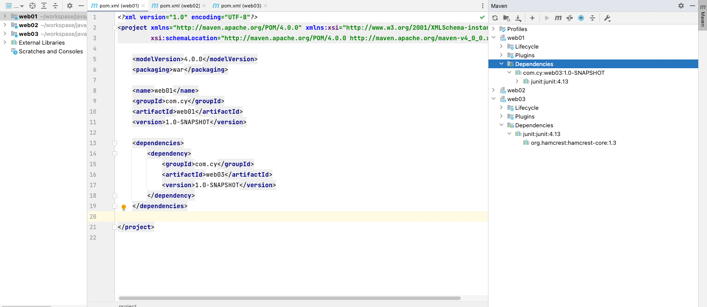
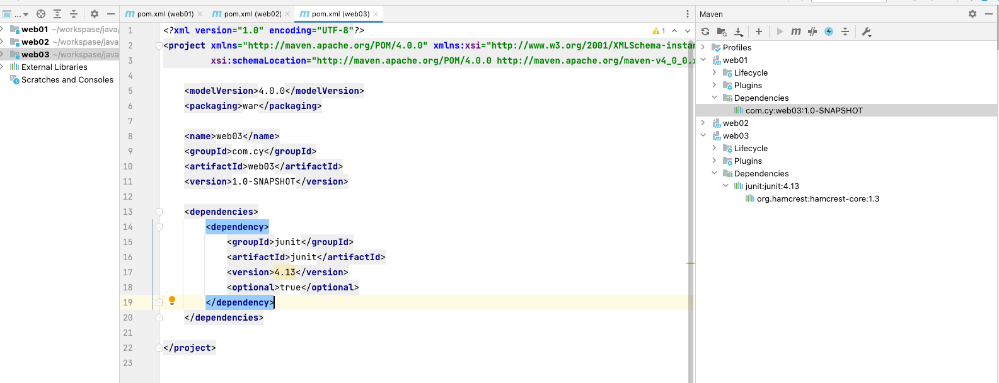
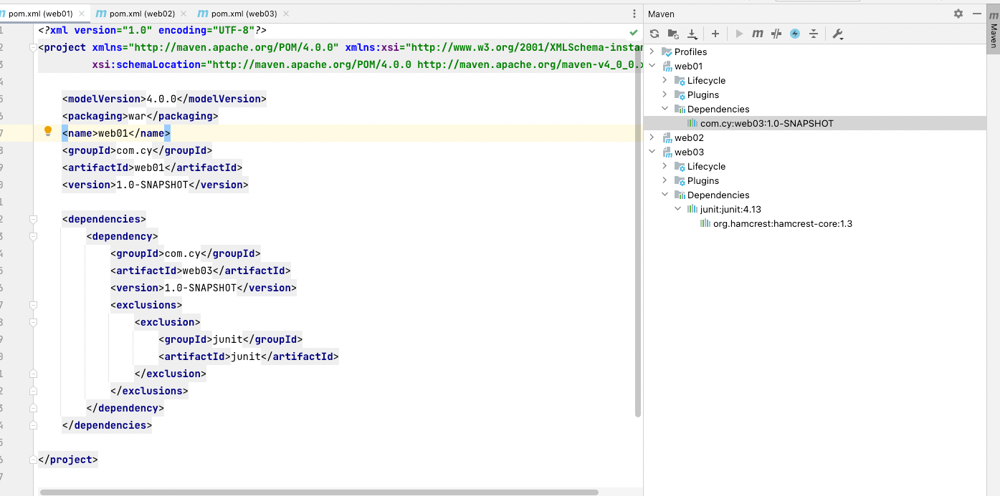
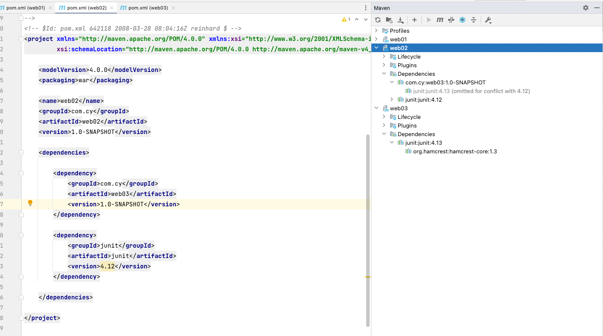

# 1、Maven 简介

## 1.1、Maven的作用

- 项目构建：提供标准的、跨平台的自动化项目构建方式
- 依赖管理：方便快捷的管理项目依赖的资源（jar包）,避免资源间的版本冲突问题
- 统一开发结构：提供标准的、统一的项目结构


## 1.2、下载&配置环境变量

### 1.2.1、下载

```shell
# 网址
https://maven.apache.org/index.html
```


### 1.2.2、环境变量

```shell
# 1.打开环境变量文件
open -e .bash_profile

# 2.增加
export M2_HOME=/Users/cuiyue/tools/apache-maven-3.8.4
export PATH=$PATH:$M2_HOME/bin

# 3.生效
source ~/.bash_profile

# 4.检查是否配置成功
mvn -v
```


### 1.2.3、 .bash_profile文件demo

```shell
# adb 
export PATH=${PATH}:/Users/cuiyue/tools/sdk/platform-tools

# java
JAVA_HOME=/Library/Java/JavaVirtualMachines/jdk1.8.0_91.jdk/Contents/Home
# JAVA_HOME=/Library/Java/JavaVirtualMachines/jdk-17.0.2.jdk/Contents/Home

PATH=$JAVA_HOME/bin:$PATH:.
CLASSPATH=$JAVA_HOME/lib/tools.jar:$JAVA_HOME/lib/dt.jar:.
export JAVA_HOME
export PATH
export CLASSPATH

# maven 
export M2_HOME=/Users/cuiyue/tools/apache-maven-3.8.4
export PATH=$PATH:$M2_HOME/bin
```


# 2、基础概念

## 2.1、仓库

仓库：

​		用于存储资源，包含各种jar包

仓库分类：

- 本地仓库：自己电脑上存储资源的仓库，连接远程仓库获取资源
- 远程仓库：非本机电脑上的仓库，为本地仓库提供资源
  - 中央仓库：Maven团队维护，存储所有资源的仓库
  - 私服：部分/公司范围内部存储的仓库，从中央仓库获取资源

## 2.2、坐标

坐标：

​		Maven中的坐标用于描述仓库中资源的位置

Maven坐标主要组成

- groupId：定义当前Maven项目隶属于组织的名称（通常是域名反写，例如：org.mybatis）
- artifactId：定义当前Maven项目名称（通常是模块名称，例如CRM、SMS）
- Version：定义当前版本号

查询 jar 包在maven仓库地址：

```shel
https://mvnrepository.com/
```

## 2.3、配置maven


### 2.3.1、配置本地仓库

如果不配置的话，以后下载的jar包都存在 /Users/cuiyue/.m2 ，不太好，需要配置一下仓库路径

```shell
# 1.打开maven配置文件
/Users/cuiyue/tools/apache-maven-3.8.4/conf/settings.xml

# 2.在解压后的maven目录下创建一个专门存放下载文件夹repository

# 2.设置自定义仓库位置
<localRepository>/Users/cuiyue/tools/apache-maven-3.8.4/repository</localRepository>
```

###  2.3.2、配置远程仓库

配置远程镜像仓库到阿里云，方便以后下载速度提升

```shell
# 1.打开maven配置文件
/Users/cuiyue/tools/apache-maven-3.8.4/conf/settings.xml

# 2.设置远程镜像仓库
<mirrors>
    <mirror>
        <id>nexus-aliyun</id>
        <mirrorOf>central</mirrorOf>
        <name>Nexus aliyun</name>
        <url>http://maven.aliyun.com/nexus/content/groups/public</url>
    </mirror>
</mirrors>
```

### 2.3.3、配置java版本

```shell
<profiles>
    <profile>
        <id>jdk-1.8</id>  
        <activation>  
            <activeByDefault>true</activeByDefault>  
            <jdk>1.8</jdk>  
        </activation>  
        <properties>  
            <maven.compiler.source>1.8</maven.compiler.source>  
            <maven.compiler.target>1.8</maven.compiler.target>  
            <maven.compiler.compilerVersion>1.8</maven.compiler.compilerVersion>  
        </properties>
    </profile>
</profiles>
```

### 2.3.4、配置idea中maven

在idea中引用下载好的maven

1. 配置Maven home path
2. 配置User setting file
3. 配置Local repository


# 3、依赖管理

## 3.1、依赖配置

依赖指当前项目运行所需要的jar，一个项目可以设置多个依赖

格式：

```xml
<!--设置当前项目依赖所有的jar-->
<dependencies>
  <!--设置具体的依赖-->
	<dependency>
    <!--依赖所属群组id-->
    <groupId>junit</groupId>
    <!--依赖所属项目id-->
    <artifactId>junit</artifactId>
    <!--依赖版本号-->
    <version>4.13</version>
  </dependency>
</dependencies>
```

## 3.2、依赖传递

- 当项目A引用了项目B，项目B引用了a.jar包，项目A也可以使用a.jar

- 当项目A引用了a.jar包，a.jar包中引用了b.jar，项目A也可以使用b.jar



上面截图中，项目web01引用了项目web03,项目web03中引用了junit，web01也可以使用junit


## 3.3、可选依赖（不透明）

当项目B引用了junit,项目A引用了项目B，项目B不想让junit，对外暴露出去可以增加optional标签进行隔离。



上面截图中web03中使用optional标签屏蔽了junit,web01在引用web03就看不到junit了。

```xml
<optional>true</optional>
```


## 3.4、排除依赖（不需要）

当项目B引用了junit,项目A引用了项目B，我们不想在项目A中使用junit，又无法修改B的代码。可以在项目A中使用exclusions排除针对junit的依赖。



上面截图中， web03使用了junit，web01引用了web03,又不想使用junit，就可以用exclusions排除依赖

```xml
    <dependencies>
        <dependency>
            <groupId>com.cy</groupId>
            <artifactId>web03</artifactId>
            <version>1.0-SNAPSHOT</version>
            <exclusions>
                <exclusion>
                    <groupId>junit</groupId>
                    <artifactId>junit</artifactId>
                </exclusion>
            </exclusions>
        </dependency>
    </dependencies>
```


## 3.5、依赖传递冲突问题

路径优先：当依赖中出现相同的资源时，层级越深，优先级越低，层级越浅，优先级越高。



上面截图中web03使用了junit4.13版本，web02引用了web03,和引用了junit4.12版本。最终web02使用的junit是4.12版本


## 3.6、依赖范围

依赖的jar默认情况可以在任何地方使用，可以用过scope标签设定其作用范围

作用范围：

- 主程序范围有效（main文件夹范围内）
- 测试程序范围有效（test文件夹范围内）
- 是否参与打包（package指令范围内）

| scope           | 主代码 | 测试代码 | 打包 | 范例        |
| --------------- | ------ | -------- | ---- | ----------- |
| compile（默认） | Y      | Y        | Y    | Log4j       |
| test            |        | Y        |      |             |
| provided        | Y      | Y        |      | Servlet-api |
| runtime         |        |          | Y    | Jdbc        |

