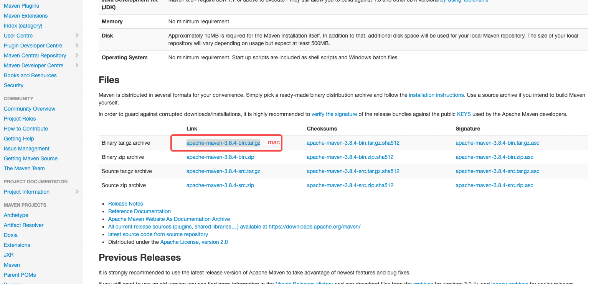
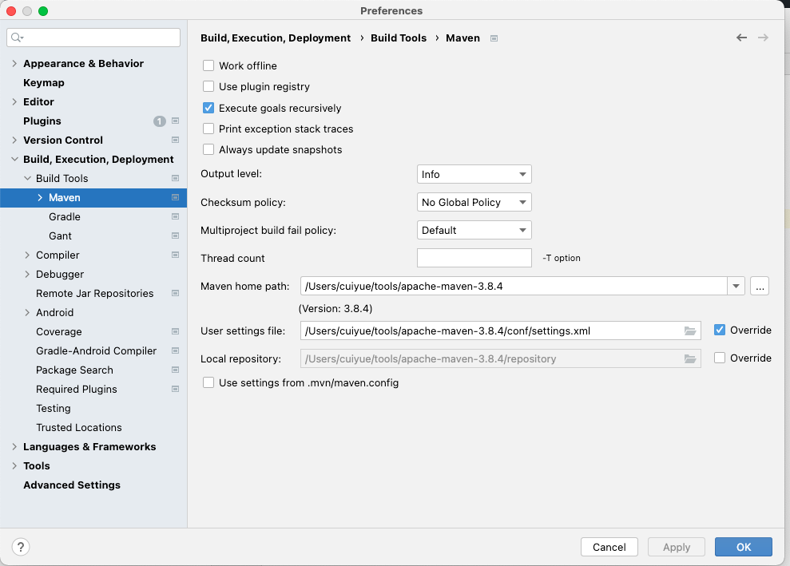

# 1、Maven 简介

## 1.1、Maven的作用

- 项目构建：提供标准的、跨平台的自动化项目构建方式
- 依赖管理：方便快捷的管理项目依赖的资源（jar包）,避免资源间的版本冲突问题
- 统一开发结构：提供标准的、统一的项目结构


## 1.2、下载&配置环境变量

### 1.2.1、下载

```shell
# 网址
https://maven.apache.org/index.html
```




### 1.2.2、环境变量

```shell
# 1.打开环境变量文件
open -e .bash_profile

# 2.增加
export M2_HOME=/Users/cuiyue/tools/apache-maven-3.8.4
export PATH=$PATH:$M2_HOME/bin

# 3.生效
source ~/.bash_profile

# 4.检查是否配置成功
mvn -v
```


### 1.2.3、 .bash_profile文件demo

```shell
# adb 
export PATH=${PATH}:/Users/cuiyue/tools/sdk/platform-tools

# java
JAVA_HOME=/Library/Java/JavaVirtualMachines/jdk1.8.0_91.jdk/Contents/Home
# JAVA_HOME=/Library/Java/JavaVirtualMachines/jdk-17.0.2.jdk/Contents/Home

PATH=$JAVA_HOME/bin:$PATH:.
CLASSPATH=$JAVA_HOME/lib/tools.jar:$JAVA_HOME/lib/dt.jar:.
export JAVA_HOME
export PATH
export CLASSPATH

# maven 
export M2_HOME=/Users/cuiyue/tools/apache-maven-3.8.4
export PATH=$PATH:$M2_HOME/bin
```


# 2、基础概念

## 2.1、仓库

仓库：

​		用于存储资源，包含各种jar包

仓库分类：

- 本地仓库：自己电脑上存储资源的仓库，连接远程仓库获取资源
- 远程仓库：非本机电脑上的仓库，为本地仓库提供资源
  - 中央仓库：Maven团队维护，存储所有资源的仓库
  - 私服：部分/公司范围内部存储的仓库，从中央仓库获取资源

## 2.2、坐标

坐标：

​		Maven中的坐标用于描述仓库中资源的位置

Maven坐标主要组成

- groupId：定义当前Maven项目隶属于组织的名称（通常是域名反写，例如：org.mybatis）
- artifactId：定义当前Maven项目名称（通常是模块名称，例如CRM、SMS）
- Version：定义当前版本号

查询 jar 包在maven仓库地址：

```shel
https://mvnrepository.com/
```

## 2.3、配置maven


### 2.3.1、配置本地仓库

如果不配置的话，以后下载的jar包都存在 /Users/cuiyue/.m2 ，不太好，需要配置一下仓库路径

```shell
# 1.打开maven配置文件
/Users/cuiyue/tools/apache-maven-3.8.4/conf/settings.xml

# 2.在解压后的maven目录下创建一个专门存放下载文件夹repository

# 2.设置自定义仓库位置
<localRepository>/Users/cuiyue/tools/apache-maven-3.8.4/repository</localRepository>
```

###  2.3.2、配置远程仓库

配置远程镜像仓库到阿里云，方便以后下载速度提升

```shell
# 1.打开maven配置文件
/Users/cuiyue/tools/apache-maven-3.8.4/conf/settings.xml

# 2.设置远程镜像仓库
<mirrors>
    <mirror>
        <id>nexus-aliyun</id>
        <mirrorOf>central</mirrorOf>
        <name>Nexus aliyun</name>
        <url>http://maven.aliyun.com/nexus/content/groups/public</url>
    </mirror>
</mirrors>
```

### 2.3.3、配置java版本

```shell
<profiles>
    <profile>
        <id>jdk-1.8</id>  
        <activation>  
            <activeByDefault>true</activeByDefault>  
            <jdk>1.8</jdk>  
        </activation>  
        <properties>  
            <maven.compiler.source>1.8</maven.compiler.source>  
            <maven.compiler.target>1.8</maven.compiler.target>  
            <maven.compiler.compilerVersion>1.8</maven.compiler.compilerVersion>  
        </properties>
    </profile>
</profiles>
```

### 2.3.4、配置idea中maven

在idea中引用下载好的maven

1. 配置Maven home path
2. 配置User setting file
3. 配置Local repository




