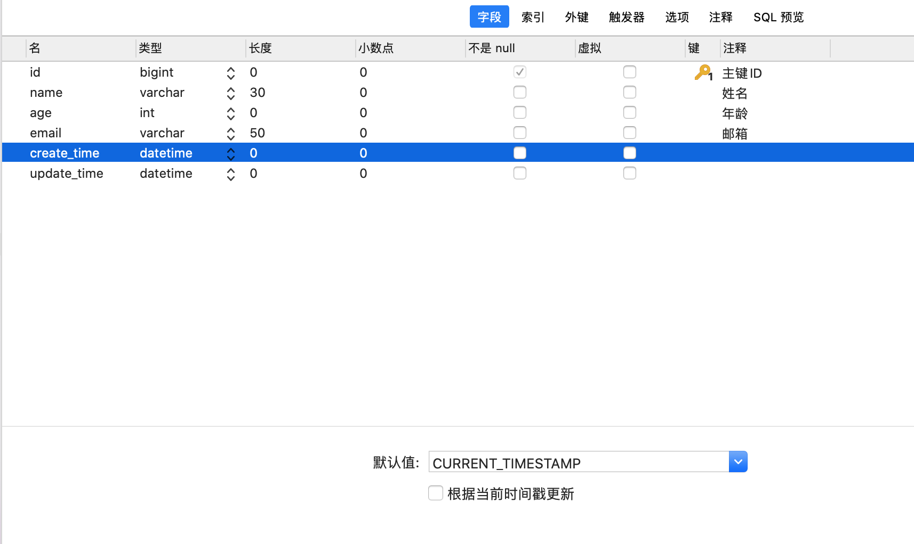
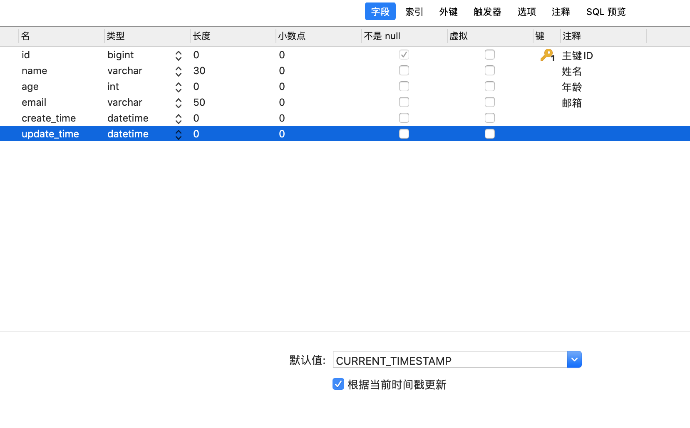
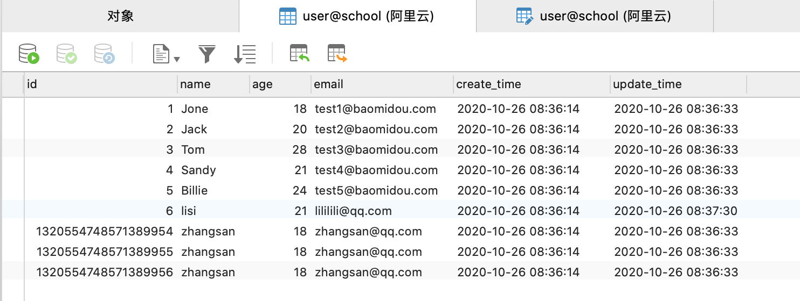
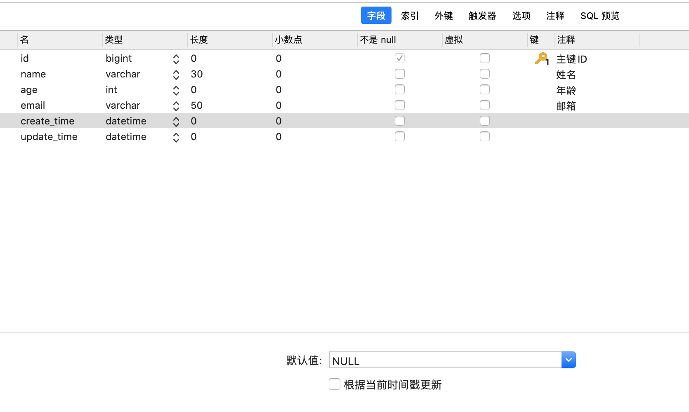
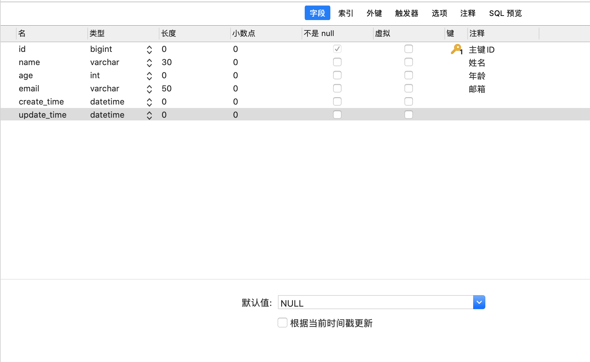
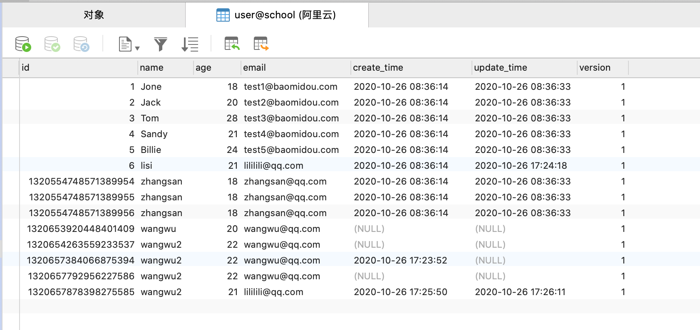
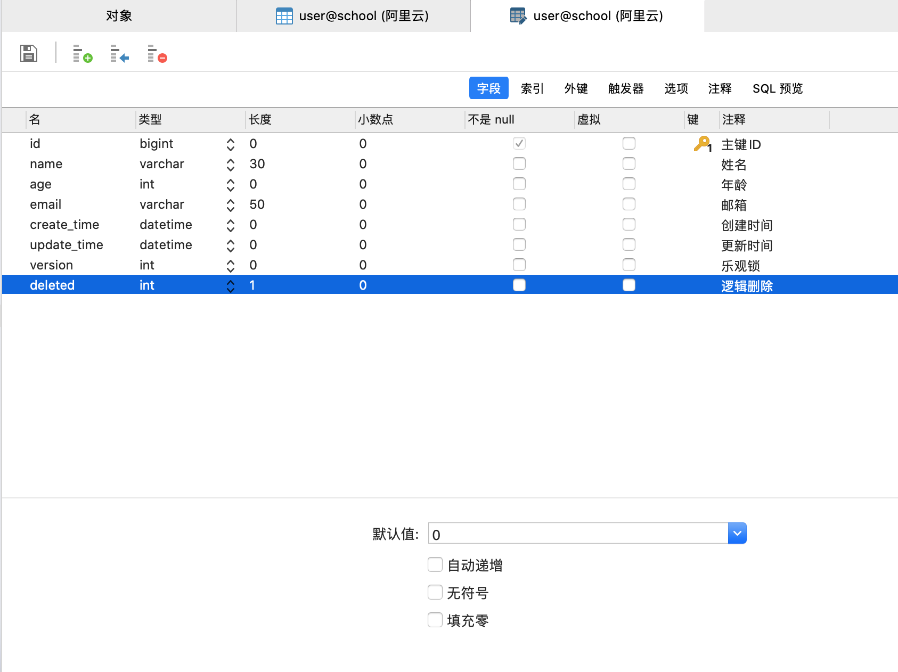
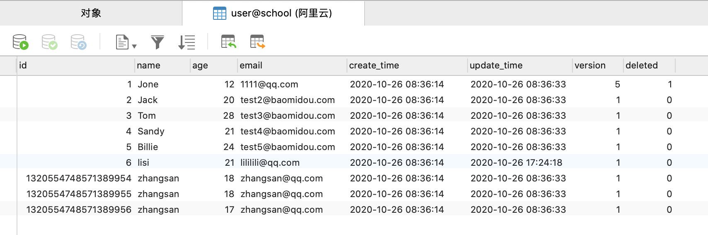

# MyBatisPlus

## 快速入门

### *准备工作：准备一张user表*

```sql
DROP TABLE IF EXISTS user;

CREATE TABLE user
(
	id BIGINT(20) NOT NULL COMMENT '主键ID',
	name VARCHAR(30) NULL DEFAULT NULL COMMENT '姓名',
	age INT(11) NULL DEFAULT NULL COMMENT '年龄',
	email VARCHAR(50) NULL DEFAULT NULL COMMENT '邮箱',
	PRIMARY KEY (id)
);

DELETE FROM user;

INSERT INTO user (id, name, age, email) VALUES
(1, 'Jone', 18, 'test1@baomidou.com'),
(2, 'Jack', 20, 'test2@baomidou.com'),
(3, 'Tom', 28, 'test3@baomidou.com'),
(4, 'Sandy', 21, 'test4@baomidou.com'),
(5, 'Billie', 24, 'test5@baomidou.com');

```

### 1、pom.xml导入依赖

```xml
        <!-- 数据库驱动 -->
        <dependency>
            <groupId>mysql</groupId>
            <artifactId>mysql-connector-java</artifactId>
            <version>8.0.22</version>
        </dependency>
        <!-- mybatis-plus -->
        <dependency>
            <groupId>com.baomidou</groupId>
            <artifactId>mybatis-plus-boot-starter</artifactId>
            <version>3.4.0</version>
        </dependency>
```

### 2、application.xml配置MySQL

```yaml
spring:
  datasource:
    username: root
    password: 123456
    url: jdbc:mysql://59.110.44.147:3306/school?serverTimezone=UTC&useUnicode=true&characterEncoding=utf-8&useSSL=false&allowPublicKeyRetrieval=true
    driver-class-name: com.mysql.cj.jdbc.Driver
```

### 3、启动类增加包扫描

```java
@SpringBootApplication
@MapperScan("com.wandata.student.mapper")
public class WanDataStudentApplication {

    public static void main(String[] args) {
        SpringApplication.run(WanDataStudentApplication.class, args);
    }

}
```

### 4、创建javabean和表中字段对应

```java
@Data
@NoArgsConstructor
@AllArgsConstructor
public class User {

    //id 对应数据库中的主键
    private Long id;
    //姓名
    private String name;
    //分数
    private Integer age;
    //邮箱
    private String email;

}
```

### 5、在该包下创建操作表的类

```java
@Repository
public interface UserMapper extends BaseMapper<User> {
}
```

### 6、测试

```java
@SpringBootTest
public class MyBatisPlusApplicationTests {

    @Autowired
    private UserMapper userMapper;

    @Test
    void test() {
        List<User> userEntities = userMapper.selectList(null);
        userEntities.forEach(System.out::println);
    }

}

// 运行test()方法，控制台输出:
User(id=1, name=Jone, age=18, email=test1@baomidou.com)
User(id=2, name=Jack, age=20, email=test2@baomidou.com)
User(id=3, name=Tom, age=28, email=test3@baomidou.com)
User(id=4, name=Sandy, age=21, email=test4@baomidou.com)
User(id=5, name=Billie, age=24, email=test5@baomidou.com)

```

## 配置日志

我们所有的SQL语句是不可见得，我们希望看到它是怎么执行的，所以要配置日志！

```yaml
mybatis-plus:
  configuration:
    log-impl: org.apache.ibatis.logging.stdout.StdOutImpl
```

再次运行上面的test()查看lOG

```verilog
JDBC Connection [HikariProxyConnection@1892062598 wrapping com.mysql.cj.jdbc.ConnectionImpl@6dc1dc69] will not be managed by Spring
==>  Preparing: SELECT id,name,age,email FROM user
==> Parameters: 
<==    Columns: id, name, age, email
<==        Row: 1, Jone, 18, test1@baomidou.com
<==        Row: 2, Jack, 20, test2@baomidou.com
<==        Row: 3, Tom, 28, test3@baomidou.com
<==        Row: 4, Sandy, 21, test4@baomidou.com
<==        Row: 5, Billie, 24, test5@baomidou.com
<==      Total: 5
Closing non transactional SqlSession [org.apache.ibatis.session.defaults.DefaultSqlSession@33956d1a]
```

## CRUD 

### insert 插入

```java
    @Test
    void testInsert() {
        //如果指定id就用指定的id,如果不指定ID，会自动生成一个id。
        User user = new User();
        user.setName("zhangsan");
        user.setAge(18);
        user.setEmail("zhangsan@qq.com");
        userMapper.insert(user);
        System.out.println(user);
    }

JDBC Connection [HikariProxyConnection@50173263 wrapping com.mysql.cj.jdbc.ConnectionImpl@5731d3a] will not be managed by Spring
==>  Preparing: INSERT INTO user ( id, name, age, email ) VALUES ( ?, ?, ?, ? )
==> Parameters: 1320554748571389954(Long), zhangsan(String), 18(Integer), zhangsan@qq.com(String)
<==    Updates: 1
Closing non transactional SqlSession [org.apache.ibatis.session.defaults.DefaultSqlSession@5b7c8930]
User(id=1320554748571389954, name=zhangsan, age=18, email=zhangsan@qq.com)
```

### 主键生成策略

> 默认 ASSIGN_ID 自3.3.0开始,默认使用雪花算法+UUID(不含中划线) 

```java
@Data
@NoArgsConstructor
@AllArgsConstructor
public class User {

    //id 对应数据库中的主键
    @TableId(type = IdType.ASSIGN_ID)
    private Long id;
    //姓名
    private String name;
    //分数
    private Integer age;
    //邮箱
    private String email;

}
```


### 雪花算法

snowflake是Twitter开源的分布式ID生成算法，结果是一个long型的ID。其核心思想是：使用41bit作为毫秒数，10bit作为机器的ID（5个bit是数据中心，5个bit的机器ID），12bit作为毫秒内的流水号（意味着每个节点在每毫秒可以产生 4096 个 ID），最后还有一个符号位，永远是0。具体实现的代码可以参看https://github.com/twitter/snowflake。

> 自增 AUTO

```java
@Data
@NoArgsConstructor
@AllArgsConstructor
public class User {

    //id 对应数据库中的主键
    @TableId(type = IdType.AUTO)
    private Long id;
    //姓名
    private String name;
    //分数
    private Integer age;
    //邮箱
    private String email;

}
```

注意，要使用自增策略，数据库字段也一定是自增，不然回报错。

> 其他策略

```java
public enum IdType {
    AUTO  // 数据库id自增
    NONE  // 未设置主键
    INPUT // 手动输入
}
```

### 更新操作

更新一个字段

```java
    @Test
    void testUpdate() {
        User user = new User();
        user.setId(6L);
        user.setAge(21);
        userMapper.updateById(user);
    }

JDBC Connection [HikariProxyConnection@2124360754 wrapping com.mysql.cj.jdbc.ConnectionImpl@19e0dffe] will not be managed by Spring
==>  Preparing: UPDATE user SET age=? WHERE id=?
==> Parameters: 21(Integer), 6(Long)
<==    Updates: 1
Closing non transactional SqlSession [org.apache.ibatis.session.defaults.DefaultSqlSession@5981f4a6]
```

更新两个字段

```java
    @Test
    void testUpdate() {
        User user = new User();
        user.setId(6L);
        user.setAge(21);
        user.setEmail("lili@qq.com");
        userMapper.updateById(user);
    }
JDBC Connection [HikariProxyConnection@1892062598 wrapping com.mysql.cj.jdbc.ConnectionImpl@6dc1dc69] will not be managed by Spring
==>  Preparing: UPDATE user SET age=?, email=? WHERE id=?
==> Parameters: 21(Integer), lili@qq.com(String), 6(Long)
<==    Updates: 1
Closing non transactional SqlSession [org.apache.ibatis.session.defaults.DefaultSqlSession@54db056b]
```

会发现执行的SQL语句是动态拼接的！

### 自动填充

阿里巴巴开发手册里面：所有的数据库表中要有create_time（创建数据的时间）、update_time（修改字段的时间）这个两个字段。而这两个字段赋值都是自动完成的。我们不希望收到操作。

> 方式一、数据库级别（不建议使用）

1、在表中新增字段create_time



2、在表中增加update_time，并且勾选根据时间戳更新



3、对应实体bean增加对应的字段

```java
@Data
@NoArgsConstructor
@AllArgsConstructor
public class User {

    //id 对应数据库中的主键
    @TableId(type = IdType.ASSIGN_ID)
    private Long id;
    //姓名
    private String name;
    //分数
    private Integer age;
    //邮箱
    private String email;
    //创建时间
    private LocalDateTime createTime;
    //更新时间
    private LocalDateTime updateTime;
    
}
```

4.执行一个更新操作,查看数据库




> 方式二、代码级别

1、删除数据库的默认值、更新操作！





2、对应实体类上增加注解

```java
@Data
@NoArgsConstructor
@AllArgsConstructor
public class User {

    //id 对应数据库中的主键
    @TableId(type = IdType.ASSIGN_ID)
    private Long id;
    //姓名
    private String name;
    //分数
    private Integer age;
    //邮箱
    private String email;
    //创建时间
    @TableField(fill = FieldFill.INSERT)
    private LocalDateTime createTime;
    //更新时间
    @TableField(fill = FieldFill.INSERT_UPDATE)
    private LocalDateTime updateTime;

}
```

3、编写处理器

```java
@Slf4j
@Component
public class MyMetaObjectHandler implements MetaObjectHandler {

    @Override
    public void insertFill(MetaObject metaObject) {
        log.info("start insert fill ....");
        this.strictInsertFill(metaObject, "createTime", LocalDateTime.class, LocalDateTime.now());
    }

    @Override
    public void updateFill(MetaObject metaObject) {
        log.info("start update fill ....");
        this.strictUpdateFill(metaObject, "updateTime", LocalDateTime.class, LocalDateTime.now());
    }
}
```

4、测试插入和更新发现结果也OK

### 乐观锁

> 乐观锁：顾名思义十分乐观，它总是认为不会出现问题，无论做什么都不会上锁。如果出现问题，再次更新值测试，当要更新一条记录的时候，希望这条记录没有被别人更新。
>
> 悲观锁：顾名思义十分悲观，它总是认为总是出现问题，无论做什么都会上锁后再操作。

乐观锁实现方式：

- 取出记录时，获取当前version
- 更新时，带上这个version
- 执行更新时， set version = newVersion where version = oldVersion
- 如果version不对，就更新失败

```sql
乐观锁：1、先查询版本号 version=1
-- A线程执行
update user set name = 'zhangsan',version = version + 1
where id = 2 and version = 1;

-- B线程抢先执行，这时候version = 2，会导致A修改失败
update user set name = 'zhangsan',version = version + 1
where id = 2 and version = 1;
```

1、给数据库中增加一个 int 类型默认值为 1 的version 字段。



2、对应的实体类对象增加字段和注解

```java
@Data
@NoArgsConstructor
@AllArgsConstructor
public class User {

    //id 对应数据库中的主键
    @TableId(type = IdType.ASSIGN_ID)
    private Long id;
    //姓名
    private String name;
    //分数
    private Integer age;
    //邮箱
    private String email;
    //创建时间
    @TableField(fill = FieldFill.INSERT)
    private LocalDateTime createTime;
    //更新时间
    @TableField(fill = FieldFill.INSERT_UPDATE)
    private LocalDateTime updateTime;
    //乐观锁
    @Version
    private Integer version;
    
}
```

3、配置类

```java
@EnableTransactionManagement
@MapperScan("com.wandata.student.mapper")
@Configuration
public class MyBatisPlusConfig {

    @Bean
    public MybatisPlusInterceptor mybatisPlusInterceptor() {
        MybatisPlusInterceptor interceptor = new MybatisPlusInterceptor();
        interceptor.addInnerInterceptor(new OptimisticLockerInnerInterceptor());
        return interceptor;
    }

}
```

4、测试

```java
    /**
     * 测试乐观锁成功
     */
    @Test
    void testOptimisticLocker1() {
        User user = userMapper.selectById(1L);
        user.setAge(12);
        user.setEmail("4562@qq.com");
        userMapper.updateById(user);
    }

    /**
     * 测试乐观锁成功失败
     */
    @Test
    void testOptimisticLocker2() {
        //线程1执行
        User user = userMapper.selectById(1L);
        user.setAge(12);
        user.setEmail("1111@qq.com");

        //线程2插队执行
        User user2 = userMapper.selectById(1L);
        user2.setAge(13);
        user2.setEmail("2222@qq.com");
        userMapper.updateById(user2);

        //线程1再更新就会失败
        userMapper.updateById(user);
    }
```


###  查询操作

```java
    /**
     * 查询单个用户
     */
    @Test
    void testSelectById() {
        User user = userMapper.selectById(1L);
        System.out.println(user);
    }

    /**
     * 查询多个用户
     */
    @Test
    void testSelectBatchIds() {
        ArrayList<Integer> userIds = new ArrayList<>();
        userIds.add(1);
        userIds.add(2);
        userIds.add(3);
        List<User> users = userMapper.selectBatchIds(userIds);
        users.forEach(System.out::println);
    }

    /**
     * 条件查询
     */
    @Test
    void testSelectByMap() {
        HashMap<String, Object> hashMap = new HashMap<>();
        hashMap.put("name", "zhangsan");
        hashMap.put("age", 17);
        List<User> users = userMapper.selectByMap(hashMap);
        users.forEach(System.out::println);
    }
```

### 分页查询

1、配置拦截器

```java
@EnableTransactionManagement
@MapperScan("com.wandata.student.mapper")
@Configuration
public class MyBatisPlusConfig {

    @Bean
    public MybatisPlusInterceptor mybatisPlusInterceptor() {
        MybatisPlusInterceptor interceptor = new MybatisPlusInterceptor();
        //乐观锁插件
        interceptor.addInnerInterceptor(new OptimisticLockerInnerInterceptor());
        //分页插件
        interceptor.addInnerInterceptor(new PaginationInnerInterceptor(DbType.MYSQL));
        return interceptor;
    }

}

```

2、直接使用page对象即可

```java
    /**
     * 分页查询
     */
    @Test
    void testPage() {
        //当前页，从1开始
        int currentPage = 1;
        //一页显示多少条
        int pageSize = 5;
        Page<User> page = new Page<>(currentPage, pageSize);
        Page<User> userPage = userMapper.selectPage(page, null);
        long total = userPage.getTotal();
        List<User> userList = userPage.getRecords();
        System.out.println("total--->" + total);
        userList.forEach(System.out::println);
    }

```


### 删除操作

```java
    /**
     * 单个删除
     */
    @Test
    void testDeleteById() {
        userMapper.deleteById(1320657878398275585L);

    }

    /**
     * 批量删除
     */
    @Test
    void testDeleteBatchIds() {
        ArrayList<Long> userIds = new ArrayList<>();
        userIds.add(1320657792956227586L);
        userIds.add(1320657384066875394L);
        userIds.add(1320654263559233537L);
        userMapper.deleteBatchIds(userIds);
    }

    /**
     * 条件删除
     */
    @Test
    void testDeleteByMap() {
        HashMap<String, Object> hashMap = new HashMap<>();
        hashMap.put("name", "wangwu");
        hashMap.put("age", 20);
        userMapper.deleteByMap(hashMap);
    }
```

### 逻辑删除

> 物理删除：从数据库中直接移出
>
> 逻辑删除：在数据库中没有被移出，而是通过一个变量让它失效

1、数据库中增加int 长度1，默认值为0，字段名为deleted的字段




2、对应实体类上增加字段注解

```java
@Data
@NoArgsConstructor
@AllArgsConstructor
public class User {

    //id 对应数据库中的主键
    @TableId(type = IdType.ASSIGN_ID)
    private Long id;
    //姓名
    private String name;
    //分数
    private Integer age;
    //邮箱
    private String email;
    //创建时间
    @TableField(fill = FieldFill.INSERT)
    private LocalDateTime createTime;
    //更新时间
    @TableField(fill = FieldFill.INSERT_UPDATE)
    private LocalDateTime updateTime;
    //乐观锁
    @Version
    private Integer version;
    //逻辑删除
    @TableLogic
    private Integer deleted;
}
```

3、进行测试

```java
    /**
     * 单个删除
     */
    @Test
    void testDeleteById() {
        userMapper.deleteById(1L);
    }

    /**
     * 查询所有
     */
    @Test
    void test() {
        List<User> userEntities = userMapper.selectList(null);
        userEntities.forEach(System.out::println);
    }

```

先进行删除操作，再进行查询操作。表面上是已经删除成功，并且查询不到了。但是通过观察数据库发现数据还在，只是deleted的值从0修改为了1




## 条件构造器

```java
    @Test
    void testWrapper1() {
        //查询name不为空，邮箱不为空，年龄大于等于12的用户
        QueryWrapper<User> wrapper = new QueryWrapper<>();
        wrapper.isNotNull("name").isNotNull("email").ge("age", 12);
        List<User> userList = userMapper.selectList(wrapper);
        userList.forEach(System.out::println);
    }

    @Test
    void testWrapper2() {
        //查询name是张三的用户
        QueryWrapper<User> wrapper = new QueryWrapper<>();
        wrapper.eq("name", "zhangsan");
        User user = userMapper.selectOne(wrapper);
        System.out.println(user);
    }

    @Test
    void testWrapper3() {
        //查询年龄在 20 ~ 30 之间的用户有几人
        QueryWrapper<User> wrapper = new QueryWrapper<>();
        wrapper.between("age", 20, 30);
        Integer count = userMapper.selectCount(wrapper);
        System.out.println("20 ~ 30 之间的用户有: " + count + " 人");
    }

    @Test
    void testWrapper4() {
        //模糊查询，查询名字不包含 'e' ，邮箱是 'z' 开头的用户
        QueryWrapper<User> wrapper = new QueryWrapper<>();
        wrapper.notLike("name", "e").likeRight("email", "z");
        List<User> userList = userMapper.selectList(wrapper);
        userList.forEach(System.out::println);
    }

    @Test
    void testWrapper5() {
        //通过id 进行排序
        QueryWrapper<User> wrapper = new QueryWrapper<>();
        wrapper.orderByDesc("id");
        List<User> userList = userMapper.selectList(wrapper);
        userList.forEach(System.out::println);
    }
```


