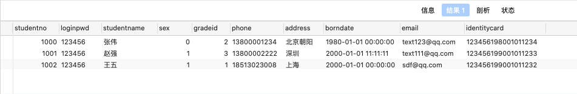
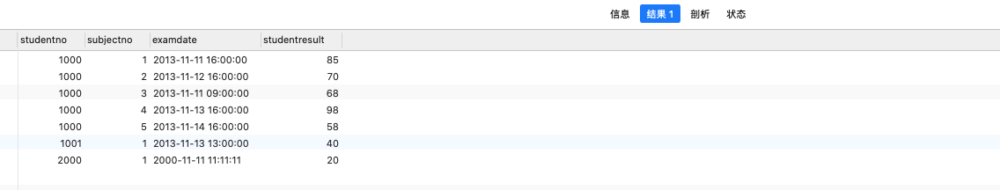
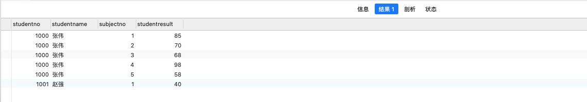
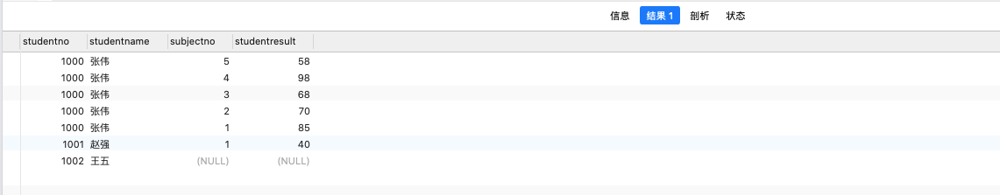
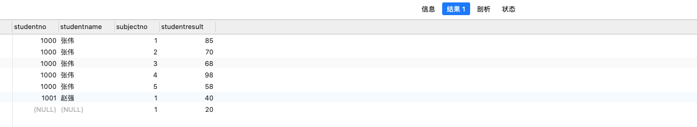
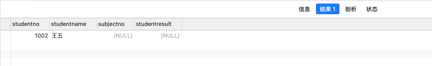
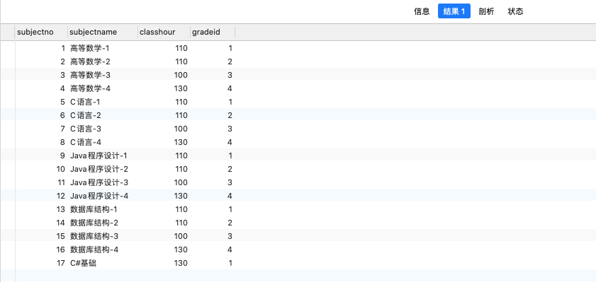
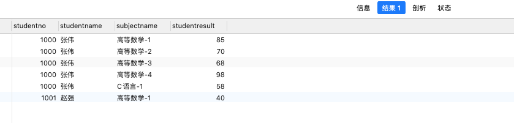
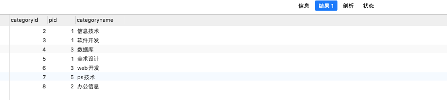
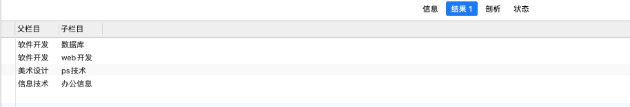

# 1、初识MySQL

## 1.1、数据库分类

**关系型数据库：（SQL）**

- MySQL，Oracle，Sql Server，Db2，SQLite
- 通过表和表之间，行和列之间的关系进行数据的存储

**非关系型数据库 ：（NoSQL）**

- Redis，MongDB
- 非关系型数据库，对象存储，通过对象的自身属性来决定

## 1.2、数据库 xxx 语言

- DDL 定义
- DML 操作
- DQL 查询
- DCL 控制

## 1.3、使用Navicat Premium注意事项

**创建库:**

Character Set （字符编码）: **utf8** 

Collation（排序规则）: **utf8_general_ci**

**创建表:**

引擎：**InnoDB**

Character Set （字符编码）: **utf8** 

Collation（排序规则）: **utf8_general_ci**

## 1.4、在物理空间存在的位置

所有的数据库文件都存在 data 目录下

## 1.5、命令

```shell
# 连接数据库
mysql -h 59.110.44.147 -P 3306 -u root -p123456
mysql: [Warning] Using a password on the command line interface can be insecure.
Welcome to the MySQL monitor.  Commands end with ; or \g.
Your MySQL connection id is 20
Server version: 8.0.21 MySQL Community Server - GPL

Copyright (c) 2000, 2020, Oracle and/or its affiliates. All rights reserved.

Oracle is a registered trademark of Oracle Corporation and/or its
affiliates. Other names may be trademarks of their respective
owners.

Type 'help;' or '\h' for help. Type '\c' to clear the current input statement.

# 查看所有数据库
mysql> show databases;
+--------------------+
| Database           |
+--------------------+
| information_schema |
| mysql              |
| performance_schema |
| school             |
| sys                |
+--------------------+
5 rows in set (0.01 sec)

# 使用某一个数据库
mysql> use school;
Reading table information for completion of table and column names
You can turn off this feature to get a quicker startup with -A

Database changed

# 查看表
mysql> show tables;
+------------------+
| Tables_in_school |
+------------------+
| student          |
+------------------+
1 row in set (0.01 sec)

# 查看表信息
mysql> describe student;
+-------+--------------+------+-----+---------+-------+
| Field | Type         | Null | Key | Default | Extra |
+-------+--------------+------+-----+---------+-------+
| id    | int          | NO   |     | NULL    |       |
| name  | varchar(255) | YES  |     | NULL    |       |
| age   | int          | YES  |     | NULL    |       |
+-------+--------------+------+-----+---------+-------+
3 rows in set (0.01 sec)

# 创建数据库
mysql> create database westos;
Query OK, 1 row affected (0.01 sec)
```

# 2、操作数据库

注意:

- 以下内容 [ ] 里面内容可以省略
- 如果表名或者字段名字是特殊字符，需要带上 ``

## 2.1、操作数据库

1、创建数据库

```sql
CREATE DATABASE [IF NOT EXISTS] westos;
```

2、删除数据库

```sql
DROP DATABASE [IF EXISTS] westos;
```

3、使用数据库

```sql
USE `school`;
```

4、查看数据库

```sql
SHOW DATABASES;
```

## 2.2、数据库列类型

> 数值

- tinyint				十分小的数据 				   1个字节
- smallint          较小的数据                     2个字节
- mediumint     中等大小的数据             3个字节
- int                   标准的整数                     4个字节（常用）
- bigint              较大的数据                     8个字节
- float                浮点数                             4个字节
- double            浮点数                             8个字节
- decimal          字符串形式的浮点数     金融计算时候使用

> 字符串

- char                 字符串固定大小的        0~255个字节
- varchar            可变字符串                    0~65535个字节（常用）
- tinytext            微型文本                        2^8 -1个字节
- text                  文本串                            2^16-1个字节  （常用）

> 时间日期

- date				    YYYY-MM-DD                    日期格式
- time                 HH:mm:ss                       时间格式
- datetime         YYYY-MM-DD HH:mm:ss  日期加时间（常用）
- timestamp                                              时间戳，1970.1.1到现在的毫秒数
- year                                                         表示年份

> NULL

-   没有值，未知
- ==注意：不要使用NULL进行运算，结果为NULL==

## 2.3、数据库字段属性

==UNSIGNED==

- 无符号的整数
- 声明了该属性，该字段不能为负数

==ZEROFILL==

- 0填充的，不足的位数，使用0来填充
- 举例:    int(3),     5 ----> 005

==自增==

- 自动在上一条的基础上+1（默认）
- 通常来设置唯一的主键 index,必须是整数类型
- 可以自定义设计主键自增的起始值和步长

==非空==

- 设置为not null ,如果不给它赋值，就会报错
- 设置为null,如果不给它赋值，默认就是null

==默认==

- 设置默认的值，,如果不给它赋值，就是给的默认值

##  2.4、创建数据库表

```sql
-- 目标：创建一个学生表
-- 学号int 登录密码varchar(20) 姓名，性别varchar(2)，出生日期datatime，家庭住址，email
-- 注意点，表的名称和字段尽量用 `` 括起来
-- AUTO_INCREMENT 自增
-- 字符串使用'' 括起来
-- 所有的语句后面加 , 最后一条不加
-- PRIMARY KEY 主键，一般一个表只有一个唯一主键
CREATE TABLE IF NOT EXISTS `student`(
	`id` INT(4) NOT NULL AUTO_INCREMENT COMMENT '学号',
	`name` VARCHAR(20) NOT NULL DEFAULT '匿名' COMMENT '姓名',
	`pwd` VARCHAR(20) NOT NULL DEFAULT '123456' COMMENT '密码',
	`sex` VARCHAR(2) NOT NULL DEFAULT '男' COMMENT '性别',
	`birthday` DATETIME DEFAULT NULL COMMENT '出生日期',
	`address` VARCHAR(100) DEFAULT NULL COMMENT '家庭住址',
	`email` VARCHAR(50) DEFAULT NULL COMMENT '邮箱',
	PRIMARY KEY(`id`)
)ENGINE=INNODB DEFAULT CHARSET=utf8
```

格式

```sql
CREATE TABLE [IF NOT EXISTS] `表名`(
	`字段名` 列类型 [属性] [索引] [注释],
 	`字段名` 列类型 [属性] [索引] [注释],
	...
  `字段名` 列类型 [属性] [索引] [注释]
)[表类型][字符集设置][注释]
```

常用命令

```sql
-- 查看创建数据库的语句
SHOW CREATE DATABASE school;
-- 查看创建表的语句
SHOW CREATE TABLE student;
-- 查看表结构
DESC student;
```

## 2.5、数据表的类型和字符集编码

> ENGINE类型

```sql
ENGINE=INNODB
```

==INNODB==

- 默认使用

==MYISAM==

- 早些年使用

|            | INNODB        | MYISAM |
| ---------- | :------------ | ------ |
| 事务支持   | 支持          | 不支持 |
| 数据行锁定 | 支持          | 不支持 |
| 外键约束   | 支持          | 不支持 |
| 全文索引   | 不支持        | 支持   |
| 表空间大小 | 较大，约为2倍 | 较小   |

常规使用操作：

- INNODB 安全性能高，事务的处理，多表多用户操作
- MYISAM 节约空间，速度较快

> 表的字符集编码

```sql
CHARSET=utf8
```

不设置的话，会是mysql默认的字符集编码Latin1 不支持中文


## 2.6、修改删除表

> 修改

```sql
-- 修改表名
-- ALTER TABLE 旧表名 RENAME AS 新表名
ALTER TABLE teacher1 RENAME AS teacher3;
-- 增加表字段 
-- ALTER TABLE 表名 ADD 字段名 字段类型
ALTER TABLE teacher3 ADD age INT(3);
-- 修改表字段(重命名)
-- ALTER TABLE 表名 CHANGE 旧字段名 新字段名 新字段类型
ALTER TABLE teacher3 CHANGE age age1 INT(1);
-- 修改表字段(修改字段类型)
-- ALTER TABLE 表名 MODIFY 字段名 字段类型
ALTER TABLE teacher3 MODIFY age1 VARCHAR(3);
-- 删除表的字段
-- ALTER TABLE 表名 DROP 字段名 
ALTER TABLE teacher3 DROP age1; 
```

> 删除

```sql
-- 删除表
DROP TABLE IF EXISTS teacher3;
```


# 3、MySQL数据管理

## 3.1、外键

> 方式一、创建表的时候，增加约束

```sql
-- 年级表(主表)
CREATE TABLE IF NOT EXISTS `grade`(
	`gradeid` INT(4) NOT NULL AUTO_INCREMENT COMMENT '年级id',
	`gradename` VARCHAR(20) NOT NULL COMMENT '年级名称',
	PRIMARY KEY(`gradeid`)
)ENGINE=INNODB DEFAULT CHARSET=utf8

-- 学生表(从表)
-- gradeid 字段引用年级表的 gradeid 字段 定义外键key
-- 给这个外键添加约束 (执行引用) REFERENCES
CREATE TABLE IF NOT EXISTS `student`(
	`id` INT(4) NOT NULL AUTO_INCREMENT COMMENT '学号',
	`name` VARCHAR(20) NOT NULL DEFAULT '匿名' COMMENT '姓名',
	`gradeid` INT(4) NOT NULL COMMENT '年级id',
	PRIMARY KEY(`id`),
	KEY `FK_gradeid`(`gradeid`),
	CONSTRAINT `FK_gradeid` FOREIGN KEY (`gradeid`) REFERENCES `grade`(`gradeid`)
)ENGINE=INNODB DEFAULT CHARSET=utf8
```

> 方式二、先创建2张没有约束的普通表，再增加约束

```sql
-- 年级表
CREATE TABLE IF NOT EXISTS `grade`(
	`gradeid` INT(4) NOT NULL AUTO_INCREMENT COMMENT '年级id',
	`gradename` VARCHAR(20) NOT NULL COMMENT '年级名称',
	PRIMARY KEY(`gradeid`)
)ENGINE=INNODB DEFAULT CHARSET=utf8

-- 学生表
CREATE TABLE IF NOT EXISTS `student`(
	`id` INT(4) NOT NULL AUTO_INCREMENT COMMENT '学号',
	`name` VARCHAR(20) NOT NULL DEFAULT '匿名' COMMENT '姓名',
	`gradeid` INT(4) NOT NULL COMMENT '年级id',
	PRIMARY KEY(`id`)
)ENGINE=INNODB DEFAULT CHARSET=utf8

-- 增加外键约束
ALTER TABLE `student` ADD CONSTRAINT `fk_gradeid` FOREIGN KEY(`gradeid`) REFERENCES `grade`(`gradeid`);
```

以上操作都是物理外键，数据库级别的外键，我们不建议使用。删除的时候，需要先删除从表，才能删除主表!

==最佳实践：==

- 数据库就是单纯的表，只用来存数据，只有行（数据）和列（字段）
- 我们想使用多张表，使用外键用程序去实现

## 3.2、DML语言

DML 语言：数据库操作语言

- insert
- update
- delete

## 3.3、添加

> INSERT

```sql
-- 格式
INSERT INTO 表名([字段名1,字段名2...]) VALUES(字段1的值,字段2的值...)

-- 添加一条记录
INSERT INTO grade(`gradeid`,`gradename`) VALUES(1,'大一');
-- 批量添加
INSERT INTO grade(`gradeid`,`gradename`) VALUES(2,'大二'),(3,'大三');
```

## 3.4、修改

> UPDATE

```sql
-- 修改一个字段
UPDATE student SET `name`='李四' WHERE id = 1;
-- 修改多个字段
UPDATE student SET `name`='王五',pwd=111111 WHERE id = 1;
-- 修改id1到3的数据
UPDATE student SET `name`='王五1',pwd=111111 WHERE id BETWEEN 1 AND 3;
-- 修改2个条件都要成立
UPDATE student SET `name`='王五3',pwd=111111 WHERE id = 1 AND `name`='王五1';
-- 修改某一个条件成立
UPDATE student SET `name`='王五3',pwd=111111 WHERE id = 1 OR `name`='王五1';
-- 使用变量赋值
UPDATE student SET `birthday`= CURRENT_TIME WHERE id = 1;
```

条件: where 语句 运算符 等于某个值，大于某个值，在某个区间修改

| 操作符               | 含义                    | 范围        | 结果  |
| -------------------- | ----------------------- | ----------- | ----- |
| =                    | 等于                    | 5=6         | false |
| <> 或者 !=           | 不等于                  | 5<>6        | true  |
| >                    |                         |             |       |
| <                    |                         |             |       |
| <=                   |                         |             |       |
| >=                   |                         |             |       |
| BETWEEN ...  AND ... | 在某个范围之内          | [1,3]       |       |
| AND                  | 并且， 相当于java的 &&  | 5>1 AND 1>2 | false |
| OR                   | 或者，相当于java的 \|\| | 5>1 OR 1>2  | true  |

```sql
--语法
UPDATE 表名 SET 字段名=值 WHERE 条件
```

注意:

- 如果不加条件，所有数据都会修改!
- 值，可以是一个具体的值，也可以是一个变量

## 3.5、删除

> DELETE

```sql
-- 删除所有数据
DELETE FROM `student`;
-- 删除指定数据
DELETE FROM `student` WHERE id = 1;
```

> TRUNCATE

```sql
-- 删除所有数据
TRUNCATE `student`;
```

delete 和 TRUNCATE 的区别

- 相同点：都能删除数据，都不会删除表结构
- 不同点:
  - TRUNCATE 重新设置自增列，计数器会归零
  - TRUNCATE 不会影响事务


# 4、DQL查询数据

## 4.1、SELECT完整语法

```sql
SELECT [ALL | DISTINCT]
{*|talbe.*|[table.]field1[AS alias1][,[table.]field2[AS alias2][,…]]}
FROM table_name [as table_alias]
	[left | right | inner join table_name2] -- 联合查询
	[WHERE ...]	-- 指定结果满足条件
	[GROUP BY ...]-- 指定结果按照哪几个字段来分组
	[HAVING ...] -- 过滤分组的记录必须满足的条件
	[ORDER BY…] -- 指定查询记录按一个或者多个条件排序
	[LIMIT {[offest,]row_count | row_countOFFSET offset}]	-- 分页查询
-- 注意：[]括号代表可选的，{}括号代表必选
```

## 4.2、查询指定字段

```sql
--格式： SELECT 字段... FROM 表名;

-- 查询全部的学生 
SELECT * FROM student;

-- 查询指定字段
SELECT studentno,studentname FROM student;

-- 别名，给结果起一个名字， AS 可以给字段起别名，也可以给表起别名
SELECT studentno AS 学号,studentname AS 学生姓名 FROM student AS s;

-- 函数
SELECT CONCAT('姓名:',studentname) AS 学生姓名 FROM student;
```

> 去重 DISTINCT

作用：去除SELECT查询出来结果数据的重复数据，只显示一条

```sql
-- 查询一下那些同学参加了考试成绩
SELECT * FROM result; -- 查询全部的考试成绩
SELECT studentno FROM result; -- 查询有那些同学参加考试
SELECT DISTINCT studentno FROM result; -- 发现重复数据，去重
```

> 数据库的列（表达式）

```sql
-- 查询MySQL版本
SELECT VERSION();
-- 用来计算
SELECT 100*3-1 AS 计算结果;
-- 查询自增的步长
SELECT @@auto_increment_increment;
-- 学生考试成绩+1分查看
SELECT studentno,studentresult+1 AS 提分后 FROM result; 
```

==数据库中的表达式：文本值，列，NULL，函数，计算表达式，系统变量==

SELECT ==表达式== FROM 表

## 4.3、where 条件字句

作用：检索数据中符合条件的值

搜索的条件由一个或者多个表达式组成，结果布尔值

> 逻辑运算符

| 运算符          | 语法                          | 描述                           |
| --------------- | ----------------------------- | ------------------------------ |
| and      &&     | a and b            a && b     | 逻辑与，两个都为真，结果为真   |
| or         \|\| | a or b               a \|\| b | 逻辑或，其中一个为真，结果为真 |
| NOT     !       | not a                ! a      | 逻辑非，真为假，假为真         |

```sql
-- ========= WHERE =========
SELECT studentno,studentresult FROM result;

-- 查询考试成绩在95~100分之间
-- 方式一 AND
SELECT studentno,studentresult FROM result WHERE studentresult>=95 AND studentresult<=100
-- 方式二 &&
SELECT studentno,studentresult FROM result WHERE studentresult>=95 && studentresult<=100
-- 方式三 模糊查询(区间)
SELECT studentno,studentresult FROM result WHERE studentresult BETWEEN 95 AND 100;

-- 查询除了1000学号学生之外的同学成绩
-- 方式一 != 
SELECT studentno,studentresult FROM result WHERE studentno != 1000;
-- 方式二 NOT
SELECT studentno,studentresult FROM result WHERE NOT studentno = 1000;
```

> 模糊查询：比较运算符

| 运算符      | 语法                | 描述                                          |
| ----------- | ------------------- | --------------------------------------------- |
| IS NULL     | a is null           | 如果操作符为NULL,结果为真                     |
| IS NOT NULL | a is not null       | 如果操作符不为NULL,结果为真                   |
| BETWEEN     | a BETWEEN b and c   | 如果 a 在 b 和 c 之间，结果为真               |
| **Like**    | a like b            | SQL匹配，如果a匹配b,结果为真                  |
| **in**      | a in (a1,a2,a3....) | 如果a在a1,或者a2...其中的某一个值中，结果为真 |

```sql
-- ========= like =========
-- 查询姓张的学生 % 代表0到任意个字符
SELECT studentno,studentname FROM student WHERE studentname LIKE '张%';
-- 查询姓张的学生,名字后面只有一个字 _ 代表一个字符
SELECT studentno,studentname FROM student WHERE studentname LIKE '张_';
-- 查询姓张的学生,名字后面只有两个字 _ 代表一个字符
SELECT studentno,studentname FROM student WHERE studentname LIKE '张__';
-- 查询姓名中有'三'字的学生
SELECT studentno,studentname FROM student WHERE studentname LIKE '%三%';

-- ========= in =========
-- 查询 1000,1001 号学生
SELECT studentno,studentname FROM student WHERE studentno IN (1000,1001);

-- ========= null not null =========
SELECT * FROM student;
-- 查询地址为空的学生
SELECT * FROM student WHERE address  = '' OR address IS NULL;
-- 查询生日为空的学生
SELECT * FROM student WHERE borndate IS NULL;
-- 查询生日不为空的学生
SELECT * FROM student WHERE borndate IS NOT NULL;
```

## 4.4、联表查询

> JOIN 对比


**查询参加考试的学生信息：（学号，姓名，科目编号，分数）**

这里面用到了==两==张表学生表和成绩表:

学生表有：	学号：studentno，姓名：studentname 

成绩表有：	学号：studentno，科目编号：subjectno，分数：studentresult

查询学生表

```sql
SELECT * FROM student;
```



查询成绩表

```sql
SELECT * FROM result;
```



学生表里面有学号为1000张伟，1001赵强，1002王五，三名学生

成绩表里面学号1000的学生参加了5场考试，学号1001的学生参加了1场考试。学号2000的学生参加了1场考试。

==注意：学生表里面的1002号王五没有参加考试。成绩表中有个2000学号不在学生表里面的陌生人参加了考试。==

> 内连接 INNER JOIN（取两张表的交集部分）

```sql
SELECT s.studentno,s.studentname,r.subjectno,r.studentresult 
FROM student AS s 
INNER JOIN result AS r 
ON s.studentno = r.studentno;
```



> 左连接 LEFT JOIN（返回左表所有的值，即使右表中没有匹配，没有匹配的值用NULL表示）

```sql
SELECT s.studentno,s.studentname,r.subjectno,r.studentresult 
FROM student AS s 
LEFT JOIN result AS r 
ON s.studentno = r.studentno;
```



> 右连接 RIGHT JOIN（返回右表所有的值，即使左表中没有匹配，没有匹配的值用NULL表示）

```sql
SELECT s.studentno,s.studentname,r.subjectno,r.studentresult 
FROM student AS s 
RIGHT JOIN result AS r 
ON s.studentno = r.studentno;
```



> 左连接-某列不为NULL时（返回左表独有的数据，即使右表中没有匹配，没有匹配的值用NULL表示）

```sql
SELECT s.studentno,s.studentname,r.subjectno,r.studentresult 
FROM student AS s 
LEFT JOIN result AS r 
ON s.studentno = r.studentno
WHERE r.studentno IS NULL;
```



**查询参加考试的学生信息：学号，学生姓名，科目名，分数**

这里面用到了==三==张表：学生表、成绩表、以及学科表：

学生表有：	学号：studentno，姓名：studentname 

成绩表有：	学号：studentno，科目编号：subjectno，分数：studentresult

学科表有：	科目编号：subjectno，科目名：subjectname

```sql
SELECT * FROM `subject`;
```



```sql
SELECT s.studentno,s.studentname,sub.subjectname,r.studentresult 
FROM student AS s 
INNER JOIN result AS r 
ON s.studentno = r.studentno
INNER JOIN `subject` AS sub
ON r.subjectno = sub.subjectno
```



> 自连接

自己和自己连接，一张表拆为两张表即可

```sql
SELECT * FROM `category`;
```



父栏目：

| categoryid | categoryname |
| ---------- | ------------ |
| 2          | 信息技术     |
| 3          | 软件开发     |
| 5          | 美术设计     |

子栏目：

| pid  | categoryid | categoryname |
| ---- | ---------- | ------------ |
| 3    | 4          | 数据库       |
| 3    | 6          | web开发      |
| 5    | 7          | ps技术       |
| 2    | 8          | 办公信息     |

操作：查询父类对应的子类关系

| 父栏目   | 子栏目   |
| -------- | -------- |
| 软件开发 | 数据库   |
| 软件开发 | web开发  |
| 美术设计 | ps技术   |
| 信息技术 | 办公信息 |

```sql
SELECT fu.categoryname AS '父栏目',zi.categoryname AS '子栏目'
FROM `category` AS fu,`category` AS zi
WHERE fu.categoryid = zi.pid;
```



## 4.5、排序和分页

> 排序

```sql
-- 升序
SELECT * FROM result ORDER BY studentresult ASC;
-- 降序
SELECT * FROM result ORDER BY studentresult DESC;
```

> 分页

```sql
SELECT * FROM result 
ORDER BY studentresult DESC
LIMIT 0,3;

-- 语法 LIMIT 起始值下表，pageSize
-- 第一页 limit 0,3	(1-1) * 3
-- 第二页 limit 3,3	(2-1) * 3		
-- 第三页 limit 6,3	(3-1) * 3
-- 第N页 limit ?,3	  (n-1) * pageSize
-- pageSize:一页显示多少条
-- (n - 1) * pageSize:起始值
-- n:当前页
-- 数据总数/页面大小 = 总页数
```

## 4.6、子查询

where (这个值是计算出来的)

本质：在where语句中嵌套一个子查询语句

where (select * from)

```sql
-- 查询 高等数学-1 的所有考试结果（学号，科目编号，成绩）降序排列

-- 方式一 联合查询
SELECT r.studentno,r.subjectno,r.studentresult
FROM result AS r
INNER JOIN `subject` AS sub
ON r.subjectno = sub.subjectno
WHERE sub.subjectname = '高等数学-1'
ORDER BY r.studentresult DESC;

-- 方式二 子查询
SELECT r.studentno,r.subjectno,r.studentresult
FROM result AS r
WHERE subjectno = (
		SELECT subjectno FROM `subject` WHERE subjectname = '高等数学-1'
)
ORDER BY r.studentresult DESC;
```

==注意: 子查询结果为多条的时候，需要用到 where in (select * from) ，不能用where = (select * from)==

## 4.7 分组和过滤

```sql
-- 查询不同课程的平均分，最高分，最低分，平均分大于80
SELECT sub.subjectname,AVG(r.studentresult),MAX(r.studentresult),MIN(r.studentresult)
FROM result r
INNER JOIN `subject` sub
ON r.subjectno = sub.subjectno
GROUP BY r.subjectno
HAVING AVG(r.studentresult) > 80;
```


# 5、MySQL函数

## 5.1、常用函数

```sql
-- 数学运算
SELECT ABS(-8); -- 绝对值
SELECT CEILING(9.4); -- 向上取整
SELECT FLOOR(9.4); -- 向上取整
SELECT RAND(); -- 返回一个 0~1之间的随机数
SELECT SIGN(10)-- 判断一个数的符号 负数返回-1，正数返回1

-- 字符串函数
SELECT CHAR_LENGTH('你好世界'); -- 字符串长度
SELECT CONCAT('你','好','世界') -- 拼接字符串
SELECT INSERT('我爱中国',2,1,'超级热爱') -- 从某个位置开始替换某个长度
SELECT LOWER('MySQL'); -- 转出小写字母
SELECT UPPER('MySQL');-- 转出大小字母
SELECT INSTR('woaizhongguo','h'); -- 返回第一次出现的子串的索引
SELECT REPLACE('woaijava','java','zhongguo'); -- 替换字符串
SELECT SUBSTR('woaijava',5,4); -- 截取字符串
SELECT REVERSE('abcdef'); -- 反转字符串

SELECT CURRENT_DATE(); -- 获取当前的日期
SELECT CURDATE(); -- 获取当前的日期
SELECT NOW(); -- 获取当前时间
SELECT LOCALTIME(); -- 获取本地时间

-- 系统
SELECT SYSTEM_USER(); 
SELECT USER();
SELECT VERSION(); 
-- 查询性张的学生，替换成李
SELECT REPLACE(studentname,'张','李') FROM student WHERE studentname LIKE '张%';
```

## 5.2、聚合函数

```sql
-- 都能够统计表中有多少条数据（想查询一个表中有多少个记录，就用这个COUNT()）
SELECT COUNT(studentname) FROM student; -- COUNT（字段名），会忽略所有NULL的值
SELECT COUNT(*) FROM student;           -- COUNT（*），不会忽略 NULL 值
SELECT COUNT(1) FROM student;           -- COUNT（1），不会忽略 NULL 值

-- 计算
SELECT SUM(studentresult) AS 总和 FROM result;
SELECT AVG(studentresult) AS 平均分 FROM result;
SELECT MAX(studentresult) AS 最高分 FROM result;
SELECT MIN(studentresult) AS 最低分 FROM result;
```


# 6、事务

## 6.1、什么是事务

事务是一组sql执行语句，这一组SQL语句要么都成功，要么都失败。这一组操作称之为一个事务。

##  6.2、事务4个原则

> 原子性（Atomicity）

原子性是指事务是一个不可分割的工作单位，事务中的操作要么都发生，要么都不发生。

> 一致性（Consistency）

一致性是指事务必须使数据库从一个一致性状态变换到另一个一致性状态，也就是说一个事务执行之前和执行之后都必须处于一致性状态。拿转账来说，假设用户A和用户B两者的钱加起来一共是5000，那么不管A和B之间如何转账，转几次账，事务结束后两个用户的钱相加起来应该还得是5000，这就是事务的一致性。

> 隔离性（Isolation）

隔离性是当多个用户并发访问数据库时，比如操作同一张表时，数据库为每一个用户开启的事务，不能被其他事务的操作所干扰，多个并发事务之间要相互隔离。即要达到这么一种效果：对于任意两个并发的事务T1和T2，在事务T1看来，T2要么在T1开始之前就已经结束，要么在T1结束之后才开始，这样每个事务都感觉不到有其他事务在并发地执行。关于事务的隔离性数据库提供了多种隔离级别。

> 持久性（Durability）

持久性是指一个事务一旦被提交，它对数据库中数据的改变就是永久性的，接下来即使数据库发生故障也不应该对其有任何影响。

## 6.3、事务隔离性产生的问题

当多个事务访问同一数据时，可能会存在5类问题，包括3类数据读取问题（脏读、不可重复读和幻读）和2类数据更新问题（第1类丢失更新和第2类丢失更新）

> 脏读（Dirty Read）

A事务读取B事务尚未提交的数据并在此基础上操作，而B事务执行回滚，那么A读取到的数据就是脏数据。

| 时间 | 转账事务A                   | 取款事务B                  |
| ---- | --------------------------- | -------------------------- |
| T1   |                             | 开始事务                   |
| T2   | 开始事务                    |                            |
| T3   |                             | 查询账户余额为1000元       |
| T4   |                             | 取出500元，余额修改为500元 |
| T5   | 查询账户余额为500元（脏读） |                            |
| T6   |                             | 撤销事务余额恢复为1000元   |
| T7   | 汇入100元把余额修改为600元  |                            |
| T8   | 提交事务                    |                            |

> 不可重复读（Unrepeatable Read）

事务A重新读取前面读取过的数据，发现该数据已经被另一个已提交的事务B修改过了。

| 时间 | 转账事务A                         | 取款事务B                |
| ---- | --------------------------------- | ------------------------ |
| T1   |                                   | 开始事务                 |
| T2   | 开始事务                          |                          |
| T3   |                                   | 查询账户余额为1000元     |
| T4   | 查询账户余额为1000元              |                          |
| T5   |                                   | 取出100元修改余额为900元 |
| T6   |                                   | 提交事务                 |
| T7   | 查询账户余额为900元（不可重复读） |                          |

> 幻读（Phantom Read）

事务A重新执行一个查询，返回一系列符合查询条件的行，发现其中插入了被事务B提交的行。

| 时间 | 统计金额事务A                  | 转账事务B                 |
| ---- | :----------------------------- | ------------------------- |
| T1   |                                | 开始事务                  |
| T2   | 开始事务                       |                           |
| T3   | 统计总存款为1000元             |                           |
| T4   |                                | 汇入100元修改余额为1100元 |
| T5   |                                | 提交事务                  |
| T6   | 再次统计总存款为1100元（幻读） |                           |

> 第1类丢失更新

事务A撤销时，把已经提交的事务B的更新数据覆盖了。

| 时间 | 取款事务A                    | 转账事务B                 |
| ---- | ---------------------------- | ------------------------- |
| T1   | 开始事务                     |                           |
| T2   |                              | 开始事务                  |
| T3   | 查询账户余额为1000元         |                           |
| T4   |                              | 查询账户余额为1000元      |
| T5   |                              | 汇入100元修改余额为1100元 |
| T6   |                              | 提交事务                  |
| T7   | 取出100元将余额修改为900元   |                           |
| T8   | 撤销事务                     |                           |
| T9   | 余额恢复为1000元（丢失更新） |                           |

> 第2类丢失更新

事务A覆盖事务B已经提交的数据，造成事务B所做的操作丢失。

| 时间 | 转账事务A                        | 取款事务B                  |
| ---- | -------------------------------- | -------------------------- |
| T1   |                                  | 开始事务                   |
| T2   | 开始事务                         |                            |
| T3   |                                  | 查询账户余额为1000元       |
| T4   | 查询账户余额为1000元             |                            |
| T5   |                                  | 取出100元将余额修改为900元 |
| T6   |                                  | 提交事务                   |
| T7   | 汇入100元将余额修改为1100元      |                            |
| T8   | 提交事务                         |                            |
| T9   | 查询账户余额为1100元（丢失更新） |                            |

## 6.4、数据库的隔离级别

​		数据并发访问所产生的问题，在有些场景下可能是允许的，但是有些场景下可能就是致命的，数据库通常会通过锁机制来解决数据并发访问问题，按锁定对象不同可以分为表级锁和行级锁；按并发事务锁定关系可以分为共享锁和独占锁。直接使用锁是非常麻烦的，为此数据库为用户提供了自动锁机制，只要用户指定会话的事务隔离级别，数据库就会通过分析SQL语句然后为事务访问的资源加上合适的锁，此外，数据库还会维护这些锁通过各种手段提高系统的性能，这些对用户来说都是透明的。ANSI/ISO SQL 92标准定义了4个等级的事务隔离级别，如下表所示：

| 隔离级别        | 脏读   | 不可重复读 | 幻读   | 第一类丢失更新 | 第二类丢失更新 |
| --------------- | ------ | ---------- | ------ | -------------- | -------------- |
| READ UNCOMMITED | 允许   | 允许       | 允许   | 不允许         | 允许           |
| READ COMMITTED  | 不允许 | 允许       | 允许   | 不允许         | 允许           |
| REPEATABLE READ | 不允许 | 不允许     | 允许   | 不允许         | 不允许         |
| SERIALIZABLE    | 不允许 | 不允许     | 不允许 | 不允许         | 不允许         |

需要说明的是，事务隔离级别和数据访问的并发性是对立的，事务隔离级别越高并发性就越差。所以要根据具体的应用来确定合适的事务隔离级别，这个地方没有万能的原则。


# 7、索引

## 7.1、索引的定义

​		MySQL官方对索引的定义为：索引（INDEX）是帮助MySQL高效获取数据的数据结构。可以得到索引的本质：索引是数据结构。拥有排序和查找两大功能，用于解决where和order by后面字段是否执行快。

## 7.2、索引的分类

- 主键索引（PRIMAY KEY）
- 唯一索引（UNIQUE）
- 常规索引（INDEX | KEY）
- 全文索引（FULLTEXT）

> 主键索引

主键：

- 某一个属性组能唯一标识一条记录
- 如：学生表（学号，姓名，班级，性别等等），学号时唯一标识的，可以作为主键　

特点：

- 最常见的索引类型
- 确保数据记录的唯一性
- 确定特定数据记录在数据库中的位置

```sql
CREATE TABLE `表名`（
　　`GradeID` INT(11)  AUTO_INCREMENT PRIMARY KEY,
　　 # 或 PRIMARY KEY(`GradeID`)
）
```

> 唯一索引

作用：避免同一个表中某数据列中的值重复。

与主键索引的区别：主键索引只能有一个，唯一索引可有多个。

```sql
CREATE TABLE `Grade`（

　　`GradeID` INT(11)  AUTO_INCREMENT PRIMARY KEY,

　　`GradeName` VARCHAR(32) NOT NULL UNIQUE

　　#或 UNIQUE KEY ` GradeID`(`GradeID`)
)
```

> 常规索引

作用：快速定位特定数据

注意：==index== 和 ==key== 关键字都可以设置常规索引

```sql
CREATE TABLE `result`(
　　-- 省略一些代码
　　INDEX / KEY `ind` (`studentNo`,`subjectNo`)
)
-- 创建后追加
ALTER TABLE `result` ADD  INDEX `ind` (`studentNo`,`subjectNo`);
```

> 全文索引

作用：快速定位特定数据

注意：

- 只能用于==MyISAM==类型的数据表
- 只能用于==CHAR ,VARCHAR,TEXT==数据列类型

```sql
CREATE TABLE `student`(
　　-- 省略一些sql语句
　　FULLTEXT(`StudentName`)
)ENDINE=MYISAM;
ALTER TABLE employee ADD FULLTEXT(`first_name`)
```

