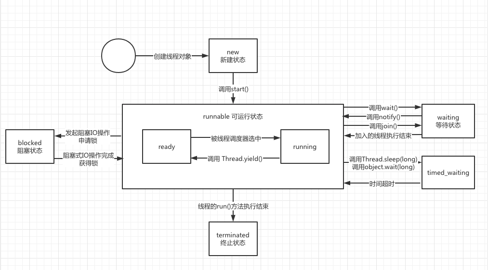
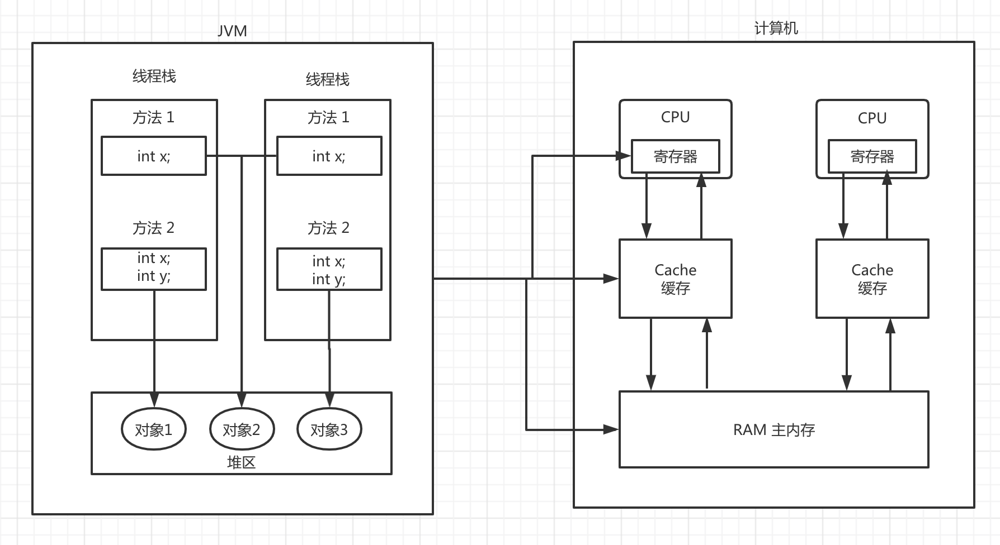
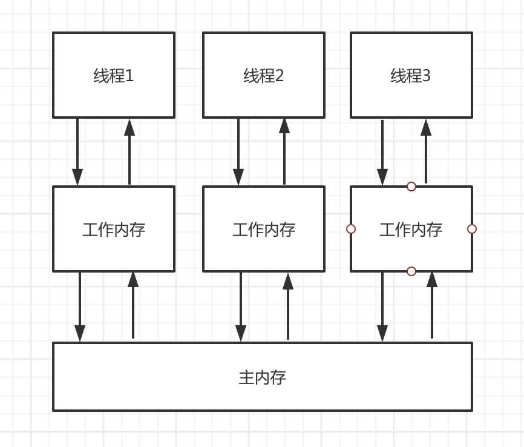
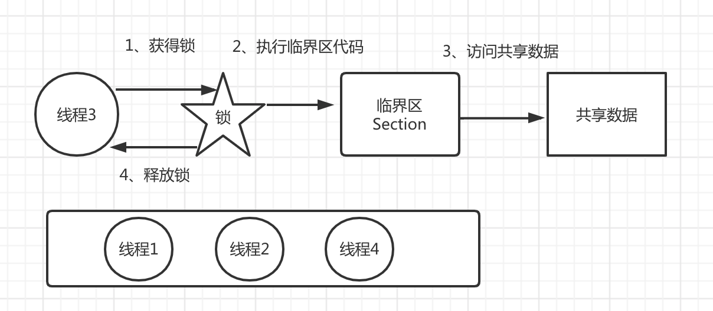
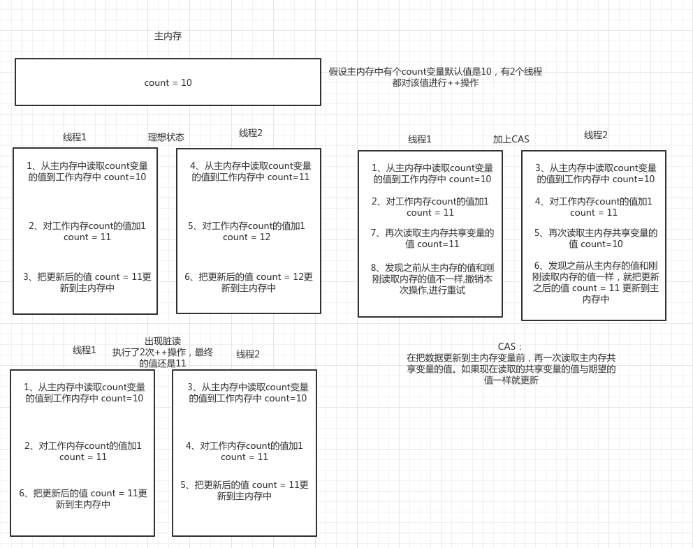
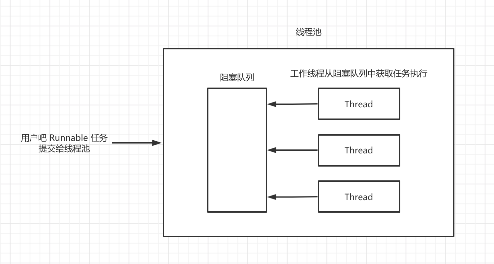
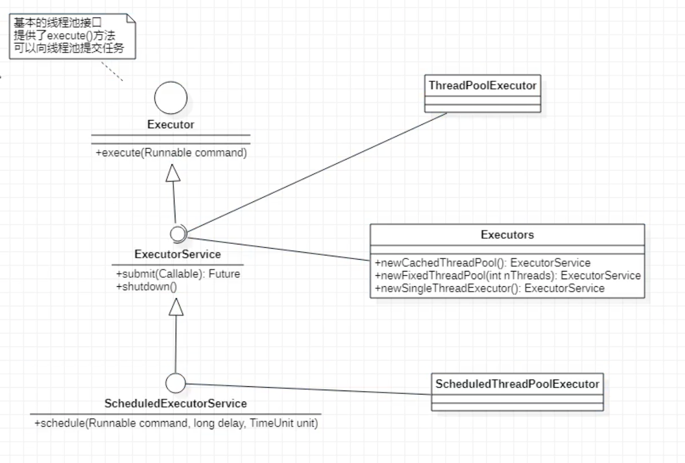
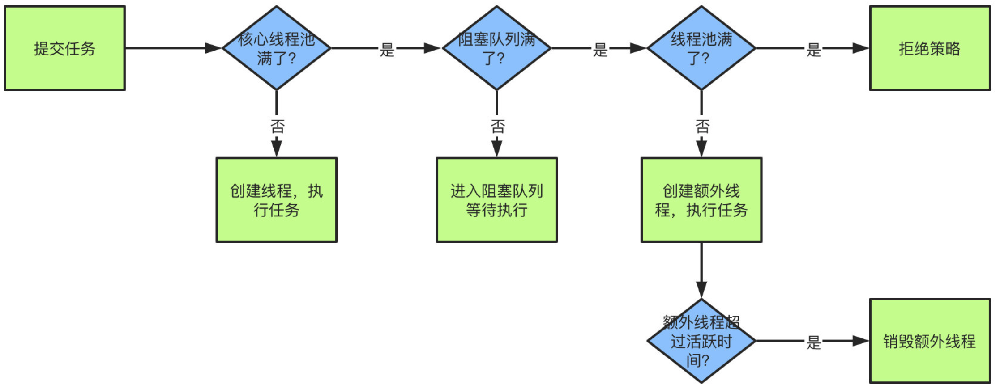

# 多线程

## 1、线程概述

### 1.1、线程相关概念

> 进程

​		进程(Process)是计算机中的程序关于某数据集合上的一次运行活动，是操作系统进行资源分配与调度的基本单位。可以把进程简单的理解为正在操作系统中运行的一个程序。

> 线程

​		线程(thread)是进程的一个执行单元。一个线程就是进程中一个单一顺序的控制流，进程的一个执行分支进程是线程的容器，一个进程至少有一个线程。一个进程中也可以有多个线程。在操作系统中是以进程为单位分配资源，如虚拟存储空间,文件描述符等。每个线程都有各自的线程栈，自己的寄存器环境，自己的线程本地存储。

> 主线程与子线程

​		JVM 启动时会创建一个主线程，该主线程负责执行 main 方法 。主线程就是运行 main 方法的线程。Java 中的线程是不孤立的，线程之间存在一些联系。如果在 A 线程中创建了B线程, 称B线程为A线程的子线程，相应的A线程就是B线程的父线程。

> 串行，并发与并行

举个例子：吃饭吃到一半，电话来了。

- 串行：一直到吃完了以后才去接。
- 并发：一手筷子，一手电话，吃一口菜，说一句话。吃菜和说话交替进行。
- 并行：吃菜和说话同时进行。

总结：

- 并发的关键是你有处理多个任务的能力，不一定要同时。
- 并行的关键是你有同时处理多个任务的能力。

### 1.2、线程的创建与启动

#### 1.2.1、继承Thread类创建

```java
public class MyThread extends Thread {
    @Override
    public void run() {
        System.out.println("子线程执行的代码");
    }
}

public class Test {
    public static void main(String[] args) {
        System.out.println("JVM开启main线程");
        //创建子线程对象
        MyThread myThread = new MyThread();
        //开启线程
        myThread.start();
        System.out.println("主线程之后的代码");
    }
}

// 输出结果:
JVM开启main线程
主线程之后的代码
子线程执行的代码
```

调用线程的start()方法来启动线程，启动线程的实质是请求JVM运行相应的线程，这个线程具体在什么时候执行由线程调度器（Scheduler）决定

- start()方法调用结束并不意味着子线程开始运行
- 新开启的线程会执行run()方法
- 如果开启了多个线程，start()方法调用的顺序并不一定就是线程启动的顺序
- 多线程运行结果与代码执行顺序或者调用顺序无关

#### 1.2.2、通过Runnable接口创建线程类

```java
public class MyRunnable implements Runnable {
    @Override
    public void run() {
        System.out.println("子线程执行的代码");
    }
}

public class Test {
    public static void main(String[] args) {
        System.out.println("JVM开启main线程");
        MyRunnable myRunnable = new MyRunnable();
        Thread thread = new Thread(myRunnable);
        thread.start();
        System.out.println("主线程之后的代码");

        //匿名内部类方式创建子线程
        new Thread(new Runnable() {
            @Override
            public void run() {
                System.out.println("子线程执行的代码2");
            }
        }).start();
    }
}

// 输出结果:
JVM开启main线程
主线程之后的代码
子线程执行的代码
子线程执行的代码2
```


#### 1.2.3、使用Callable和Future创建线程

```java
public class MyCallable implements Callable<String> {
    @Override
    public String call() throws Exception {
        System.out.println("子线程执行的代码");
        return "执行完毕";
    }
}

public class Test {
    public static void main(String[] args) {
        System.out.println("JVM开启main线程");
        Callable<String> callable = new MyCallable();
        FutureTask<String> futureTask = new FutureTask<>(callable);
        Thread thread = new Thread(futureTask);
        thread.start();
        try {
            System.out.println("子线程的返回值:" + futureTask.get());
        } catch (Exception e) {
            e.printStackTrace();
        }
        System.out.println("主线程之后的代码");
    }
}

// 输出结果:
JVM开启main线程
子线程执行的代码
子线程的返回值:执行完毕
主线程之后的代码
```

#### 1.2.4、CompletableFuture异步编排配合线程池

```java
public class CompletableFutureTest {

    public static ExecutorService executorService = Executors.newFixedThreadPool(10);

    public static void main(String[] args) {
        System.out.println("Main-in-当前线程:" + Thread.currentThread().getName());
        test1();
        System.out.println("Main-out-当前线程:" + Thread.currentThread().getName());
    }

    /**
     * 不需要返回值
     */
    private static void test1() {
        System.out.println("test1");
        CompletableFuture.runAsync(new Runnable() {
            @Override
            public void run() {
                System.out.println("当前线程:" + Thread.currentThread().getName());
                int a = 10 / 2;
                System.out.println("运行结果:" + a);
            }
        }, executorService);
    }

    /**
     * 得到返回值
     */
    private static void test2() {
        System.out.println("test2");
        CompletableFuture<Integer> completableFuture = CompletableFuture.supplyAsync(new Supplier<Integer>() {
            @Override
            public Integer get() {
                System.out.println("当前线程:" + Thread.currentThread().getName());
                int a = 10 / 2;
                System.out.println("运行结果:" + a);
                return a;
            }
        }, executorService);
        try {
            Integer integer = completableFuture.get();
            System.out.println("最终结果:" + integer);
        } catch (Exception e) {
            e.printStackTrace();
        }
    }

    /**
     * 感知异常并且修改返回值
     */
    private static void test3() {
        System.out.println("test3");
        CompletableFuture<Integer> completableFuture = CompletableFuture.supplyAsync(new Supplier<Integer>() {
            @Override
            public Integer get() {
                System.out.println("当前线程:" + Thread.currentThread().getName());
                int a = 10 / 0;
                System.out.println("运行结果:" + a);
                return a;
            }
        }, executorService).whenComplete((res, exception) -> {
            System.out.println("异步任务完成了，结果:" + res + "--异常:" + exception);
        }).exceptionally(exception -> {
            //当异常的时候使用该返回值
            return 10;
        });
        try {
            Integer integer = completableFuture.get();
            System.out.println("最终结果:" + integer);
        } catch (Exception e) {
            e.printStackTrace();
        }
    }

    /**
     * 处理返回结果
     */
    private static void test4() {
        System.out.println("test4");
        CompletableFuture<Integer> completableFuture = CompletableFuture.supplyAsync(new Supplier<Integer>() {
            @Override
            public Integer get() {
                System.out.println("当前线程:" + Thread.currentThread().getName());
                int a = 10 / 2;
                System.out.println("运行结果:" + a);
                return a;
            }
        }, executorService).handle((res, thr) -> {
            if (res != null) {
                return res * 2;
            }
            return 0;
        });
        try {
            Integer integer = completableFuture.get();
            System.out.println("最终结果:" + integer);
        } catch (Exception e) {
            e.printStackTrace();
        }
    }

    /**
     * 线程串行
     */
    private static void test5() {
        System.out.println("test5");
        CompletableFuture.supplyAsync(new Supplier<Integer>() {
            @Override
            public Integer get() {
                System.out.println("当前线程:" + Thread.currentThread().getName());
                int a = 10 / 2;
                System.out.println("运行结果:" + a);
                return a;
            }
        }, executorService).thenRunAsync(() -> {
            System.out.println("任务2启动了");
        }, executorService);
    }

    /**
     * 线程串行得到第一步任务的结果
     */
    private static void test6() {
        System.out.println("test6");
        CompletableFuture.supplyAsync(new Supplier<Integer>() {
            @Override
            public Integer get() {
                System.out.println("当前线程:" + Thread.currentThread().getName());
                int a = 10 / 2;
                System.out.println("运行结果:" + a);
                return a;
            }
        }, executorService).thenAcceptAsync(res -> {
            System.out.println("任务2启动了:");
            System.out.println("第一步的结果是:" + res);
        }, executorService);
    }

    /**
     * 线程串行得到第一步任务的结果并且把
     * 第二步的结果返回
     */
    private static void test7() {
        System.out.println("test7");
        CompletableFuture<Integer> completableFuture = CompletableFuture.supplyAsync(new Supplier<Integer>() {
            @Override
            public Integer get() {
                System.out.println("当前线程:" + Thread.currentThread().getName());
                int a = 10 / 2;
                System.out.println("运行结果:" + a);
                return a;
            }
        }, executorService).thenApplyAsync(res -> {
            System.out.println("任务2启动了:");
            System.out.println("第一步的结果是:" + res);
            return res * 2;
        }, executorService);

        try {
            Integer integer = completableFuture.get();
            System.out.println("最终结果:" + integer);
        } catch (Exception e) {
            e.printStackTrace();
        }
    }

    /**
     * 两个任务都完成之后触发任务3
     */
    private static void test8() {
        System.out.println("test8");
        CompletableFuture<Integer> future1 = CompletableFuture.supplyAsync(new Supplier<Integer>() {
            @Override
            public Integer get() {
                System.out.println("future1当前线程:" + Thread.currentThread().getName());
                int a = 10 / 2;
                System.out.println("运行结果:" + a);
                return a;
            }
        });
        CompletableFuture<String> future2 = CompletableFuture.supplyAsync(new Supplier<String>() {
            @Override
            public String get() {
                System.out.println("future2当前线程:" + Thread.currentThread().getName());
                return "hello";
            }
        });
        future1.runAfterBothAsync(future2, () -> {
            System.out.println("任务3开始" + Thread.currentThread().getName());
        }, executorService);
    }

    /**
     * 两个任务都完成之后触发任务3,再任务3中拿到任务1和任务2的结果
     * 任务3没返回值
     */
    private static void test9() {
        System.out.println("test9");
        CompletableFuture<Integer> future1 = CompletableFuture.supplyAsync(new Supplier<Integer>() {
            @Override
            public Integer get() {
                System.out.println("future1当前线程:" + Thread.currentThread().getName());
                int a = 10 / 2;
                System.out.println("运行结果:" + a);
                return a;
            }
        });
        CompletableFuture<String> future2 = CompletableFuture.supplyAsync(new Supplier<String>() {
            @Override
            public String get() {
                System.out.println("future2当前线程:" + Thread.currentThread().getName());
                return "hello";
            }
        });
        future1.thenAcceptBothAsync(future2, (f1, f2) -> {
            System.out.println("任务3开始" + Thread.currentThread().getName());
            System.out.println("任务1结果:" + f1);
            System.out.println("任务2结果:" + f2);
        }, executorService);
    }

    /**
     * 两个任务都完成之后触发任务3,再任务3中拿到任务1和任务2的结果
     * 任务3有返回值
     */
    private static void test10() {
        System.out.println("test10");
        CompletableFuture<Integer> future1 = CompletableFuture.supplyAsync(new Supplier<Integer>() {
            @Override
            public Integer get() {
                System.out.println("future1当前线程:" + Thread.currentThread().getName());
                int a = 10 / 2;
                System.out.println("运行结果:" + a);
                return a;
            }
        });
        CompletableFuture<String> future2 = CompletableFuture.supplyAsync(new Supplier<String>() {
            @Override
            public String get() {
                System.out.println("future2当前线程:" + Thread.currentThread().getName());
                return "hello";
            }
        });
        CompletableFuture<String> completableFuture = future1.thenCombineAsync(future2, (f1, f2) -> {
            System.out.println("任务3开始" + Thread.currentThread().getName());
            System.out.println("任务1结果:" + f1);
            System.out.println("任务2结果:" + f2);
            return f1 + f2;
        }, executorService);

        try {
            String integer = completableFuture.get();
            System.out.println("最终结果:" + integer);
        } catch (Exception e) {
            e.printStackTrace();
        }
    }


    /**
     * 两个任务中有一个任务完成了，就触发任务3
     */
    private static void test11() {
        System.out.println("test11");
        CompletableFuture<Integer> future1 = CompletableFuture.supplyAsync(new Supplier<Integer>() {
            @Override
            public Integer get() {
                System.out.println("future1当前线程:" + Thread.currentThread().getName());
                int a = 10 / 2;
                System.out.println("运行结果:" + a);
                return a;
            }
        });
        CompletableFuture<String> future2 = CompletableFuture.supplyAsync(new Supplier<String>() {
            @Override
            public String get() {
                System.out.println("future2当前线程:" + Thread.currentThread().getName());
                return "hello";
            }
        });
        future1.runAfterEitherAsync(future2, () -> {
            System.out.println("任务3开始" + Thread.currentThread().getName());
        }, executorService);
    }

    /**
     * 两个任务中有一个任务完成了，就触发任务3
     * 触发任务3的时候，得到完成任务的结果
     */
    private static void test12() {
        System.out.println("test12");
        CompletableFuture<Object> future1 = CompletableFuture.supplyAsync(new Supplier<Object>() {
            @Override
            public Object get() {
                System.out.println("future1当前线程:" + Thread.currentThread().getName());
                int a = 10 / 2;
                System.out.println("运行结果:" + a);
                return a;
            }
        });
        CompletableFuture<Object> future2 = CompletableFuture.supplyAsync(new Supplier<Object>() {
            @Override
            public Object get() {
                System.out.println("future2当前线程:" + Thread.currentThread().getName());
                return "hello";
            }
        });
        future1.acceptEitherAsync(future2, (res) -> {
            System.out.println("任务3开始" + Thread.currentThread().getName());
            System.out.println("上一次结果:" + res);
        }, executorService);
    }

    /**
     * 两个任务中有一个任务完成了，就触发任务3
     * 触发任务3的时候，得到完成任务的结果，并且返回结果
     */
    private static void test13() {
        System.out.println("test13");
        CompletableFuture<Object> future1 = CompletableFuture.supplyAsync(new Supplier<Object>() {
            @Override
            public Object get() {
                System.out.println("future1当前线程:" + Thread.currentThread().getName());
                int a = 10 / 2;
                System.out.println("运行结果:" + a);
                return a;
            }
        });
        CompletableFuture<Object> future2 = CompletableFuture.supplyAsync(new Supplier<Object>() {
            @Override
            public Object get() {
                System.out.println("future2当前线程:" + Thread.currentThread().getName());
                return "hello";
            }
        });
        CompletableFuture<String> completableFuture = future1.applyToEitherAsync(future2, (res) -> {
            System.out.println("任务3开始" + Thread.currentThread().getName());
            System.out.println("上一次结果:" + res);
            return res + "哈哈";
        }, executorService);

        try {
            String integer = completableFuture.get();
            System.out.println("最终结果:" + integer);
        } catch (Exception e) {
            e.printStackTrace();
        }
    }

    /**
     * 所有任务都完成了。最后得到结果
     */
    private static void test14() {
        System.out.println("test14");
        CompletableFuture<Object> future1 = CompletableFuture.supplyAsync(new Supplier<Object>() {
            @Override
            public Object get() {
                try {
                    Thread.sleep(3000);
                } catch (InterruptedException e) {
                    e.printStackTrace();
                }
                System.out.println("查询商品图片信息");
                return "abc.jpg";
            }
        }, executorService);
        CompletableFuture<Object> future2 = CompletableFuture.supplyAsync(new Supplier<Object>() {
            @Override
            public Object get() {
                System.out.println("查询商品的属性");
                return "黑色+256G";
            }
        }, executorService);
        CompletableFuture<Object> future3 = CompletableFuture.supplyAsync(new Supplier<Object>() {
            @Override
            public Object get() {
                System.out.println("查询商品的介绍");
                return "华为";
            }
        }, executorService);

        CompletableFuture<Void> voidCompletableFuture = CompletableFuture.allOf(future1, future2, future3);
        try {
            voidCompletableFuture.get();
        } catch (InterruptedException | ExecutionException e) {
            e.printStackTrace();
        }
    }

    /**
     * 有一个任务执行成功。最后得到结果
     */
    private static void test15() {
        System.out.println("test15");
        CompletableFuture<Object> future1 = CompletableFuture.supplyAsync(new Supplier<Object>() {
            @Override
            public Object get() {
                try {
                    Thread.sleep(3000);
                } catch (InterruptedException e) {
                    e.printStackTrace();
                }
                System.out.println("查询商品图片信息");
                return "abc.jpg";
            }
        }, executorService);
        CompletableFuture<Object> future2 = CompletableFuture.supplyAsync(new Supplier<Object>() {
            @Override
            public Object get() {
                System.out.println("查询商品的属性");
                return "黑色+256G";
            }
        }, executorService);
        CompletableFuture<Object> future3 = CompletableFuture.supplyAsync(new Supplier<Object>() {
            @Override
            public Object get() {
                System.out.println("查询商品的介绍");
                return "华为";
            }
        }, executorService);

        CompletableFuture<Object> objectCompletableFuture = CompletableFuture.anyOf(future1, future2, future3);
        try {
            Object o = objectCompletableFuture.get();
            System.out.println("最终结果:" + o);
        } catch (InterruptedException | ExecutionException e) {
            e.printStackTrace();
        }
    }

}
```


### 1.3、线程的常用方法

####  1.3.1、Thread.currentThread()

​		Thread.currentThread()方法可以获得当前线程，Java中的任何一段代码都是执行再某个线程中的。执行当前代码的线程就是当前线程。同一段代码可能被不同的线程执行，因此当前线程是相对的。Thread.currentThread()方法的返回值是代码实际运行时候的线程对象

#### 1.3.2、setName()/getName()

​		thread.setName（线程名称）， 设置线程名称 thread.getName()返回线程名称通过设置线程名称，有助于程序调试，提高程序的可读性，建议为每个线程都设置一个能够体现线程功能的名称。

#### 1.3.3、isAlive()

​		thread.isAlive()判断当前线程是否处于活动状态，活动状态就是线程已启动并且尚未终止。

#### 1.3.4、sleep()

​		Thread.sleep(millis)让当前线程休眠指定的毫秒数。

#### 1.3.5、getId()

​		thread.getId()可以获得线程的唯一标识注意：某个编号的线程运行结束后，该编号可能被后续创建的线程使用。重启的JVM 后，同一个线程的编号可能不一样。

#### 1.3.6、yield()

​		Thread.yield()方法的作用是放弃当前的 CPU 资源。

#### 1.3.7、setPriority()

​		thread.setPriority( num ); 设置线程的优先级。Java 线程的优先级取值范围是 1 ~ 10。如果超出这个范围会抛出 异常 IllegalArgumentException。在操作系统中,优先级较高的线程获得 CPU 的资源越多线程优先级本质上是只是给线程调度器一个提示信息，以便于调度器决定先调度哪些线程。注意不能保证优先级高的线程先运行。Java 优先级设置不当或者滥用可能会导致某些线程永远无法得到运行，即产生了线程饥饿。线程的优先级并不是设置的越高越好，一般情况下使用普通的优先级即可。在开发时不必设置线程的优先级。

#### 1.3.8、interrupt()

​		中断线程。注意调用 interrupt()方法仅仅是在当前线程打一个停止标志，并不是真正的停止线程。要想停止需要在子线程中调用isInterrupted()判断是否被打了中断线程标记再做退出处理。

```java
public class MyThread extends Thread {
    @Override
    public void run() {
        for (int i = 0; i < 100000; i++) {
            boolean interrupted = isInterrupted();
            if (interrupted) {
                System.out.println("interrupted = true--退出");
                break;
            }
            System.out.println("子线程报数：" + i);
        }
    }
}

public class Test {
    public static void main(String[] args) {
        MyThread myThread = new MyThread();
        myThread.start();

        for (int i = 0; i < 100; i++) {
            System.out.println("main线程报数：" + i);
        }
        System.out.println("设置 interrupted = true");
        myThread.interrupt();
    }
}

// 输出结果
main线程报数：98
main线程报数：99
设置 interrupted = true
子线程报数：42
interrupted = true--退出
```


#### 1.3.9、setDaemon()

​		Java 中的线程分为用户线程与守护线程。守护线程是为其他线程提供服务的线程，如垃圾回收器(GC)就是一 个典型的守护线程，守护线程不能单独运行，当JVM中没有其他用户线程，只有守护线程时，守护线程会自动销毁，JVM 会退出。

```java
public class MyThread extends Thread {
    @Override
    public void run() {
        int i = 0;
        while (true) {
            i++;
            System.out.println("子线程报数：" + i);
        }
    }
}

public class Test {
    public static void main(String[] args) {
        MyThread myThread = new MyThread();
        //设置子线程为守护线程，注意需要在start()之前设置。
        myThread.setDaemon(true);
        myThread.start();

        for (int i = 0; i < 10; i++) {
            System.out.println("main线程报数：" + i);
        }
        System.out.println("main线程执行完毕了");
    }
}

// 输出结果
子线程报数：1
main线程报数：0
子线程报数：2
子线程报数：3
子线程报数：4
子线程报数：5
子线程报数：6
子线程报数：7
main线程报数：1
main线程报数：2
main线程报数：3
main线程报数：4
main线程报数：5
子线程报数：8
子线程报数：9
子线程报数：10
子线程报数：11
子线程报数：12
子线程报数：13
子线程报数：14
子线程报数：15
main线程报数：6
main线程报数：7
main线程报数：8
main线程报数：9
main线程执行完毕了
子线程报数：16
子线程报数：17
子线程报数：18
子线程报数：19
子线程报数：20
子线程报数：21
子线程报数：22
子线程报数：23
子线程报数：24
子线程报数：25
子线程报数：26
子线程报数：27

Process finished with exit code 0
```


### 1.4、线程的生命周期

​		线程生命周期可以通过 getState()方法获得, 线程的状态是Thread.State 枚举类型定义的, 由以下几种:

- NEW：新建状态，创建了线程对象，在调用 start()启动之前的状态。
- RUNNABLE：可运行状态。它是一个复合状态，包含：READY 和 RUNNING 两个状态。READY 状态该线程可以被线程调度器进行调度。使它处于 RUNNING 状态。RUNING 状态表示该线程正在执行。Thread.yield()方法可以把线程由 RUNNING 状态转换为 READY 状态。
- BLOCKED：阻塞状态。线程发起阻塞的 I/O 操作,或者申请由其他线程占用的独占资源，线程会转换为 BLOCKED 阻塞状态。处于阻塞状态的线程不会占用CPU资源。当阻塞I/O操作执行完，或者线程获得了其申请的资源。线程可以转换为 RUNNABLE。
- WAITING：等待状态。线程执行了 object.wait()，thread.join()方法会把线程转换为 WAITING 等待状态，执行 object.notify()方法，或者加入的线程执行完毕，当前线程会转换为 RUNNABLE 状态。
- TIMED_WAITING：该状态与 WAITING 状态类似，都是等待状态。区别在于处于该状态的线程不会无限的等待。如果线程没有在指定的时间范围内完成期望的操作，该线程自动转换为 RUNNABLE 状态。
- TERMINATED：终止状态,线程结束处于终止状态




### 1.5、多线程编程的优势与存在的风险

####  1.5.1、多线程编程具有以下优势：

- 提高系统的吞吐率（Throughout）。多线程编程可以使一个进程有多个并发(concurrent，即同时进行的)的操作
- 提高响应性（Responsiveness）。Web 服务器会采用一些专门的线程负责用户的请求处理。缩短了用户的等待时间。
- 充分利用多核（Multicore）处理器资源。通过多线程可以充分的利用 CPU 资源。

#### 1.5.2、多线程编程存在的问题与风险：

- 线程安全（Thread safe）问题。多线程共享数据时，如果没有采取正确的并发访问控制措施，就可能会产生数据一致性问题，如读取脏数据（过期的数据），如丢失数据更新。
- 线程活性（thread liveness）问题。由于程序自身的缺陷或者由资源稀缺性导致线程一直处于非 RUNNABLE 状态，这就是线程活性问题，常见的活性故障有以下几种：
  - 死锁（Deadlock）类似鹬蚌相争。
  - 锁死（Lockout）类似于睡美人故事中王子挂了，睡美人一直醒不过来。
  - 活锁（Livelock）类似于小猫咬自己尾巴，一直转着圈咬自己的尾巴，咬不着。
  - 饥饿（Starvation）类似于健壮的雏鸟总是从母鸟嘴中抢到食物。那些弱小的雏鸟一直处于挨饿状态。

- 上下文切换（Context Switch）处理器从执行一个线程切换到执行另外一个线程。有一定额性能消耗。
- 可靠性。 可能会由一个线程导致 JVM 意外终止，其他的线程也无法执行。


## 2、线程安全问题

​		非线程安全主要是指多个线程对同一个对象的实例变量进行操作时，会出现值被更改，值不同步的情况。线程安全问题表现为三个方面：

- 原子性
- 可见性
- 有序性

### 2.1、原子性

​		原子（Atomic）就是不可分割的意思。原子操作的不可分割有两层含义：

- 访问（读，写）某个共享变量的操作从其他线程来看，该操作要么已经执行完毕，要么尚未发生，即其他线程看不到当前操作的中间结果。
- 访问同一组共享变量的原子操作是不能够交错的

​		如现实生活中从 ATM 机取款。对于用户来说，要么操作成功，用户拿到钱，余额减少了。增加了一条交易记录。要么没拿到钱。相当于取款操作没有发生。

​		Java 有两种方式实现原子性：

- 使用锁
-  利用处理器的CAS（Compare and Swap）指令。

​       锁具有排它性，保证共享变量在某一时刻只能被一个线程访问。CAS 指令直接在硬件(处理器和内存)层次上实现，看作是硬件锁。

```java
/**
 * 测试线程的原子性
 */
public class Test {
    public static void main(String[] args) {
        MyInt myInt = new MyInt();
        for (int i = 1; i <= 2; i++) {
            new Thread(new Runnable() {
                @Override
                public void run() {
                    while (true) {
                        int num = myInt.getNum();
                        System.out.println("Thread:" + Thread.currentThread().getName() + " num: " + num);
                        try {
                            Thread.sleep(100);
                        } catch (InterruptedException e) {
                            e.printStackTrace();
                        }
                    }
                }
            }).start();
        }
    }

    static class MyInt {
        int num;
        /**
         * 1、读取 num 的值
         * 2、对 num 的值+1
         * 3、把 +1 之后的值保存到num上
         * 4、返回 +1 之后的值
         */
        int getNum() {
            return ++num;
        }
    }

    //Java中提供了一个线程安全的AtomicInteger类，保证了原子性操作
    static class MySafeInt {
        AtomicInteger num = new AtomicInteger();
        int getNum() {
            return num.getAndIncrement();
        }
    }
}

//使用 MyInt 打印会发现有脏读的数据
Thread:Thread-0 num: 1
Thread:Thread-1 num: 2
Thread:Thread-0 num: 3
Thread:Thread-1 num: 4
Thread:Thread-0 num: 6
Thread:Thread-1 num: 5
Thread:Thread-1 num: 7
Thread:Thread-0 num: 7
Thread:Thread-1 num: 8
Thread:Thread-0 num: 8
Thread:Thread-0 num: 9
//使用 MySafeInt 打印没有错误的数据
Thread:Thread-0 num: 0
Thread:Thread-1 num: 1
Thread:Thread-0 num: 2
Thread:Thread-1 num: 3
Thread:Thread-0 num: 4
Thread:Thread-1 num: 5
Thread:Thread-1 num: 7
Thread:Thread-0 num: 6
Thread:Thread-1 num: 9
Thread:Thread-0 num: 8
Thread:Thread-1 num: 10

```


###  2.2、可见性

​		可见性（visibility）是在多线程环境中，一个线程对某个共享变量进行更新之后，后续其他的线程可能无法立即读到这个更新的结果。如果一个线程对共享变量更新后，后续访问该变量的其他线程可以读到更新的结果，称这个线程对共享变量的更新对其他线程可见，否则称这个线程对共享变量的更新对其他线程不可见。多线程程序因为可见性问题可能会导致其他线程读取到了旧数据 (脏数据)。

```java
/**
 * 测试线程的可见性
 */
public class Test10 {
    public static void main(String[] args) {
        MyUtils myUtils = new MyUtils();
        new Thread(new Runnable() {
            @Override
            public void run() {
                myUtils.print();
            }
        }).start();
        try {
            Thread.sleep(1000);
        } catch (InterruptedException e) {
            e.printStackTrace();
        }
        System.out.println("setContinuePrint--false");
        myUtils.setContinuePrint(false);
    }

    static class MyUtils {
        //如果不加 volatile 程序会死循环
        //原因：main线程修改了 continuePrint 变量后，子线程读不到
        //解决办法：使用 volatile 关键字 ，强制线程从公共内存中读取变量的值，
        //        而不是从工作内存中读取
        private boolean continuePrint = true;
        public void setContinuePrint(boolean continuePrint) {
            this.continuePrint = continuePrint;
        }
        public void print() {
            System.out.println("开始打印...");
            while (continuePrint) {
            }
            System.out.println("结束打印...");
        }
    }
}
```


### 2.3、有序性

​		有序性（Ordering）是指在什么情况下一个处理器上运行的一个线程所执行的内存访问操作在另外一个处理器运行的其他线程看来是乱序的(Out of Order)。乱序是指内存访问操作的顺序看起来发生了变化。

####  2.3.1、重排序

​		在多核处理器的环境下，编写的顺序结构，这种操作执行的顺序可能是没有保障的：编译器可能会改变两个操作的先后顺序；处理器也可能不会按照目标代码的顺序执行；这种一个处理器上执行的多个操作，在其他处理器来看它的顺序与目标代码指定的顺序可能不一样，这种现象称为重排序。

​		重排序是对内存访问有序操作的一种优化，可以在不影响单线程程序正确的情况下提升程序的性能。但是可能 对多线程程序的正确性产生影响，即可能导致线程安全问题重排序与可见性问题类似，不是必然出现的。

​		与内存操作顺序有关的几个概念:

- 源代码顺序：就是源码中指定的内存访问顺序。
- 程序顺序：处理器上运行的目标代码所指定的内存访问顺序。
- 执行顺序：内存访问操作在处理器上的实际执行顺序。
- 感知顺序：给定处理器所感知到的该处理器及其他处理器的内存访问操作的顺序。

可以把重排序分为指令重排序与存储子系统重排序两种：

- 指令重排序主要是由 JIT 编译器，处理器引起的，指程序顺序与执行顺序不一样。
- 存储子系统重排序是由高速缓存，写缓冲器引起的， 感知顺序与执行顺序不一致。

#### 2.3.2、指令重排序

​		在源码顺序与程序顺序不一致，或者 程序顺序与执行顺序不一致的情况下，我们就说发生了指令重排序(Instruction Reorder)。指令重排是一种动作，确实对指令的顺序做了调整，重排序的对象指令。javac 编译器一般不会执行指令重排序，而 JIT 编译器可能执行指令重排序。处理器也可能执行指令重排序，使得执行顺序与程序顺序不一致。指令重排不会对单线程程序的结果正确性产生影响，可能导致多线程程序出现非预期的结果。

#### 2.3.3、存储子系统重排序

​		存储子系统是指写缓冲器与高速缓存。高速缓存(Cache)是 CPU 中为了匹配与主内存处理速度不匹配而设计的一个高速缓存。写缓冲器(Store buffer, Write buffer)用来提高写高速缓存操作的效率。即使处理器严格按照程序顺序执行两个内存访问操作，在存储子系统的作用下，其他处理器对这两个操作的感知顺序与程序顺序不一致，即这两个操作的顺序顺序看起来像是发生了变化，这种现象称为存储子系统重排序。

​		存储子系统重排序并没有真正的对指令执行顺序进行调整，而是造成一种指令执行顺序被调整的现象。存储子系统重排序对象是内存操作的结果。

​		从处理器角度来看，读内存就是从指定的RAM地址中加载数据到 寄存器,称为 Load 操作；写内存就是把数据存储到指定的地址表示的 RAM 存储单元中，称为 Store 操作。内存重排序有以下四种可能：

- LoadLoad 重排序，一个处理器先后执行两个读操作 L1 和 L2，其他处理器对两个内存操作的感知顺序可能是 L2->L1
- StoreStore 重排序，一个处理器先后执行两个写操作 W1 和 W2，其他处理器对两个内存操作的感知顺序可能是 W2->W1
- LoadStore 重排序，一个处理器先执行读内存操作 L1 再执行写内存操作 W1，其他处理器对两个内存操作的感知顺序可能是 W1->L1
- StoreLoad 重排序，一个处理器先执行写内存操作 W1 再执行读内存操作 L1， 其他处理器对两个内存操作的感知顺序可能是 L1->W1

​        内存重排序与具体的处理器微架构有关,不同架构的处理器所允许的内存重排序不同。内存重排序可能会导致线程安全问题。假设有两个共享变量：

```java
int data = 0; 
boolean ready = false;
```

| 处理器1                                                      | 处理器2                                                      |
| :----------------------------------------------------------- | ------------------------------------------------------------ |
| data=1;                   //s1<br />ready = true;        //S2 |                                                              |
|                                                              | while(!ready){}          //L3<br />shut(data);                 //L4 |

#### 2.3.4、貌似串行语义

​		JIT 编译器，处理器，存储子系统是按照一定的规则对指令，内存操作的结果进行重排序，给单线程程序造成一种假象----指令是按照源码的顺序执行的。这种假象称为貌似串行语义。 并不能保证多线程环境程序的正确性。

​		为了保证貌似串行语义，有数据依赖关系的语句不会被重排序，只有不存在数据依赖关系的语句才会被重排序。如果两个操作（指令）访问同一个变量，且其中一个操作（指令）为写操作，那么这两个操作之间就存在数据依赖关系（Data dependency）。如：

```java
//后一条语句的操作数包含前一条语句的执行结果;
x = 1;
y = x + 1;

//先读取 x 变量,再更新 x 变量的值;
y = x;
x = 1;

//两条语句同时对一个变量进行写操作
x = 1;
x = 2;
```

如果不存在数据依赖关系则可能重排序，如：

```java
double price = 45.8;
int quantity = 10;
double sum = price * quantity;
```

​		存在控制依赖关系的语句允许重排。一条语句（指令）的执行结果会决定另一条语句（指令）能否被执行，这两条语句（指令）存在控制依赖关系（Control Dependency）。如在 if 语句中允许重排，可能存在处理器先执行 if 代码块，再判断 if 条件是否成立。

#### 2.3.5、保证内存访问的顺序性

​		可以使用 ==volatile== 关键字，==synchronized== 关键字实现有序性

### 2.4、Java内存模型



说明：

- 每个线程都有独立的栈空间
- 每个线程都可以访问堆内存
- 计算机的CPU不直接从主内存中读取数据，CPU读取数据时，先把主内存的数据读取到Cache缓存中，再把Cache中的数据读取到Register寄存器中
- JVM中的共享数据可能会被分配到Register寄存器中，每个CPU都有自己的Register寄存器。一个CPU不能读取其他CPU上寄存器的数据。如果两个线程分别运行在不同的处理器（CPU）上，而这个共享的数据被分配到寄存器上，会产生可见性问题
- 即使JVM中的共享数据分配到主内存中，也不能保证数据的可见性。CPU不直接对主内存访问，而是通过Cache高速缓存进行的。一个处理器上运行的线程对数据的更新可能只是更新到了处理器的写缓冲器（Store Buffer），还没有到达Cache缓存，更不用说主内存了。另外一个处理器不能读取到该处理器写缓冲器上的内容，会产生运行在另外一个处理器上的线程无法看到该处理器对共享数据的更新。
- 一个处理器的Cache不能读取另外一个处理器的Cache。但是一个处理器可以通过缓存一致性协议（Cache Coherence Protocol）来读取其他处理器缓存中的数据，并将读取的数据更新到该处理器的Cache中。这个过程称为缓存同步。缓存同步使得一个处理器上运行的线程可以读取到另外一个处理器运行的线程对共享数据的所做的更新，即保障了'可见性'。为了保障可见性，必须使一个处理器对共享数据的更新最终被写入该处理器的Cache，这个过程称为冲刷处理器缓存。

也可以把Java内存模型抽象为：



规定：

- 每个线程之间的共享数据都存储在主内存中
- 每个线程都有一个私有的本地内存（工作内存），线程的工作内存是抽象的概念，不是真实存在的，它涵盖写缓冲器，寄存器，其他硬件的优化
- 每个线程从主内存吧数据读取到本地工作内存中，在工作内存中保存共享数据副本
- 线程在自己的工作内存中处理数据，仅对当前线程可见。对其他线程是不可见的


## 3、线程同步

### 3.1、线程同步机制简介

​		线程同步机制是一套用于协调线程之间的数据访问的机制。该机制可以保障线程安全。Java 平台提供的线程同步机制包括：锁，volatile 关键字，final 关键字，static 关键字，以及相关的 API，如Object.wait()/Object.notify()等。

### 3.2、锁概述

​		线程安全问题的产生前提是多个线程并发访问共享数据。将多个线程对共享数据的并发访问转换为串行访问，即一个共享数据一次只能被一个线程访问。锁就是复用这种思路来保障线程安全的。

​		锁(Lock)可以理解为对共享数据进行保护的一个许可证。对于同一个许可证保护的共享数据来说，任何线程想要访问这些共享数据必须先持有该许可证。一个线程只有在持有许可证的情况下才能对这些共享数据进行访问；并且一个许可证一次只能被一个线程持有；许可证线程在结束对共享数据的访问后必须释放其持有的许可证。

​		一线程在访问共享数据前必须先获得锁；获得锁的线程称为锁的持有线程；一个锁一次只能被一个线程持有。锁的持有线程在获得锁之后和释放锁之前这段时间所执行的代码称为临界区（Critical Section）。

​		锁具有排他性（Exclusive）， 即一个锁一次只能被一个线程持有。这种锁称为排它锁或互斥锁（Mutex）。




JVM 把锁分为内部锁和显示锁两种：

- 内部锁：通过 synchronized 关键字实现
- 显示锁：通过 java.concurrent.locks.Lock 接口的实现类实现


#### 3.2.1、锁的作用

​		锁可以实现对共享数据的安全访问。保障线程的原子性，可见性与有序性。

​		锁是通过互斥保障原子性。一个锁只能被一个线程持有，这就保证临界区的代码一次只能被一个线程执行。使得临界区代码所执行的操作自然而然的具有不可分割的特性，即具备了原子性。

​		可见性的保障，是通过写线程冲刷处理器的缓存，和读线程刷新处理器缓存，这两个动作实现的。在 java 平台中，锁的获得隐含着刷新处理器缓存的动作，锁的释放隐含着冲刷处理器缓存的动作。

​		锁能够保障有序性。写线程在临界区所执行的在读线程所执行的临界区看来像是完全按照源码顺序执行的。

​		注意：使用锁保障线程的安全性，必须满足以下条件：

- 这些线程在访问共享数据时必须使用同一个锁
- 即使是读取共享数据的线程也需要使用同步锁

#### 3.2.2、锁的相关概念

> 1、可重入性

​		可重入性(Reentrancy)描述这样一个问题：一个线程持有该锁的时候能再次(多次)申请该锁。

```java
void methodA(){
    申请 a 锁
    methodB();
    释放 a 锁
}

void methodB(){
     申请 a 锁
     ...
     释放 a 锁    
}

//1、某个线程调用 methodA()
//2、申请了 a 锁
//3、调用 methodB()
//4、再次申请 a 锁 ，如果申请成功 a 锁就称之为可重入的,不能申请成功称之为不可重入的。
```

​		如果一个线程持有一个锁的时候还能够继续成功申请该锁，称该锁是可重入的，否则就称该锁为不可重入的。

> 2、锁的争用与调度

​		Java 平台中内部锁属于非公平锁，显示 Lock 锁既支持公平锁又支持非公平锁。

> 3、锁的粒度

​		一个锁可以保护的共享数据的数量大小称为锁的粒度。锁保护共享数据量大，称该锁的粒度粗， 否则就称该锁的粒度细。 锁的粒度过粗会导致线程在申请锁时会进行不必要的等待。锁的粒度过细会增加锁调度的开销。

### 3.3、内部锁：synchronized 关键字

​		Java 中的每个对象都有一个与之关联的内部锁（Intrinsic lock）。这种锁也称为监视器（Monitor），这种内部锁是一种排他锁。可以保障原子性，可见性与有序性。

​		内部锁是通过 synchronized 关键字实现的。synchronized 关键字可以修饰代码块，也可以修饰方法。修饰实例方法就称为同步实例方法，修饰静态方法称称为同步静态方法。

#### 3.3.1、synchronized 同步代码块

​		修饰代码块的语法：

```java
synchronized( 对象锁 ) {
	同步代码块，可以在同步代码块中访问共享数据
}
```

```java
/**
 * 测试synchronized
 * 1、假设Thread-0线程获得CPU执行权，调用obj对象的mm方法，执行方法体。
 * 先获得this对象obj的锁，再执行for循环
 * 2、假设Thread-0再执行for循环的期间，Thread-1线程获得了CPU的执行权调用obj对象的mm方法，
 * 执行方法体，想要获得this对象obj的锁。现象Thread-0线程持有this对象obj的锁
 * synchronized 内部锁是排斥锁，只能被一个线程持有，Thread-1进入等待区等待this对象obj的锁
 * 3、当Thread-0线程重新获取CPU执行权，把for循环执行完，即执行完同步代码块中的代码
 * Thread-0线程会释放this对象的obj锁
 * 4、等待区的Thread-1线程获得this对象的obj锁，执行同步代码块的代码
 */
public class Test1 {

    public static void main(String[] args) {
        Test1 obj = new Test1();

        new Thread(new Runnable() {
            @Override
            public void run() {
                obj.mm();
            }
        }).start();

        new Thread(new Runnable() {
            @Override
            public void run() {
                obj.mm();
            }
        }).start();
    }

    public void mm() {
        synchronized (this) {
            for (int i = 1; i <= 100; i++) {
                System.out.println(Thread.currentThread().getName() + "-->" + i);
            }
        }
    }

}

/**
 * 测试synchronized
 * 如果线程的锁不同, 不能实现同步，
 * 想要同步必须使用同一个锁对象
 */
public class Test2 {

    public static void main(String[] args) {
        Test2 obj1 = new Test2();
        Test2 obj2 = new Test2();

        new Thread(new Runnable() {
            @Override
            public void run() {
                obj1.mm();
            }
        }).start();

        new Thread(new Runnable() {
            @Override
            public void run() {
                obj2.mm();
            }
        }).start();
    }

    public void mm() {
        synchronized (this) {
            for (int i = 1; i <= 100; i++) {
                System.out.println(Thread.currentThread().getName() + "-->" + i);
            }
        }
    }

}

/**
 * 测试synchronized
 * 使用一个常量对象作为锁对象
 */
public class Test3 {

    public static final Object OBJ = new Object();

    public static void main(String[] args) {
        Test3 obj1 = new Test3();
        Test3 obj2 = new Test3();

        new Thread(new Runnable() {
            @Override
            public void run() {
                obj1.mm();
            }
        }).start();

        new Thread(new Runnable() {
            @Override
            public void run() {
                obj2.mm();
            }
        }).start();
    }

    public void mm() {
        synchronized (OBJ) {
            for (int i = 1; i <= 100; i++) {
                System.out.println(Thread.currentThread().getName() + "-->" + i);
            }
        }
    }

}


/**
 * 测试synchronized
 * 使用一个常量对象作为锁对象,
 * 不同方法中的同步代码块也可以同步
 */
public class Test4 {

    public static final Object OBJ = new Object();

    public static void main(String[] args) {
        Test4 obj1 = new Test4();
        Test4 obj2 = new Test4();

        new Thread(new Runnable() {
            @Override
            public void run() {
                obj1.mm();
            }
        }).start();

        new Thread(new Runnable() {
            @Override
            public void run() {
                obj2.mm();
            }
        }).start();

        new Thread(new Runnable() {
            @Override
            public void run() {
                sm();
            }
        }).start();
    }

    public void mm() {
        synchronized (OBJ) {
            for (int i = 1; i <= 100; i++) {
                System.out.println(Thread.currentThread().getName() + "-->" + i);
            }
        }
    }

    public static void sm() {
        synchronized (OBJ) {
            for (int i = 1; i <= 100; i++) {
                System.out.println(Thread.currentThread().getName() + "-->" + i);
            }
        }
    }

}


```

#### 3.3.2、同步方法

```java
/**
 * 测试 synchronized 同步实例方法
 * 把整个方法体作为同步代码块
 * 默认的锁对象是 this 对象
 */
public class Test5 {

    public static void main(String[] args) {
        Test5 obj1 = new Test5();

        new Thread(new Runnable() {
            @Override
            public void run() {
                obj1.mm();
            }
        }).start();

        new Thread(new Runnable() {
            @Override
            public void run() {
                obj1.mm22();
            }
        }).start();
    }

    public void mm() {
        synchronized (this) {
            for (int i = 1; i <= 100; i++) {
                System.out.println(Thread.currentThread().getName() + "-->" + i);
            }
        }
    }

    public synchronized void mm22() {
        for (int i = 1; i <= 100; i++) {
            System.out.println(Thread.currentThread().getName() + "-->" + i);
        }
    }

}

/**
 * 测试 synchronized 同步实例方法
 * 把整个静态方法体作为同步代码块，默认的锁对象是当前类的运行时类对象, Test06.class
 * 有人称它为类锁
 */
public class Test6 {

    public static void main(String[] args) {
        Test6 obj1 = new Test6();

        new Thread(new Runnable() {
            @Override
            public void run() {
                obj1.mm();
            }
        }).start();

        new Thread(new Runnable() {
            @Override
            public void run() {
                Test6.mm22();
            }
        }).start();
    }

    public void mm() {
        synchronized (Test6.class) {
            for (int i = 1; i <= 100; i++) {
                System.out.println(Thread.currentThread().getName() + "-->" + i);
            }
        }
    }

    public static synchronized void mm22() {
        for (int i = 1; i <= 100; i++) {
            System.out.println(Thread.currentThread().getName() + "-->" + i);
        }
    }

}

/**
 * 同步方法与同步代码块如何选择
 * 同步方法锁的粒度粗, 执行效率低, 同步代码块执行效率高
 */
public class Test7 {

    public static void main(String[] args) {
        Test7 obj = new Test7();
        new Thread(new Runnable() {
            @Override
            public void run() {
                obj.doLongTimeTask();
            }
        }).start();

        new Thread(new Runnable() {
            @Override
            public void run() {
                obj.doLongTimeTask();
            }
        }).start();
    }

    public synchronized void doLongTimeTask() {
        try {
            System.out.println(Thread.currentThread().getName() + "-->Task Begin");
            Thread.sleep(3000); //模拟任务需要准备 3 秒
            System.out.println("开始同步");
            for (int i = 1; i <= 100; i++) {
                System.out.println(Thread.currentThread().getName() + "-->" + i);
            }
            System.out.println(Thread.currentThread().getName() + "-->Task end");
        } catch (InterruptedException e) {
            e.printStackTrace();
        }
    }

    public synchronized void doLongTimeTask2() {
        try {
            System.out.println(Thread.currentThread().getName() + "-->Task Begin");
            Thread.sleep(3000); //模拟任务需要准备 3 秒
            synchronized (this) {
                System.out.println("开始同步");
                for (int i = 1; i <= 100; i++) {
                    System.out.println(Thread.currentThread().getName() + "-->" + i);
                }
            }
            System.out.println(Thread.currentThread().getName() + "-->Task end");
        } catch (InterruptedException e) {
            e.printStackTrace();
        }
    }

}
```

#### 3.3.3、脏读

```java
/**
 * 脏读
 * 出现读取属性值出现了一些意外，读取的是中间值，而不是修改之后的值
 * 出现脏读的原因：是对共享数据的修改与对共享数据的读取不同步
 * 解决方法：setValue 和 getValue 方法上加上 synchronized
 * 不仅对修改数据点额代码进行同步，还要对读取数据的代码同步
 */
public class Test8 {

    public static void main(String[] args) {
        PublicValue publicValue = new PublicValue();
        MyThread myThread = new MyThread(publicValue);
        myThread.start();
        try {
            Thread.sleep(200);
        } catch (InterruptedException e) {
            e.printStackTrace();
        }
        publicValue.getValue();
    }

    static class MyThread extends Thread {
        private final PublicValue publicValue;
        public MyThread(PublicValue publicValue) {
            this.publicValue = publicValue;
        }
        @Override
        public void run() {
            publicValue.setValue("李四", "李四的密码");
        }
    }

    static class PublicValue {
        private String name = "张三";
        private String pwd = "张三的密码";
        public void setValue(String name, String pwd) {
            this.name = name;
            try {
                Thread.sleep(1000);
            } catch (InterruptedException e) {
                e.printStackTrace();
            }
            this.pwd = pwd;
            System.out.println(Thread.currentThread().getName() + "--setValue--name:" + name + "--pwd:" + pwd);
        }
        public void getValue() {
            System.out.println(Thread.currentThread().getName() + "--getValue--name:" + name + "--pwd:" + pwd);
        }
    }
}

// setValue 和 getValue 不加同步的话会读取下面的数据
// main--getValue--name:李四--pwd:张三的密码
// Thread-0--setValue--name:李四--pwd:李四的密码

```


#### 3.3.4、线程出现异常会自动释放锁

```java
/**
 * 同步过程中线程出现异常，会自动释放锁对象
 */
public class Test9 {

    public static void main(String[] args) {
        Test9 obj1 = new Test9();

        new Thread(new Runnable() {
            @Override
            public void run() {
                obj1.mm();
            }
        }).start();

        new Thread(new Runnable() {
            @Override
            public void run() {
                obj1.mm22();
            }
        }).start();
    }

    public void mm() {
        synchronized (this) {
            for (int i = 1; i <= 100; i++) {
                if (i == 50) {
                    Object o = null;
                    o.toString();
                }
                System.out.println(Thread.currentThread().getName() + "-->" + i);
            }
        }
    }

    public synchronized void mm22() {
        for (int i = 1; i <= 100; i++) {
            System.out.println(Thread.currentThread().getName() + "-->" + i);
        }
    }

}
```


#### 3.3.5、死锁

```java
/**
 * 在多线程程序中，同步时可能需要使用多个锁，如果获得锁的顺序不一致，可能会导致死锁
 * 如何避免死锁？当需要获得多个锁时，所有线程获得锁的顺序保持一致即可
 */
public class Test10 {

    private static final Object lock1 = new Object();
    private static final Object lock2 = new Object();

    private static final String THREAD_NAME_1 = "Thread1";
    private static final String THREAD_NAME_2 = "Thread2";

    public static void main(String[] args) {
        MyThread1 myThread1 = new MyThread1();
        myThread1.setName(THREAD_NAME_1);
        MyThread2 myThread2 = new MyThread2();
        myThread2.setName(THREAD_NAME_2);
        myThread1.start();
        myThread2.start();
    }

    static class MyThread1 extends Thread {
        @Override
        public void run() {
            mm();
        }
    }

    static class MyThread2 extends Thread {
        @Override
        public void run() {
            mm();
        }
    }

    static void mm() {
        String threadName = Thread.currentThread().getName();
        if (THREAD_NAME_1.equals(threadName)) {
            synchronized (lock1) {
                System.out.println(THREAD_NAME_1 + "得到loca1,打算去得到loca2");
                synchronized (lock2) {
                    System.out.println(THREAD_NAME_1 + "得到lock1和lock2...");
                }
            }
        }
        if (THREAD_NAME_2.equals(threadName)) {
            synchronized (lock2) {
                System.out.println(THREAD_NAME_2 + "得到loca2,打算去得到loca1");
                synchronized (lock1) {
                    System.out.println(THREAD_NAME_2 + "得到lock1和lock2...");
                }
            }
        }
    }

}

//输出:
//Thread2得到loca2,打算去得到loca1
//Thread1得到loca1,打算去得到loca2

```


### 3.4、轻量级同步机制：volative 关键字

#### 3.4.1、volative 的作用

​		volatile 关键的作用使变量在多个线程之间可见

```java
/**
 * 测试 volatile 关键字
 */
public class Test10 {
    public static void main(String[] args) {
        MyUtils myUtils = new MyUtils();
        new Thread(new Runnable() {
            @Override
            public void run() {
                myUtils.print();
            }
        }).start();
        try {
            Thread.sleep(1000);
        } catch (InterruptedException e) {
            e.printStackTrace();
        }
        System.out.println("setContinuePrint--false");
        myUtils.setContinuePrint(false);
    }

    static class MyUtils {
        //如果不加 volatile 程序会死循环
        //原因：main线程修改了 continuePrint 变量后，子线程读不到
        //解决办法：使用 volatile 关键字 ，强制线程从公共内存中读取变量的值，
        //        而不是从工作内存中读取
        private volatile boolean continuePrint = true;
        public void setContinuePrint(boolean continuePrint) {
            this.continuePrint = continuePrint;
        }
        public void print() {
            System.out.println("开始打印...");
            while (continuePrint) {
            }
            System.out.println("结束打印...");
        }
    }
}


```

​		volatile 与 synchronized 比较

- volatile 关键字是线程同步的轻量级实现，所以 volatile 性能肯定 比 synchronized 要好；volatile 只能修饰变量，而 synchronized 可以修饰方法，代码块。 随着 JDK 新版本的发布，synchronized 的执行效率也有较大的提升，在开发中使用 sychronized 的比率还是很大的。
- 多线程访问 volatile 变量不会发生阻塞，而 synchronized 可能会阻塞
- volatile 能保证数据的可见性，但是不能保证原子性； 而 synchronized 可以保证原子性，也可以保证可见性
-  volatile 解决的是变量在多个线程之间的可见性，synchronized 解决的是多个线程之间访问公共资源的同步性。

#### 3.4.2、volative 非原子特征

​		volatile 关键字增加了实例变量在多个线程之间的可见性，但是不具备原子性.

```java
/**
 * 测试 volatile 不具备原子性
 */
public class Test10 {
    public static void main(String[] args) {
        MyInt myInt = new MyInt();
        for (int i = 1; i <= 2; i++) {
            new Thread(new Runnable() {
                @Override
                public void run() {
                    while (true) {
                        int num = myInt.getNum();
                        System.out.println("Thread:" + Thread.currentThread().getName() + " num: " + num);
                        try {
                            Thread.sleep(100);
                        } catch (InterruptedException e) {
                            e.printStackTrace();
                        }
                    }
                }
            }).start();
        }
    }

    static class MyInt {
        volatile int num;
        /**
         * 1、读取 num 的值
         * 2、对 num 的值+1
         * 3、把 +1 之后的值保存到num上
         * 4、返回 +1 之后的值
         */
        int getNum() {
            return ++num;
        }
    }

}

//加上 volatile 还是有脏读的情况
```

#### 3.4.3、常用原子类进行自增自减操作

​		我们知道 i++操作不是原子操作， 除了使用 Synchronized 进行同步外，也可以使用 AtomicInteger/AtomicLong 原子类进行实现。详情见 2.1 demo 代码


### 3.5、CAS

#### 3.5.1、CAS原理

​		在把数据更新到主内存时，再次读取主内存变量的值，如果现在变量的值与期望的值(操作起始时读取的值)一样就更新。

​		CAS(Compare And Swap)是由硬件实现的。

​		CAS 可以将 read- modify - write 这类的操作转换为原子操作。

​		i++自增操作包括三个子操作:

- 从主内存读取 i 变量值
- 对 i 的值加 1
- 再把加 1 之后 的值保存到主内存
  ​		


#### 3.5.2、CAS的ABA问题

​		CAS 实现原子操作背后有一个假设：共享变量的当前值与当前线 程提供的期望值相同，就认为这个变量没有被其他线程修改过。实际上这种假设不一定总是成立。

如有共享变量 count = 0：

| 时间 | 线程修改值                 |
| ---- | -------------------------- |
| T1   | A 线程对 count 值修改为 10 |
| T2   | B 线程对 count 值修改为 20 |
| T3   | C 线程对 count 值修改为 0  |

​		当前线程看到 count 变量的值现在是 0，现在是否认为 count 变量的值没有被其他线程更新呢？这种结果是否能够接受？这就是 CAS 中的 ABA 问题，即共享变量经历了 A->B->A 的更新。

​		是否能够接收 ABA 问题跟实现的算法有关。如果想要规避 ABA 问题，可以为共享变量引入一个修订号（时间 戳），每次修改共享变量时，相应的修订号就会增加 1。ABA 变量更新过程变量： [A,0] ->[B,1]->[A,2]，每次对共享变量的修改都会导致修订号的增加，通过修订号依然可以准确判断变量是否被其他线程修改过。AtomicStampedReference 类就是基于这种思想产生的。


### 3.6、原子变量类

​		原子变量类基于CAS实现的。当对共享变量进行 read-modify-write 更新操作时，通过原子变量类可以保障操作的原子性与可见性。对变量的 read-modify-write 更新操作是指当前操作不是一个简单的赋值，而是变量的新值依赖变量的旧值，如自增操作 i++。由于 volatile 只能保证可见性，无法保障原子性。原子变量类内部就是借助一个Volatile变量，并且保障了该变量的 read-modify-write 操作的原子性，有时把原子变量类看作增强的 volatile 变量。 		原子变量类有 12 个，如：

| 分组       | 原子变量类                                                   |
| ---------- | ------------------------------------------------------------ |
| 基础数据型 | AtomicInteger<br />AtomicLong<br />AtomicBoolean             |
| 数组型     | AtomicIntegerArray<br />AtomicLongArray<br />AtomicReferenceArray |
| 字段更新器 | AtomicIntegerFieldUpdater<br />AtomicLongFieldUpdater<br />AtomicReferenceFieldUpdater |
| 引用型     | AtomicReference<br />AtomicStampedReference<br />AtomicMarkableReference |

#### 3.6.1、AtomicLong

```java
package com.wandata.other;

import java.util.concurrent.atomic.AtomicLong;

public class Indicator {
    private Indicator() {
    }

    private static final Indicator INSTANCE = new Indicator();

    public static Indicator getInstance() {
        return INSTANCE;
    }

    //使用原子变量类保存请求总数,成功数,失败数
    private final AtomicLong requestCount = new AtomicLong(0);
    private final AtomicLong successCount = new AtomicLong(0);
    private final AtomicLong failureCount = new AtomicLong(0);

    //有新的请求
    public void newRequestReceive() {
        requestCount.incrementAndGet();
    }

    //处理成功
    public void requestProcessSuccess() {
        successCount.incrementAndGet();
    }

    //处理失败
    public void requestProcessFailure() {
        failureCount.incrementAndGet();
    }

    //查看总数,成功数,失败数
    public long getRequestCount() {
        return requestCount.get();
    }

    public long getSuccessCount() {
        return successCount.get();
    }

    public long getFailureCount() {
        return failureCount.get();
    }

}


package com.wandata.other;

import java.util.Random;

public class Demo {

    public static void main(String[] args) {
        //通过线程模拟请求,在实际应用中可以在 ServletFilter 中调用 Indicator 计数器的相关方法
        for (int i = 0; i < 100; i++) {
            new Thread(new Runnable() {
                @Override
                public void run() {
                    //每个线程就是一个请求,请求总数要加 1
                    Indicator.getInstance().newRequestReceive();
                    //模拟请求成功还是失败
                    int num = new Random().nextInt();
                    if (num % 2 == 0) { //偶数模拟成功
                        Indicator.getInstance().requestProcessSuccess();
                    } else { //处理失败
                        Indicator.getInstance().requestProcessFailure();
                    }
                }
            }).start();
        }
        try {
            Thread.sleep(1000);
        } catch (InterruptedException e) {
            e.printStackTrace();
        }
        //总的请求数
        System.out.println(Indicator.getInstance().getRequestCount());
        //成功数
        System.out.println(Indicator.getInstance().getSuccessCount());
        //失败数
        System.out.println(Indicator.getInstance().getFailureCount());
    }

}

```


#### 3.6.2、AtomicIntegerArray

```java
import java.util.concurrent.atomic.AtomicIntegerArray;

public class Demo {

    public static void main(String[] args) {
        //1、创建一个指定长度的原子数组
        AtomicIntegerArray atomicIntegerArray = new AtomicIntegerArray(10);
        // [0, 0, 0, 0, 0, 0, 0, 0, 0, 0]
        System.out.println(atomicIntegerArray);
        //2、返回指定位置的元素
        //0
        System.out.println(atomicIntegerArray.get(0));
        //0
        System.out.println(atomicIntegerArray.get(1));
        //3、设置指定位置的元素
        atomicIntegerArray.set(0, 10);
        //在设置数组元素的新值时, 同时返回数组元素的旧值
        //0
        System.out.println(atomicIntegerArray.getAndSet(1, 11));
        //[10, 11, 0, 0, 0, 0, 0, 0, 0, 0]
        System.out.println(atomicIntegerArray);
        //4、修改数组元素的值,把数组元素加上某个值
        //32
        System.out.println(atomicIntegerArray.addAndGet(0, 22));
        //11
        System.out.println(atomicIntegerArray.getAndAdd(1, 33));
        //[32, 44, 0, 0, 0, 0, 0, 0, 0, 0]
        System.out.println(atomicIntegerArray);
        //5、CAS 操作
        //如果数组中索引值为 0 的元素的值是 32 , 就修改为 222
        //true
        System.out.println(atomicIntegerArray.compareAndSet(0, 32, 222));
        //[222, 44, 0, 0, 0, 0, 0, 0, 0, 0]
        System.out.println(atomicIntegerArray);
        //false
        System.out.println(atomicIntegerArray.compareAndSet(1, 11, 333));
        //[222, 44, 0, 0, 0, 0, 0, 0, 0, 0]
        System.out.println(atomicIntegerArray);
        //6、自增/自减
        //223, 相当于前缀
        System.out.println(atomicIntegerArray.incrementAndGet(0));
        //44, 相当于后缀
        System.out.println(atomicIntegerArray.getAndIncrement(1));
        //[223, 45, 0, 0, 0, 0, 0, 0, 0, 0]
        System.out.println(atomicIntegerArray);
        //-1
        System.out.println(atomicIntegerArray.decrementAndGet(2));
        //[223, 45, -1, 0, 0, 0, 0, 0, 0, 0]
        System.out.println(atomicIntegerArray);
        //0
        System.out.println(atomicIntegerArray.getAndDecrement(3));
        //[223, 45, -1, -1, 0, 0, 0, 0, 0, 0]
        System.out.println(atomicIntegerArray);
    }
}
```


#### 3.6.3、AtomicReference

演示 AtomicReference 可能会出现 CAS 的 ABA 问题

```java
import java.util.concurrent.TimeUnit;
import java.util.concurrent.atomic.AtomicReference;

public class Demo {
    private static AtomicReference<String> atomicReference = new AtomicReference<>("abc");

    public static void main(String[] args) {
        //创建第一个线程,先把 abc 字符串改为"def",再把字符串还原为 abc
        Thread t1 = new Thread(new Runnable() {
            @Override
            public void run() {
                atomicReference.compareAndSet("abc", "def");
                System.out.println(Thread.currentThread().getName() + "--" + atomicReference.get());
                atomicReference.compareAndSet("def", "abc");
            }
        });

        Thread t2 = new Thread(new Runnable() {
            @Override
            public void run() {
                try {
                    TimeUnit.SECONDS.sleep(1);
                } catch (InterruptedException e) {
                    e.printStackTrace();
                }
                System.out.println(atomicReference.compareAndSet("abc", "ghg"));
            }
        });
        t1.start();
        t2.start();
        try {
            t1.join();
            t2.join();
        } catch (InterruptedException e) {
            e.printStackTrace();
        }
        System.out.println(atomicReference.get());
    }
}
```


#### 3.6.4、AtomicStampedReference

演示 AtomicStampedReference 原子类可以解决 CAS 中的 ABA 问题

```java
import java.util.concurrent.TimeUnit;
import java.util.concurrent.atomic.AtomicStampedReference;

public class Demo {
    // 定义 AtomicStampedReference 引用操作"abc"字符串,指定初始化版本号为 0
    private static AtomicStampedReference<String> stampedReference = new AtomicStampedReference<>("abc", 0);

    public static void main(String[] args) {
        Thread t1 = new Thread(new Runnable() {
            @Override
            public void run() {
                stampedReference.compareAndSet("abc", "def", stampedReference.getStamp(), stampedReference.getStamp() + 1);
                System.out.println(Thread.currentThread().getName() + "--" + stampedReference.getReference());
                stampedReference.compareAndSet("def", "abc", stampedReference.getStamp(), stampedReference.getStamp() + 1);
            }
        });
        Thread t2 = new Thread(new Runnable() {
            @Override
            public void run() {
                //获得版本号
                int stamp = stampedReference.getStamp();
                try {
                    TimeUnit.SECONDS.sleep(1);
                } catch (InterruptedException e) {
                    e.printStackTrace();
                }
                System.out.println(stampedReference.compareAndSet("abc", "ggg", stamp, stamp + 1));
            }
        });
        t1.start();
        t2.start();
        try {
            t1.join();
            t2.join();
        } catch (InterruptedException e) {
            e.printStackTrace();
        }
        System.out.println(stampedReference.getReference());
    }
}
```


## 4、线程间的通信

### 4.1、等待/通知机制

#### 4.1.1、什么是等待通知机制

​		在单线程编程中，要执行的操作需要满足一定的条件才能执行。可以把这个操作放在 if 语句块中。在多线程编程中，可能 A 线程的条件没有满足只是暂时的, 稍后其他的线程 B 可能会更新条件使得 A 线程的条件得到满足。可以将 A 线程暂停，直到它的条件得到满足后再将 A 线程唤醒。它的伪代码：

```java
// 原子操作
atomics{  
    while( 条件不成立 ){
		等待
    }
	当前线程被唤醒条件满足后,继续执行下面的操作 
}
```


#### 4.1.2、等待/通知机制的实现

​		Object 类中的 wait() 方法可以使执行当前代码的线程等待，暂停执行，直到接到通知或被中断为止。

​		注意：

- wait()方法只能在同步代码块中由锁对象调用

- 调用 wait()方法，当前线程会释放锁

  其伪代码如下：

```java
//在调用 wait()方法前获得对象的内部锁
synchronized( 锁对象 ){
    while( 条件不成立 ){
        //通过锁对象调用 wait()方法暂停线程,会释放锁对象
        锁对象.wait();
    }
    //线程的条件满足了继续向下执行
}    
```

​		Object 类的 notify() 可以唤醒线程，该方法也必须在同步代码块中由锁对象调用。没有使用锁对象调用wait()/notify() 会抛出 IlegalMonitorStateExeption 异常。如果有多个等待的线程，notify() 方法只能唤醒其中的一个。在同步代码块中调用 notify() 方法后，并不会立即释放锁对象，需要等当前调用 notify() 的同步代码块执行完后才会释放锁对象，一般将 notify() 方法放在同步代码块的最后。它的伪代码如下：

```java
synchronized( 锁对象 ){ 
    //执行修改保护条件 的代码 
    //唤醒其他线程
    锁对象.notify();
}
```

```java
public class Demo {

    public static void main(String[] args) {

        Object obj = new Object();

        Thread t1 = new Thread(new Runnable() {
            @Override
            public void run() {
                System.out.println("T1线程--in");
                synchronized (obj) {
                    try {
                        obj.wait();
                    } catch (InterruptedException e) {
                        e.printStackTrace();
                    }
                }
                System.out.println("T1线程--out");
            }
        });
        Thread t2 = new Thread(new Runnable() {
            @Override
            public void run() {
                System.out.println("T2线程--in");
                synchronized (obj) {
                    obj.notify();
                }
                System.out.println("T2线程--out");
            }
        });

        t1.start();
        try {
            Thread.sleep(1000);
        } catch (InterruptedException e) {
            e.printStackTrace();
        }
        t2.start();
    }

}
```

#### 4.1.3、interrupt() 方法会中断 wait()

​		当线程处于 wait()等待状态时，调用线程对象的 interrupt()方法会中断线程的等待状态，会产生 InterruptedException 异常

```java
public class Demo {
    private static final Object obj = new Object();

    public static void main(String[] args) {
        MyThread myThread = new MyThread();
        myThread.start();
        try {
            Thread.sleep(2000);
        } catch (InterruptedException e) {
            e.printStackTrace();
        }
        System.out.println("--interrupt");
        myThread.interrupt();
    }

    static class MyThread extends Thread {
        @Override
        public void run() {
            synchronized (obj) {
                try {
                    System.out.println("wait");
                    obj.wait();
                } catch (InterruptedException e) {
                    System.out.println("线程被中断了");
                }
            }
        }
    }
}
```

#### 4.1.4、notify() 与 notifyAll()

​		notify() 一次只能唤醒一个线程，如果有多个等待的线程，只能随机唤醒其中的某一个；想要唤醒所有等待线程，需要调用 notifyAll()

```java
public class Demo {

    public static void main(String[] args) {

        Object obj = new Object();
        MyThread myThread1 = new MyThread(obj);
        MyThread myThread2 = new MyThread(obj);
        MyThread myThread3 = new MyThread(obj);
        myThread1.setName("T1");
        myThread2.setName("T2");
        myThread3.setName("T3");
        myThread1.start();
        myThread2.start();
        myThread3.start();
        try {
            Thread.sleep(2000);
        } catch (InterruptedException e) {
            e.printStackTrace();
        }
        synchronized (obj) {
            // 调用notify()只能唤醒其中一个线程，其他等待的线程仍然处于等待状态，对于仍然等待的线程来说，错过了通知信号，
            // 这种现象也称之为信号丢失
//            obj.notify();
            // 唤醒所用等待的线程
            obj.notifyAll();
        }
    }

    static class MyThread extends Thread {
        private Object object;

        public MyThread(Object object) {
            this.object = object;
        }

        @Override
        public void run() {
            synchronized (object) {
                try {
                    System.out.println("线程" + Thread.currentThread().getName() + "wait");
                    object.wait();
                } catch (InterruptedException e) {
                    e.printStackTrace();
                }
            }
            System.out.println("线程" + Thread.currentThread().getName() + "结束");
        }
    }
}
```


#### 4.1.5、wait(long)的使用

​		wait(long) 带有 long 类型参数的 wait()等待，如果在参数指定的时间内没有被唤醒，超时后会自动唤醒。

```java
public class Demo {

    public static void main(String[] args) {

        Object obj = new Object();
        MyThread myThread1 = new MyThread(obj);
        myThread1.start();
    }

    static class MyThread extends Thread {
        private Object object;

        public MyThread(Object object) {
            this.object = object;
        }

        @Override
        public void run() {
            synchronized (object) {
                try {
                    System.out.println("线程" + Thread.currentThread().getName() + "-wait");
                    object.wait(3000);
                } catch (InterruptedException e) {
                    e.printStackTrace();
                }
            }
            System.out.println("线程" + Thread.currentThread().getName() + "结束");
        }
    }
}
```


#### 4.1.6、通知过早

​		线程 wait()等待后，可以调用 notify() 唤醒线程，如果 notify() 唤醒的过早，在等待之前就调用了 notify() 可能会打乱程序正常的运行逻辑。

#### 4.1.7、wait 等待条件发生了变化

​		在使用 wait/noitfy 模式时，注意 wait 条件发生了变化，也可能会造成逻辑的混乱

```java
public class Demo {

    private static final ArrayList<String> list = new ArrayList<>();

    public static void main(String[] args) {

        GetThread getThread1 = new GetThread();
        getThread1.start();

        GetThread getThread2 = new GetThread();
        getThread2.start();

        AddThread addThread = new AddThread();
        addThread.start();
    }

    static class GetThread extends Thread {
        @Override
        public void run() {
            synchronized (list) {
                // 需要把 if 替换为 while
                if (list.size() == 0) {
                    try {
                        System.out.println("线程" + Thread.currentThread().getName() + "-当前list中没有数据，wait");
                        list.wait();
                    } catch (InterruptedException e) {
                        e.printStackTrace();
                    }
                }
                String data = list.remove(0);
                System.out.println("线程" + Thread.currentThread().getName() + "-得到数据-->" + data);
            }
        }
    }

    static class AddThread extends Thread {
        @Override
        public void run() {
            synchronized (list) {
                System.out.println("线程" + Thread.currentThread().getName() + "-添加了数据");
                list.add("haha");
                list.notifyAll();
            }
        }
    }

}
```

#### 4.1.8、join()的使用

​		thread.Join把指定的线程加入到当前线程，可以将两个交替执行的线程合并为顺序执行的线程。比如在线程B中调用了线程A的Join()方法，直到线程A执行完毕后，才会继续执行线程B。

```java
public class Demo {

    public static void main(String[] args) {
        MyThread1 thread1 = new MyThread1();
        thread1.start();
    }

    static class MyThread1 extends Thread {
        @Override
        public void run() {
            MyThread2 thread2 = new MyThread2();
            thread2.start();
            try {
                thread2.join();
            } catch (InterruptedException e) {
                e.printStackTrace();
            }
            for (int i = 0; i < 100; i++) {
                System.out.println("MyThread1-->" + i);
            }
        }
    }

    static class MyThread2 extends Thread {
        @Override
        public void run() {
            for (int i = 0; i < 100; i++) {
                System.out.println("MyThread2-->" + i);
            }
        }
    }
}
```


#### 4.1.9、通过管道实现线程之间的通信

​		在 Java.io 包中的，PipeStream 管道流用于在线程之间传送数据。一个线程发送数据到输出管道上。另一个线程从输入管道中读取相关数据。相关的类包括:

- PipedInputStream
- PipedOutStream
- PipedReader
- PipedWriter

### 4.2、ThreadLocal的使用

​		除了控制资源的访问外，还可以通过增加资源来保证线程安全。ThreadLocal 主要解决为每个线程绑定自己的值。

```java
public class Demo {

    private static final ThreadLocal<String> threadLocal = new ThreadLocal<>();

    public static void main(String[] args) {

        System.out.println("设置main线程值--main");
        threadLocal.set("Main线程的值");

        MyThread1 thread1 = new MyThread1();
        thread1.start();

        MyThread2 thread2 = new MyThread2();
        thread2.start();


        String value = threadLocal.get();
        System.out.println("得到main线程值-->" + value);
    }

    static class MyThread1 extends Thread {
        @Override
        public void run() {
            System.out.println("设置线程1线程值--线程1");
            threadLocal.set("线程1");
            String value = threadLocal.get();
            try {
                Thread.sleep(1000);
            } catch (InterruptedException e) {
                e.printStackTrace();
            }
            System.out.println("得到线程1值-->" + value);
        }
    }

    static class MyThread2 extends Thread {
        @Override
        public void run() {
            System.out.println("设置线程2线程值--线程2");
            threadLocal.set("线程2");
            try {
                Thread.sleep(2000);
            } catch (InterruptedException e) {
                e.printStackTrace();
            }
            String value = threadLocal.get();
            System.out.println("得到线程2值-->" + value);
        }
    }
}
```


## 5、Lock 显示锁

​		在 JDK5 中增加了 Lock 锁接口，有 ReentrantLock 实现类，ReentrantLock 锁称为可重入锁，它功能比 synchronized 多，synchronized 也是重入锁。

### 5.1、锁的可重入性

​		锁的可重入是指，当一个线程获得一个对象锁后，再次请求该对象锁时是可以获得该对象的锁的。

```java
/**
 * 演示可重入锁
 * 线程执行 sm1()方法,默认 this 作为锁对象,在 sm1()方法中调用了 sm2()方法。
 * 注意 当前线程还是持有 this 锁对象的
 * sm2()同步方法默认的锁对象也是 this 对象, 要执行 sm2()必须先获得 this 锁对象,
 * 当前 this 对象被当前线程持有,可以 再次获得 this 对象, 这就是锁的可重入性。
 * 假设锁不可重入的话,可能会造成死锁
 */
public class Demo {
    private static final Lock lock = new ReentrantLock();

    public static void main(String[] args) {
        Demo obj = new Demo();
        new Thread(new Runnable() {
            @Override
            public void run() {
                obj.sm1();
            }
        }).start();

    }

    public synchronized void sm1() {
        System.out.println("同步方法 1");
        sm2();
    }

    private synchronized void sm2() {
        System.out.println("同步方法 2");
    }
}
```


### 5.2、ReentrantLock 可重入锁

#### 5.2.1、ReentrantLock 的基本使用

​		调用 lock( )方法获得锁，调用 unlock()释放锁。JDK文档建议用 finally 块 释放锁资源。

```java
import java.util.concurrent.locks.Lock;
import java.util.concurrent.locks.ReentrantLock;

public class Demo {
    private static final Lock lock = new ReentrantLock();
    public static void main(String[] args) {
        new Thread(new Runnable() {
            @Override
            public void run() {
                sm();
            }
        }).start();
        new Thread(new Runnable() {
            @Override
            public void run() {
                sm();
            }
        }).start();

    }
    public static void sm() {
        lock.lock();
        try {
            for (int i = 0; i < 100; i++) {
                System.out.println(Thread.currentThread().getName() + "--" + i);
            }
        } finally {
            lock.unlock();
        }
    }
}
```


#### 5.2.2、ReentrantLock 锁的可重入性

```java
public class Demo {
    private static final Lock lock = new ReentrantLock();

    public static void main(String[] args) {
        new Thread(new Runnable() {
            @Override
            public void run() {
                sm();
            }
        }).start();
        new Thread(new Runnable() {
            @Override
            public void run() {
                sm();
            }
        }).start();

    }

    public static void sm() {
        lock.lock();
        lock.lock();
        try {
            for (int i = 0; i < 100; i++) {
                System.out.println(Thread.currentThread().getName() + "--" + i);
            }
        } finally {
            lock.unlock();
            lock.unlock();
        }
    }
}

```


#### 5.2.3、lockInterruptibly() 方法的使用

​		对于 synchronized 内部锁来说，如果一个线程在等待锁，只有两个结果：要么该线程获得锁继续执行；要么就保持等待。对于 ReentrantLock 可重入锁来说，提供另外一种可能，在等待锁的过程中，程序可以根据需要取消对锁的请求。即使用Thread.interrupt()方法取消。注意：用Thread.interrupt() 取消等待线程只对 lockInterruptibly() 方式获得锁的线程有效，对 lock() 方式获得锁的线程无效。

> 演示取消等待

```java
/**
 * 演示使用 lockInterruptibly 加锁后，再等待过程中使用interrupt打断等待。
 */
public class Demo {
    private static final ReentrantLock lock = new ReentrantLock();

    public static void main(String[] args) {
        MyThread1 thread1 = new MyThread1();
        MyThread2 thread2 = new MyThread2();
        thread1.setName("T1");
        thread2.setName("T2");
        thread1.start();
        try {
            Thread.sleep(100);
        } catch (InterruptedException e) {
            e.printStackTrace();
        }
        thread2.start();
        try {
            Thread.sleep(2000);
        } catch (InterruptedException e) {
            e.printStackTrace();
        }
        System.out.println("T2--interrupt()");
        thread2.interrupt();
    }

    static class MyThread1 extends Thread {
        @Override
        public void run() {
            sm();
        }
    }

    static class MyThread2 extends Thread {
        @Override
        public void run() {
            sm();
        }
    }

    public static void sm() {
        try {
            System.out.println(Thread.currentThread().getName() + "--->申请锁");
            lock.lockInterruptibly();
            System.out.println(Thread.currentThread().getName() + "--->准备工作");
            for (int i = 0; i < Integer.MAX_VALUE; i++) {
                new StringBuilder();
            }
            System.out.println(Thread.currentThread().getName() + "--->工作完成");
        } catch (InterruptedException e) {
            e.printStackTrace();
        } finally {
            //判断该锁被一个线程持有着
            if (lock.isHeldByCurrentThread()) {
                System.out.println(Thread.currentThread().getName() + "--->释放锁");
                lock.unlock();
            }
        }
    }

} 
```

> 演示解决死锁问题

```java
import java.util.concurrent.locks.ReentrantLock;

/**
 * 演示使用 lockInterruptibly 解决死锁问题
 */
public class Demo {

    private static final ReentrantLock lock1 = new ReentrantLock();
    private static final ReentrantLock lock2 = new ReentrantLock();

    public static void main(String[] args) {
        MyThread1 thread1 = new MyThread1();
        MyThread2 thread2 = new MyThread2();
        thread1.setName("T1");
        thread2.setName("T2");
        thread1.start();
        thread2.start();

        try {
            Thread.sleep(3000);
        } catch (InterruptedException e) {
            e.printStackTrace();
        }
        //让任意一个线程停止等待都行
        if (thread1.isAlive()) {
            System.out.println("三秒后判断线程1是否还存活，就让线程1停止等待");
            thread1.interrupt();
        }
    }

    static class MyThread1 extends Thread {
        @Override
        public void run() {
            sm1();
        }
    }

    static class MyThread2 extends Thread {
        @Override
        public void run() {
            sm2();
        }
    }

    public static void sm1() {
        try {
            try {
                lock1.lockInterruptibly();
                System.out.println(Thread.currentThread().getName() + "得到了lock1");
                lock2.lockInterruptibly();
                System.out.println(Thread.currentThread().getName() + "得到了lock1和lock2");
            } catch (InterruptedException e) {
                e.printStackTrace();
            }
        } finally {
            if (lock1.isHeldByCurrentThread()) {
                System.out.println(Thread.currentThread().getName() + "释放lock1");
                lock1.unlock();
            }
            if (lock2.isHeldByCurrentThread()) {
                System.out.println(Thread.currentThread().getName() + "释放lock2");
                lock2.unlock();
            }
        }
    }

    public static void sm2() {
        try {
            try {
                lock2.lockInterruptibly();
                System.out.println(Thread.currentThread().getName() + "得到了lock2");
                lock1.lockInterruptibly();
                System.out.println(Thread.currentThread().getName() + "得到了lock2和lock1");
            } catch (InterruptedException e) {
                e.printStackTrace();
            }

        } finally {
            if (lock2.isHeldByCurrentThread()) {
                System.out.println(Thread.currentThread().getName() + "释放lock2");
                lock2.unlock();
            }
            if (lock1.isHeldByCurrentThread()) {
                System.out.println(Thread.currentThread().getName() + "释放lock1");
                lock1.unlock();
            }
        }
    }

}
```


#### 5.2.4、tryLock(time) 方法的使用

​		tryLock(long time, TimeUnit unit) 的作用在给定等待时长内锁没有被另外的线程持有，并且当前线程也没有被中断，则获得该锁。通过该方法可以实现锁对象的限时等待。

​		例如一个线程调用了该方法，如果再设定的范围内获得了锁会立即返回 true ,没有则等到最后返回false

```java
import java.util.concurrent.TimeUnit;
import java.util.concurrent.locks.ReentrantLock;

/**
 * tryLock(long time, TimeUnit unit) 的基本使用
 */
public class Demo {

    private static final ReentrantLock lock = new ReentrantLock();

    public static void main(String[] args) {
        TimeLock timeLock = new TimeLock();
        Thread t1 = new Thread(timeLock);
        Thread t2 = new Thread(timeLock);
        t1.start();
        t2.start();
    }

    static class TimeLock implements Runnable {

        @Override
        public void run() {
            try {
                System.out.println(Thread.currentThread().getName() + "尝试获得锁");
                if (lock.tryLock(3, TimeUnit.SECONDS)) {
                    System.out.println(Thread.currentThread().getName() + "获得锁,开始执行耗时任务");
                    // 假设 Thread-0 线程先持有锁,完成任 务需要 10 秒钟,Thread-1 线程尝试获得锁,Thread-1 线程在 3 秒内还没有获得锁的话,Thread-1 线程会放弃
                    Thread.sleep(10000);
                    System.out.println(Thread.currentThread().getName() + "任务结束");
                } else {
                    // 没有获得锁
                    System.out.println(Thread.currentThread().getName() + "没有获得锁");
                }
            } catch (InterruptedException e) {
                e.printStackTrace();
            } finally {
                if (lock.isHeldByCurrentThread()) {
                    System.out.println(Thread.currentThread().getName() + "释放锁");
                    lock.unlock();
                }
            }
        }
    }
}
```


#### 5.2.5、newCondition() 方法的使用

​		关键字 synchronized 与 wait()/notify() 这两个方法一起使用可以实现等待/通知模式。Lock 锁的 newContition()方法返回 Condition 对象，Condition 类也可以实现等待/通知模式。

​		使用 notify() 通知时，JVM 会随机唤醒某个等待的线程。使用 Condition 类可以进行选择性通知。Condition 比较常用的两个方法：

- await() 会使当前线程等待，同时会释放锁，当其他线程调用 signal() 时，线程会重新获得锁并继续执行。
- signal() 用于唤醒一个等待的线程。

​      注意：在调用 Condition 的 await()/signal() 方法前，也需要线程持有相关的 Lock 锁。调用 await() 后线程会释放这个锁，在 singal() 调用后会从当前 Condition 对象的等待队列中，唤醒一个线程，唤醒的线程尝试获得锁，一旦获得锁成功就继续执行。

```java
/**
 * 演示开启一个线程等待，主线程睡3秒后唤醒该线程
 */
public class Demo {

    private static ReentrantLock lock = new ReentrantLock();
    private static Condition condition = lock.newCondition();

    public static void main(String[] args) {

        MyThread myThread = new MyThread();
        myThread.start();
        try {
            Thread.sleep(3000);
            lock.lock();
            System.out.println("主线程-获得了锁-开始唤醒");
            condition.signal();
        } catch (InterruptedException e) {
            e.printStackTrace();
        } finally {
            System.out.println("主线程--释放锁");
            lock.unlock();
        }
    }

    static class MyThread extends Thread {
        @Override
        public void run() {
            super.run();
            lock.lock();
            try {
                System.out.println("MyThread-获得了锁-开始等待");
                condition.await();
                System.out.println("MyThread--开始等待之后");
            } catch (InterruptedException e) {
                e.printStackTrace();
            } finally {
                System.out.println("MyThread--释放锁");
                lock.unlock();
            }
        }
    }
}
```

```java
/**
 * 演示通知唤醒部分现车
 */
public class Demo {

    private static ReentrantLock lock = new ReentrantLock();
    private static Condition conditionA = lock.newCondition();
    private static Condition conditionB = lock.newCondition();

    public static void main(String[] args) {
        Demo demo = new Demo();
        new Thread(new Runnable() {
            @Override
            public void run() {
                demo.awaitA();
            }
        }).start();

        new Thread(new Runnable() {
            @Override
            public void run() {
                demo.awaitB();
            }
        }).start();

        try {
            Thread.sleep(3000);
            demo.signalA();
        } catch (InterruptedException e) {
            e.printStackTrace();
        }
    }

    private void awaitA() {
        try {
            lock.lock();
            System.out.println(Thread.currentThread().getName() + "-conditionA-获得了锁-开始等待-并且释放锁");
            conditionA.await();
            System.out.println(Thread.currentThread().getName() + "-conditionA-等待之后的代码");
        } catch (InterruptedException e) {
            e.printStackTrace();
        } finally {
            System.out.println(Thread.currentThread().getName() + "-conditionA-释放锁");
            lock.unlock();
        }
    }

    private void awaitB() {
        try {
            lock.lock();
            System.out.println(Thread.currentThread().getName() + "-conditionB-获得了锁-开始等待-并且释放锁");
            conditionB.await();
            System.out.println(Thread.currentThread().getName() + "-conditionB-等待之后的代码");
        } catch (InterruptedException e) {
            e.printStackTrace();
        } finally {
            System.out.println(Thread.currentThread().getName() + "-conditionB-释放锁");
            lock.unlock();
        }
    }

    private void signalA() {
        try {
            lock.lock();
            System.out.println(Thread.currentThread().getName() + "-conditionA-唤醒");
            conditionA.signal();
        } finally {
            System.out.println(Thread.currentThread().getName() + "-conditionA-释放锁");
            lock.unlock();
        }
    }

    private void signalB() {
        try {
            lock.lock();
            System.out.println(Thread.currentThread().getName() + "-conditionB-唤醒");
            conditionB.signal();
        } finally {
            System.out.println(Thread.currentThread().getName() + "-conditionB-释放锁");
            lock.unlock();
        }
    }

}
```


#### 5.2.6、公平锁与非公平锁

​		大多数情况下，锁的申请都是非公平的。如果线程1与线程2都在请求锁 A，当锁 A 可用时，系统只是会从阻塞队列中随机的选择一个线程，不能保证其公平性。公平的锁会按照时间先后顺序，保证先到先得，公平锁的这一特点不会出现线程饥饿现象。

​		synchronized 内部锁就是非公平的。ReentrantLock 重入锁提供了一个构造方法：ReentrantLock(boolean fair)，当在创建锁对象时实参传递 true 可以把该锁设置为公平锁。公平锁看起来很公平，但是要实现公平锁必须要求系统维护一个有序队列，公平锁的实现成本较高，性能也低。因此默认情况下锁是非公平的。不是特别的需求，一般不使用公平锁。

```java
/**
 * 演示 公平锁与非公平锁
 * 1、如果是非公平锁, 系统倾向于让一个线程再次获得已经持有的锁, 这种分配策略是高效的,非公平的
 * 2、如果是公平锁, 多个线程不会发生同一个线程连续多次获得锁的可能,保证了公平性
 */
public class Demo {

    //true为公平锁，false或者无参的为非公平锁
    private static ReentrantLock lock = new ReentrantLock(false);

    public static void main(String[] args) {
        Runnable runnable = new Runnable() {
            @Override
            public void run() {
                while (true) {
                    try {
                        lock.lock();
                        System.out.println(Thread.currentThread().getName() + "获得了锁对象");
                    } finally {
                        lock.unlock();
                    }
                }
            }
        };
        for (int i = 0; i < 5; i++) {
            new Thread(runnable).start();
        }
    }

}
```


#### 5.2.7、几个常用的方法

```java
// 返回当前线程调用 lock()方法的次数
// ReentrantLock是可重入锁，即获得锁，之后没有释放，又获得了锁。
// 调用这个方法返回获得了几次锁
int getHoldCount()

// 返回正等待获得锁的线程预估数
int getQueueLength()

// 返回与 Condition 条件 相关的等待的线程预估数
int getWaitQueueLength(Condition condition)
    
// 查询参数指定的线程是否 在等待获得锁
boolean hasQueuedThread(Thread thread)
    
// 查询是否还有线程在等待获得该锁
boolean hasQueuedThreads()
    
// 查询是否有线程正在等待 指定的 Condition 条件
boolean hasWaiters(Condition condition)
    
// 判断是否为公平锁
boolean isFair() 
    
// 判断当前线程是否持有该锁
boolean isHeldByCurrentThread()

// 查询当前锁是否被线程持有
boolean isLocked()
```


### 5.3、ReentrantReadWriteLock 读写锁

​		synchronized 内部锁与ReentrantLock锁都是独占锁（排它锁），同一时间只允许一个线程执行同步代码块，可以保证线程的安全性，但是执行效率低。

​		ReentrantReadWriteLock 读写锁是一种改进的排他锁，也可以称作 共享/排他锁。允许多个线程同时读取共享数据，但是一次只允许一个线程对共享数据进行更新。

​		读写锁通过读锁与写锁来完成读写操作。线程在读取共享数据前必须先持有读锁，该读锁可以同时被多个线程持有，即它是共享的。线程在修改共享数据前必须先持有写锁，写锁是排他的，一个线程持有写锁时其他线程无法获得相应的锁。

​		读锁只是在读线程之间共享，任何一个线程持有读锁时，其他线程都无法获得写锁，保证线程在读取数据期间没有其他线程对数据进行更新，使得读线程能够读到数据的最新值，保证在读数据期间共享变量不被修改。

|      | 获得条件                                                 | 排他性                             | 作用                                                         |
| ---- | -------------------------------------------------------- | ---------------------------------- | ------------------------------------------------------------ |
| 读锁 | 写锁未被任意线程持有                                     | 对读线程是共享的，对写线程是排他的 | 允许多个读线程可以同时读取共享数据，保证在读共享数据时，没有其他线程对共享数据进行修改 |
| 写锁 | 该写锁未被其他线程持有，并且相应的读锁也未被其他线程持有 | 对读线程或者写线程，都是排他的     | 保证写线程以独占的方式修改共享数据                           |

​		读写锁允许读读共享，读写互斥，写写互斥。

​		在 java.util.concurrent.locks 包中定义了 ReadWriteLock 接口，该接口中定义了 readLock() 返回读锁，定义 writeLock() 方法返回写锁。该接口的实现类是 ReentrantReadWriteLock。

​		注意 readLock() 与 writeLock() 方法返回的锁对象是同一个锁的两个不同的角色，不是分别获得两个不同的锁。ReadWriteLock 接口实例可以充当两个角色。读写锁的其他使用方法


#### 5.3.1、读读共享

​		ReadWriteLock 读写锁可以实现多个线程同时读取共享数据，即读读共享，可以提高程序的读取数据的效率。

```java
/**
 * 演示读线程共享一把锁
 */
public class Demo {

    private static ReentrantReadWriteLock readWriteLock = new ReentrantReadWriteLock();

    public static void main(String[] args) {

        for (int i = 0; i < 5; i++) {
            new Thread(new Runnable() {
                @Override
                public void run() {
                    m1();
                }
            }).start();
        }
    }

    public static void m1() {
        try {
            readWriteLock.readLock().lock();
            System.out.println(Thread.currentThread().getName() + "-读取数据");
            try {
                Thread.sleep(2000);
            } catch (InterruptedException e) {
                e.printStackTrace();
            }
        } finally {
            readWriteLock.readLock().unlock();
        }
    }
}
```


#### 5.3.2、写写互斥

​		通过 ReadWriteLock 读写锁中的写锁，只允许有一个线程执行 lock() 后面的代码。

```java
/**
 * 演示写锁互斥
 */
public class Demo {

    private static ReentrantReadWriteLock readWriteLock = new ReentrantReadWriteLock();

    public static void main(String[] args) {

        for (int i = 0; i < 5; i++) {
            new Thread(new Runnable() {
                @Override
                public void run() {
                    m1();
                }
            }).start();
        }
    }

    public static void m1() {
        try {
            readWriteLock.writeLock().lock();
            System.out.println(Thread.currentThread().getName() + "-写数据");
            try {
                Thread.sleep(2000);
            } catch (InterruptedException e) {
                e.printStackTrace();
            }
        } finally {
            readWriteLock.writeLock().unlock();
        }
    }
}
```


#### 5.3.2、读写互斥

​		写锁是独占锁，是排他锁，读线程与写线程也是互斥的

```java
/**
 * 演示写锁互斥
 */
public class Demo {

    public static void main(String[] args) {
        Service service = new Service();

        //定义一个线程读数据
        new Thread(new Runnable() {
            @Override
            public void run() {
                service.read();
            }
        }).start();
        //定义一个线程写数据
        new Thread(new Runnable() {
            @Override
            public void run() {
                service.write();
            }
        }).start();
    }

    static class Service { //先定义读写锁
        ReadWriteLock readWriteLock = new ReentrantReadWriteLock();
        Lock readLock = readWriteLock.readLock();
        Lock writeLock = readWriteLock.writeLock();

        public void read() {
            try {
                readLock.lock(); //申请获得读锁
                System.out.println(Thread.currentThread().getName() + "获得读锁,开始读取 数据的时间--" + System.currentTimeMillis());
                Thread.sleep(3000); //模拟读取数据的用时
            } catch (InterruptedException e) {
                e.printStackTrace();
            } finally {
                System.out.println(Thread.currentThread().getName() + "读取数据完毕时的时间 == " + System.currentTimeMillis());
                readLock.unlock();
            }
        }

        //定义方法修改数据
        public void write() {
            try {
                writeLock.lock();
                System.out.println(Thread.currentThread().getName() + "获得写锁,开始修改数据的时间--" + System.currentTimeMillis());
                Thread.sleep(3000); //模拟修改数据的用时
            } catch (InterruptedException e) {
                e.printStackTrace();
            } finally {
                System.out.println(Thread.currentThread().getName() + "修改数据完毕时的时间 == " + System.currentTimeMillis());
                writeLock.unlock();
            }
        }
    }
}
```


## 6、线程的管理

### 6.1、捕获线程的执行异常

​		当线程运行过程中出现异常，JVM 会调用 Thread 类的 dispatchUncaughtException(Throwable e) 方 法，该 方 法 会 调 用 getUncaughtExceptionHandler().uncaughtException(this, e)；如果想要获得线程中出现异常的信息，就需要设置线程的 UncaughtExceptionHandler

```java
public class Demo {

    public static void main(String[] args) {

        Thread.setDefaultUncaughtExceptionHandler(new Thread.UncaughtExceptionHandler() {
            @Override
            public void uncaughtException(Thread t, Throwable e) {
                System.out.println("捕获到了异常：" + e.toString());
            }
        });

        new Thread(new Runnable() {
            @Override
            public void run() {
                String name = null;
                name.length();
            }
        }).start();
    }
}
```


### 6.2、线程组

​		类似于在计算机中使用文件夹管理文件，也可以使用线程组来管理线程。在线程组中定义一组相似(相关)的线程,在线程组中也可以定义子线程组。

​		Thread 类有几个构造方法允许在创建线程时指定线程组，如果在创建线程时没有指定线程组则该线程就属于父线程所在的线程组。JVM 在创建 main 线程时会为它指定一个线程组，因此每个 Java 线程都有一个线程组与之关联，可以调用线程的 getThreadGroup() 方法返回线程组。

​		线程组开始是出于安全的考虑设计用来区分不同的 Applet。然而 ThreadGroup 并未实现这一目标，在新开发的系统中，已经不常用线程组，现在一般会将一组相关的线程存入一个数组或一个集合中。如果仅仅是用来区分线程时，可以使用线程名称来区分。多数情况下，可以忽略线程组。


### 6.3、线程池

#### 6.3.1、什么是线程池

​		可以以 new Thread( () -> { 线程执行的任务 }).start()；这种形式开启一个线程。当 run()方法运行结束，线程对象会被 GC 释放。

​		在真实的生产环境中，可能需要很多线程来支撑整个应用，当线程数量非常多时，反而会耗尽 CPU 资源。如果不对线程进行控制与管理，反而会影响程序的性能。线程开销主要包括：

- 创建与启动线程的开销
- 线程销毁开销
- 线程调度的开销
- 线程数量受限 CPU 处理器数量

​         线程池就是有效使用线程的一种常用方式。线程池内部可以预先创建一定数量的工作线程，客户端代码直接将任务作为一个对象提交给线程池，线程池将这些任务缓存在工作队列中，线程池中的工作线程不断地从队列中取出任务并执行。




#### 6.3.2、JDK 对线程池的支持

​		JDK 提供了一套 Executor 框架，可以帮助开发人员有效的使用线程池。常见的线程池：

- Executors.newCachedThreadPool() 

  创建一个可缓存线程池，如果线程池长度超过处理需要，可灵活回收空闲线程，若无可回收，则新创建线程。

- Executors.newFixedThreadPool()

  创建一个定长线程池，可控制线程最大并发数量，超出的线程会在队列中等待。

- Executors.newSingleThreadExecutor()

  创建一个单线程化的线程池，它只会用唯一的工作线程执行任务。

- Executors.newScheduledThreadPool()

  创建一个定长线程池，支持定时及周期性任务执行。





```java
/**
 * 线程池基本使用
 */
public class Demo {
    public static void main(String[] args) {
        ExecutorService executorService = Executors.newFixedThreadPool(3);
        for (int i = 0; i < 10; i++) {
            executorService.execute(new Runnable() {
                @Override
                public void run() {
                    System.out.println("线程 " + Thread.currentThread().getName() + " 正在执行任务");
                    try {
                        Thread.sleep(2000); //模拟任务执行时长
                    } catch (InterruptedException e) {
                        e.printStackTrace();
                    }
                }
            });
        }
    }
}
```

```java
/**
 * 线程池计划任务
 */
public class Demo {
    
    public static void main(String[] args) {
        test1();
    }

    /**
     * 延迟2秒后，执行任务
     */
    private static void test1() {
        ScheduledExecutorService scheduledExecutorService = Executors.newScheduledThreadPool(3);
        scheduledExecutorService.schedule(new Runnable() {
            @Override
            public void run() {
                System.out.println(Thread.currentThread().getName() + "-延迟2秒后，开始执行任务");
            }
        }, 2, TimeUnit.SECONDS);
    }

    /**
     * 延迟5秒后，每隔2秒轮询执行一次任务
     * 注意：如果任务时长超过了定义的轮询时长，下次任务开始会等待上次任务结束才开始。
     */
    private static void test2() {
        ScheduledExecutorService scheduledExecutorService = Executors.newScheduledThreadPool(3);
        scheduledExecutorService.scheduleAtFixedRate(new Runnable() {
            @Override
            public void run() {
                System.out.println(Thread.currentThread().getName() + "-循环执行任务");
            }
        }, 5, 2, TimeUnit.SECONDS);
    }
    
    /**
     * 延迟5秒后，每隔2秒轮询执行一次任务
     * 注意：下次开始轮询时间 = 任务完成时间 + 指定的轮询时间
     */
    private static void test3() {
        ScheduledExecutorService scheduledExecutorService = Executors.newScheduledThreadPool(3);
        scheduledExecutorService.scheduleWithFixedDelay(new Runnable() {
            @Override
            public void run() {
                System.out.println(Thread.currentThread().getName() + "-循环执行任务");
                try {
                    TimeUnit.SECONDS.sleep(5);
                } catch (InterruptedException e) {
                    e.printStackTrace();
                }
            }
        }, 5, 2, TimeUnit.SECONDS);
    }
}
```


#### 6.3.3、核心线程池的底层实现

​		查看 Executors 工具类中 newCachedThreadPool()，newSingleThreadExcecutor()，newFixedThreadPool()，newScheduledThreadPool() 源码，前3个都是 ThreadPoolExecutor 的一种封装，只有调度线程池是用 ScheduledThreadPoolExecutor ：

```java
public static ExecutorService newCachedThreadPool() {
        return new ThreadPoolExecutor(0, Integer.MAX_VALUE,
                                      60L, TimeUnit.SECONDS,
                                      new SynchronousQueue<Runnable>());
}
public static ExecutorService newSingleThreadExecutor() {
        return new FinalizableDelegatedExecutorService
            (new ThreadPoolExecutor(1, 1,
                                    0L, TimeUnit.MILLISECONDS,
                                    new LinkedBlockingQueue<Runnable>()));
}
public static ExecutorService newFixedThreadPool(int nThreads) {
        return new ThreadPoolExecutor(nThreads, nThreads,
                                      0L, TimeUnit.MILLISECONDS,
                                      new LinkedBlockingQueue<Runnable>());
}

public static ScheduledExecutorService newScheduledThreadPool(int corePoolSize) {
        return new ScheduledThreadPoolExecutor(corePoolSize);
}
```

> ThreadPoolExecutor 的构造方法：

```java
public ThreadPoolExecutor(	  int corePoolSize,
                              int maximumPoolSize,
                              long keepAliveTime,
                              TimeUnit unit,
                              BlockingQueue<Runnable> workQueue,
                              ThreadFactory threadFactory,
                              RejectedExecutionHandler handler) 
    
// 各个参数函数含义: 
// 核心线程的数量，核心线程数一直存在,线程池创建好以后就准备就绪的线程数量，就等待接收去异步执行
int corePoolSize
// 最大线程数量
int maximumPoolSize   
// 存活时间，当前运行的线程数量大于核心数量。释放空闲的线程（maximumPoolSize - corePoolSize ）。
long keepAliveTime     
// 存活时间的单位
TimeUnit unit    
// 阻塞队列。如果任务有很多，就会将多的任务放到队列里面，只要有线程空闲，就会去队列里面取新的任务继续执行。
BlockingQueue<Runnable> workQueue
// 线程工厂,用于创建线程
ThreadFactory threadFactory
// 如果队列满了，按照指定的拒绝策略执行任务。
RejectedExecutionHandler handler
    
    
        /**

         * 工作顺序：
         * 1.线程池创建，准备好core数量的核心线程，准备接受任务
         * 2.新的任务进来，用core准备好的空闲线程执行。
         *  1）core满了，就讲再进来的任务放入阻塞队列中。空闲的core就会自己去阻塞队队列获取任务执行
         *  2）阻塞队列满了，就执行开新线程执行，最大只能开大 max 指定的数量
         *  3）max都执行好了。max-core数量空闲的线程会在keepAliveTime指定的时间后自动销毁。最终保持到core大小
         *  4）如果线程开到了max的数量。还有新任务进来，就会使用reject指定的拒绝策略进行处理
         * 3.所有的线程创建都是由指定的factory创建的
         *
         * 一个线程池 core 7,max 20 ,queue 50,100并发进来是怎么分配的。
         * 7个会立即执行，50个进入到队列里面，再开13个进行执行，剩下的30个使用拒绝策略执行。

         */

```

> 阻塞队列 BlockingQueue<Runnable> workQueue

​		工作队列是指提交未执行的任务队列，它是 BlockingQueue 接口的对象，仅用于存储 Runnable 任务。根据队列功能分类，在 ThreadPoolExecutor 构造方法中可以使用以下几种阻塞队列：

- SynchronousQueue 直接提交队列

  ​        该队列没有容量，提交给线程池的任务不会被真实的保存，总是将新的任务提交给线程执行，如果没有空闲线程，则尝试创建新的线程。如果线程数量已经达到 maxinumPoolSize 规定的最大值则执行拒绝策略。

- ArrayBlockingQueue 有界任务队列

  ​         在创建 ArrayBlockingQueue 对象时，可以指定一个容量。当有任务需要执行时，如果线程池中线程数小于 corePoolSize 核心线程数则创建新的线程；如果大于 corePoolSize 核心线程数则加入等待队列。如果队列已满则无法加入，在线程数小于 maxinumPoolSize 指定的最大线程数前提下会创建新的线程来执行，如果线程数大于 maxinumPoolSize 最大线程数则执行拒绝策略。




- LinkedBlockingQueue 无界任务队列

  ​        与有界队列相比，除非系统资源耗尽，否则无界队列不存在任务入队失败的情况。当有新的任务时，在系统线程数小于 corePoolSize 核心线程数则创建新的线程来执行任务；当线程池中线程数量大于 corePoolSize 核心线程数则把任务加入阻塞队列。

- PriorityBlockingQueue 优先任务队列

  ​       是带有任务优先级的队列，是一个特殊的无界队列。不管是 ArrayBlockingQueue 队列还是LinkedBlockingQueue 队列都是按照先进先出算法处理任务的。在 PriorityBlockingQueue 队列中可以根据任务优先级顺序先后执行。

> 拒绝策略 RejectedExecutionHandler handler

​		ThreadPoolExecutor 构造方法的最后一个参数指定了拒绝策略。当提交给线程池的任务量超过实际承载能力时，如何处理？即线程池中的线程已经用完了，等待队列也满了，无法为新提交的任务服务，可以通过拒绝策略来处理这个问题。JDK 提供了四种拒绝策略：

- AbortPolicy：直接丢弃任务，抛出异常。==默认策略==
- CallerRunsPolicy：只要线程池没关闭，会在调用者线程中运行当前被丢弃的任务。
- DiscardOldestPolicy：将任务队列中最老的任务丢弃，尝试再次提交新任务。
- DiscardPolicy：直接丢弃任务，也不抛出异常。

> ThreadFactory

​		线程池中的线程从哪儿来的？答案就是 ThreadFactory。ThreadFactory 是一个接口，只有一个用来创建线程的方法：Thread newThread(Runnable r)；当线程池中需要创建线程时就会调用该方法。也可以用默认的线程工厂

```java
Executors.defaultThreadFactory()
```


#### 6.3.4、监控线程池

​		ThreadPoolExecutor 提供了一组方法用于监控线程池

```java
// 获得线程池中当前活动线程的数量
int getActiveCount()
// 返回线程池完成任务的数量
long getCompletedTaskCount()
// 线程池中核心线程的数量
int getCorePoolSize() 
// 返回线程池曾经达到的线程的最大数
int getLargestPoolSize() 
// 返回线程池的最大容量
int getMaximumPoolSize() 
// 当前线程池的大小
int getPoolSize() 
// 返回阻塞队列
BlockingQueue<Runnable> getQueue() 
// 返回线程池收到的任务总数
long getTaskCount() 
```


#### 6.3.5、扩展线程池

​		有时需要对线程池进行扩展，如在监控每个任务的开始和结束时间，或者自定义一些其他增强的功能。ThreadPoolExecutor 线程池提供了两个方法:

```java
 protected void afterExecute(Runnable r, Throwable t)
 protected void beforeExecute(Thread t, Runnable r)
```

​		在线程池执行某个任务前会调用 beforeExecute() 方法，在任务结束后(任务异常退出)会执行 afterExecute() 方法查看 ThreadPoolExecutor 源码，在该类中定义了一个内部类 Worker，ThreadPoolExecutor 线程池中的工作线程就是 Worker 类的实例，Worker 实例在执行时会调用 beforeExecute() 与 afterExecute() 方法


#### 6.3.6、优化线程池大小

​		线程池大小对系统性能是有一定影响的。过大或者过小都会无法发挥最优的系统性能，线程池大小不需要非常精确，只要避免极大或者极小的情况即可，一般来说，线程池大小需要考虑 CPU 数量，内存大小等因素。在 <Java Concurrency in Practice> 书中给出一个估算线程池大小的公式:

```java
线程池大小 = CPU 的数量 * 目标 CPU 的使用率*( 1 + 等待时间 与计算时间的比)
```


#### 6.3.7、线程池死锁

​		如果在线程池中执行的任务 A 在执行过程中又向线程池提交了任务 B，任务 B 添加到了线程池的等待队列中，如果任务 A 的结束需要等待任务 B 的执行结果。就有可能会出现这种情况：线程池中所有的工作线程都处于等待任务处理结果，而这些任务在阻塞队列中等待执行，线程池中没有可以对阻塞队列中的任务进行处理的线程，这种 等待会一直持续下去，从而造成死锁。

​		适合给线程池提交相互独立的任务，而不是彼此依赖的任务。对于彼此依赖的任务，可以考虑分别提交给不同的线程池来执行。


#### 6.3.8、线程池的异常处理

​		在使用 ThreadPoolExecutor 进行 submit 提交任务时，有的任务抛出了异常，但是线程池并没有进行提示，即线程池把任务中的异常给吃掉了，可以把 submit 提交改为 execute 执行，也可以对 ThreadPoolExecutor 线程池进行扩展。对提交的任务进行包装：

```java
/**
 * 演示线程池可能会吃掉程序中的异常
 */
public class Demo {

    public static void main(String[] args) {
        //创建线程池
        ThreadPoolExecutor poolExecutor = new ThreadPoolExecutor(0, Integer.MAX_VALUE, 0, TimeUnit.SECONDS, new SynchronousQueue<>());

        //向线程池中添加计算两个数相除的任务
        for (int i = 0; i < 5; i++) {
            poolExecutor.submit(new DivideTask(10, i));
//            poolExecutor.execute(new DivideTask(10, i));
        }
        /*
            运行程序,只有四条计算结果, 我们实际上向线程池提交了5个计算任务,分析结果发现当i==0时,提交的任务会产生算术异常,线程池把该异常给吃掉了,导致我们对该异常一无所知
            解决方法:
                一是把submit()提交方法改为execute();
                二是对线程池进行扩展,对submit()方法进行包装
         */
    }

    /**
     * 定义类实现Runnable接口,用于计算两个数相除
     */
    private static class DivideTask implements Runnable {
        private int x;
        private int y;

        public DivideTask(int x, int y) {
            this.x = x;
            this.y = y;
        }

        @Override
        public void run() {
            System.out.println(Thread.currentThread().getName() + "计算:" + x + " / " + y + " = " + (x / y));
        }
    }
}
```

