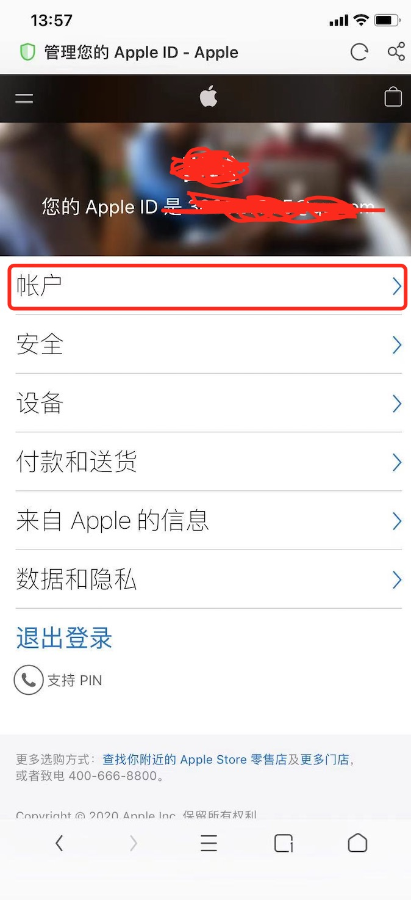

# Apple 账号地区切换到香港

### 1、设置里面退出登录

### 2、进入 Apple 官网，用自己的 Apple 账号登录

```shell
https://appleid.apple.com
```


### 3、登录成功后选择 Account（账号）




### 4、拉到底部，将地区修改为“Hong Kong”（香港）


### 5、填写信息，填好以后点 Save（保存）即可

- Payment Method（支付方式）选择None（无）

- 账单地址可以随便填写
- 地区码为852
- 电话号码是8位，必须为9或者6开头


### 6、您 Apple 账号的地区已经成功改为香港了，直接在AppStore登录即可

